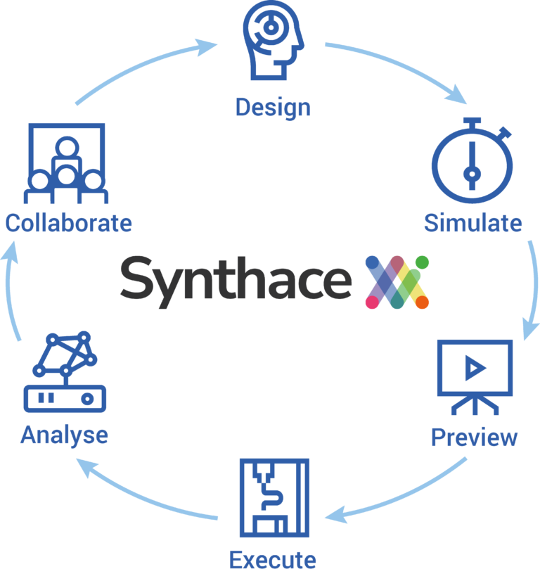

[Events](#events), [Readings](#readings), [Companies/Orgs](#orgs), [People](#people), [Languages](#languages), [Acronym Watch](#acronym-watch), [Training/Classes](#training), [Future Research](#future)

---

#### Summary

This week I was mostly exploring SynBio DevOps for a [blog post](/synbio-devops) I wrote.

Image Courtesy of Synthace

### Events

- [Ginkgo Ferment 2021](https://www.ginkgoferment.com/) Videos just got posted. Website says it was in Oct. Was it a COVID event time warp? Its in person.

  Video 1 [Ginkgo Ferment 2021: Developing the Next Wave of Products with Synthetic Biology](https://www.youtube.com/watch?v=c-9tc4NfK3k). Announced [Jake Wintermute](https://wintermute.bio/) as developer evangelist. I followed him in Twitter a while back and thought it was a cool handle, but its his _actual_ name. And he really does live in Paris, France.

### Reading Corner 

- Books

  - "[Deep Learning with Python](https://www.manning.com/books/deep-learning-with-python-second-edition?gclid=Cj0KCQiAw9qOBhC-ARIsAG-rdn46abAzsF3bC_3pVQtSgwAFq4kVQ8ajeIlsgFy9_LLQZsZ5yRYDvxEaAkOgEALw_wcB)", Francois Chollet, Second Edition

  - "[The Code Breaker: Jennifer Doudna, Gene Editing, and the Future of the Human Race](https://www.amazon.com/Code-Breaker-Jennifer-Doudna-Editing/dp/1982115858)". I read it and now I have the twins reading it. Also available as [audio book](https://www.amazon.com/Code-Breaker-Jennifer-Doudna-Editing/dp/B08GP2J186/ref=tmm_aud_swatch_0?_encoding=UTF8&qid=&sr=).

- Articles: I read a lot of articles while writing some blog posts. Here are the key ones.

  - [Biodefense in the Age of Synthetic Biology](https://www.ncbi.nlm.nih.gov/books/NBK535871/) I read this while writing my SynBio Devops blog post. I wish I'd seen it earlier because it would have saved me a lot of work. I intend to go back and write a blog post to summarize its contents.
  - [How Bio is Disrupting Industries and Eating the World: A Historical Perspective](https://strangehelix.com/?p=f3523c96b99d)
  - [Biology is Eating the World: A Manifesto](https://a16z.com/2019/10/28/biology-eating-world-a16z-manifesto/): a16z (Andreessen Horowitz). "drug discovery and development will move from a bespoke to an iterative process"
  - [How Biotech Startup Funding Will Change in the Next 10 Years](https://www.ycombinator.com/library/4L-how-biotech-startup-funding-will-change-in-the-next-10-years), 2019
  - [Translational Medicine](https://en.wikipedia.org/wiki/Translational_medicine) The goal of TM is to combine disciplines, resources, expertise, and techniques within these pillars to promote enhancements in prevention, diagnosis, and therapies. Accordingly, translational medicine is a highly interdisciplinary field, the primary goal of which is to coalesce assets of various natures within the individual pillars in order to improve the global healthcare system significantly

- Magazines/Web Sites

  - [GEN: Genetic Engineering and Biotechnology News](https://www.genengnews.com/) I signed up for a free newsletter.

### Companies/Orgs 

- [ChemPartner](https://www.chempartner.com/): Life Science CRO/CDMO. China.
- [Science Exchange](https://ww2.scienceexchange.com/s/): Marketplace lets you source, order and pay for 3,500+ scientific services providers.
- [OpenTrons](https://opentrons.com/): Open source lab automation hardware and software. Python API.
  - [Opentrons OT2 Liquid Handler Robot Video](https://vimeo.com/260833720?embedded=true&source=vimeo_logo&owner=66172389). Get ready to shake your booty cause that soundtrack is funkier that it needs to be.
- [Atomwise](https://www.atomwise.com/): "developed a machine learning-based discovery engine that combines the power of convolutional neural networks with massive chemical libraries to discover new small molecule medicines."
  - IT: Terraform/Ansible. Python. Docker. AWS.

### People 

- None specifically. [Jennifer Doudna](https://en.wikipedia.org/wiki/Jennifer_Doudna), [Tom Knight](<https://en.wikipedia.org/wiki/Tom_Knight_(scientist)>), and [Eric Lander](https://en.wikipedia.org/wiki/Eric_Lander) are always on my mind.

### Languages 

- Go+: [The Go+ language](https://github.com/goplus/gop) for engineering, STEM education, and data science.
  - For engineering: working in the simplest language that can be mastered by children.
  - For STEM education: studying an engineering language that can be used to work in the future.
  - For data science: communicating with engineers in the same language.

### Acronym Watch 

These Acronyms are _all_ courtesy of ChemPartner.com

- CRO: Contract Research Organization
- CDMO: Contract Development & Manufacturing Organisation
- CMO: Contract Manufacturing Org
- CMC
- CTD: "for regulatory filings"
- IND: IND filing
- NDA: In this context, I don't think this is a Non Disclosure Agreement.
- DMPK/Tox
- cGMP

### Training 

- Synthace: Design of Experiments Masterclass For Biology

  - [Synthace](https://www.synthace.com/) is one of my favorite Cloud Bio Labs play. [This masterclass](https://www.synthace.com/design-of-experiments-masterclass-for-biology/) is focused on helping lab biologist transition to it. 3 Sessions. Session 1: Starts January 25th 2022.
  - Design of Experiments (DOE) is a systematic method of investigating the relationship between multiple factors and their impact on the process simultaneously.
  - It is the key to understanding the ever-increasing complexity of biological experiments, and has the potential to transform biological research.

- MIT Intro to Deep Learning | 6.S191

  - MIT's introductory course on deep learning methods with applications to computer vision, natural language processing, biology,... 1 Week crash course. Next session starts Jan 24.
  - [The website](http://introtodeeplearning.com/) (No HTTPS. Academia, you need me.)
  - Lectures on YouTube: New 2021 Edition!
    - [1. Intro](https://www.youtube.com/watch?v=5tvmMX8r_OM)

### Future Research 

Things I ran across and thought "Oh yeah, I need to look into that sometime, but not now."

- Google DeepMind, AlphaFold2
- Insitro, Insilico Medicine
- Craig Venter Institue
- ETH Zurich. Caulobacter ethensis 2.0
- Jared Friedman, YC (Y Combinator)
- Ginkgo Ferment Partner Presenters
  - Arcea
  - Genomatica
