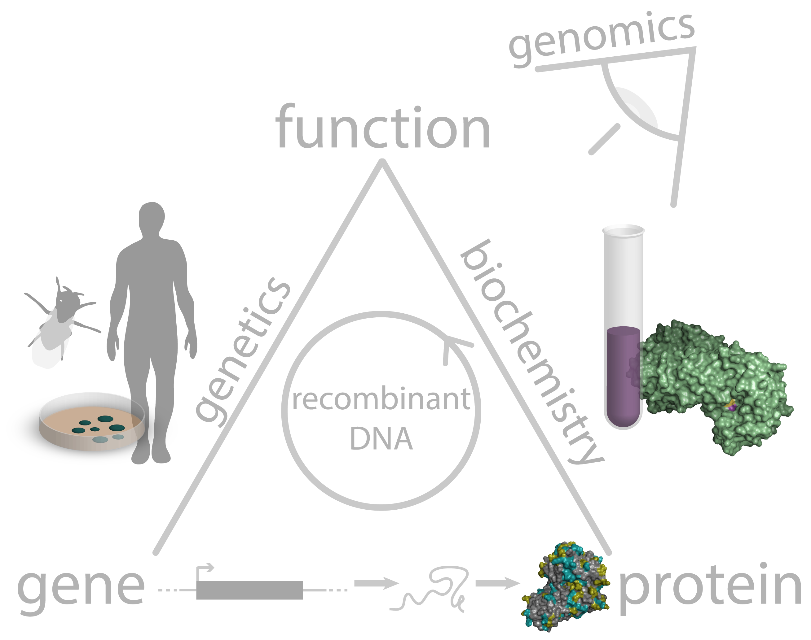

## A High Level View of Biology

Its a bit rambly and meant for my and my kids consumption. I'm sharing it here for those who stumble across it.

- SystemsBiology: understanding and experimentng upon systems like gut biomes, SCOBYs, forests.
- Bioprospecting
  - Physical: butterfly nets, interviewing traditional healers
  - Virtual: Bioinformatics, virtual evolution
- BioTech: The exploitation of biological processes for industrial and other purposes, especially the genetic manipulation of microorganisms for the production of antibiotics, hormones, etc.
  - [Synthetic Biology](https://www.ncbi.nlm.nih.gov/books/NBK535871/) An enhanced version of Genetic Engineering, with more emphasis on agile, iterative Design-Build-Test cycles pioneered by the software industry, encoded in DevOps culture.
  - Biosimulation: Simulating expected behavior in virtual, cellular or intracellular environments (e.g. [Tesla Dojo](https://www.youtube.com/watch?v=6hkiTejoyms), or [MIT Evolution Gym](https://news.mit.edu/2021/system-designing-training-intelligent-soft-robots-1207)). [Existing examples](https://www.ncbi.nlm.nih.gov/pmc/articles/PMC6481718/):
    - Intracellular: Virtual Cell, BIOCHAM, BioNetGen, Cellular Dynamic Simulator (CDS), Smoldyn, and COPAS
    - Cellular: Multiscale Systems Immunology Project (MSI), EPISIM, LINDSAY, SimuLife, FLAME, Simmune, C-ImmSim, CellSys, and Compucell3D.
    - Biomanufacturing: producing the end products at scale (fermenters, other bioreactors)

"In Silico". I use this to mean virtual or digital, no actual silicon chips directly involved.

### Strategic

- Intranet and B to B Apps. Integration with backend software and hardware.
- DevSecOps for digital cloud assets.
- MLOps _support_. I can know enough to help the actual data scientist and biologist transform their code to operate at scale.
- IOT integration

I believe that Bioengineeringy can solve many major problems from climate change to starvation, pollution, disease and aging. What could be more exciting and meaningful work?

_My_ definition of Bioengineering: science of biology plus the techniques of genetic engineering

- Bioinformatics: discovery and feedback from engineering
- Synthetic Biology: editing based on the info.
- Genetic Engineering:

The core sciences and technologies for a Bioengineering revolution are in place, and getting rapidly better. Now the world needs to execute, with speed, at scale. Rapid advances depends on rapid automation of research and "starter culture" production. That requires:

1. Cloud Bio Labs: Like AWS, but for Bio. LabOps, inspired by DevOps CI/CD, will replace manual lab processes which are historically based on prose instructions and unwritten institutional knowledge. It replaces it with version controlled code executed by software and robots. It will do for experiments what Pandas did for numeric research: add reproducibility and the ability to rapidly iterate. An epidemic of unreproducibility has been making the news in recent years and this is the cure.

- Lab Projects as Code: version control, CloudFormation/Terraform for biology experiments and processes.
- Self serve API's, SDK's and Console web apps are needed just like for digital clouds.
- Command, control, and monitoring for lab robots, sensors (IOT)
  - NGS ([Next Generation Sequencing](https://www.thermofisher.com/onelambda/us/en/featured-products/alltype-fastplex.html?filter=%7B%7D)): they are delicate and produce tons of data
- Security: baked in, automated, zero trust, elastic.
- Gene sequence data is massive, integral with the production pipline, and integrated with the physical pipeline, _at a scale beyond any other industry's with physical plant operations_. Most companies do not need massive amounts of data being steadily processed in order to produce a _physical_ product. Massive web apps like Google or Youtube mine real time data to produce _digital_ products. A car company like Tesla consumes tons of real time data, but only to train an AI that is copied to the car physical cars. The physical cars are produced the traditional way, from batch produced engineering designs. Amazon is the only company that I think compares in combining the digital and physical in realtime via the integration of their web site with fulfilment and delivery services. AWS + Amazon shopping + Amazon fulfillment come closest to a current model for CloudLabs (aka Foundries).

2. Machine Learning

- ML Ops: Data preperation/massage pipelines
- Training: self training GANs, like Tesla Dojo, but for microscopic environment or whole organism body interiors?
- Data Lakes: ingress and expiry.

3. Digital Cloud Arbitrage

- Minimize the digital component of expenses by automatically moving work between cloud vendors. **Digital cloud will become a commodity much sooner than bio clouds will.**
- Breaking vendor lock requires using open standards.
  - Migrate all digital infrastructure to open standards like Kubernetes, various Apache libs

### <u>Online Classes</u>

If I were starting out again, I'd get a Masters in a biology field, add a big dose of software engineering, and enter a startup ASAP. I've guided my twin 18 year olds to do just that.

I've already got the software engineering part, so I'm coming from the opposite direction, though I don't have time for a biology degree. The best realistic thing I can do is take online courses. I hope someday soon, cloud bio labs and virtual lab simulators will remove the need for in person labs, opening the field up to people around the world.

#### Upcoming Classes

I wish there were multiple me's so I could take all of these classes. I'll narrow and prioritize based on which company I'm working for:

- [Stanford Genetics and Genomics Program](https://online.stanford.edu/programs/genetics-and-genomics-program)
- [ML Engineering For Production (MLOps Specialization)](https://www.coursera.org/specializations/machine-learning-engineering-for-production-mlops?utm_source=gg&utm_medium=sem&utm_campaign=28-MLOps-DL.ai-US&utm_content=B2C&campaignid=13572037851&adgroupid=120618068101&device=c&keyword=andrew%20ng%20machine%20learning&matchtype=b&network=g&devicemodel=&adpostion=&creativeid=528598123150&hide_mobile_promo&gclid=CjwKCAiAzrWOBhBjEiwAq85QZ0O7Sc1ICt7Ij8t2r8CbPeyNhvECq2kj7NMboPNB_wS7lHQ04dLKzhoC7IcQAvD_BwE). This is Andrew Ng's newer material, from his DeepLearning.ai. Ideally, it will be cross digital cloud vendor compatible, as their ML infrastructure will almost certainly converge.
- [MIT: BioInformatics](https://www.edx.org/course/quantitative-biology-workshop-3) I started this in late 2019 but could not complete the class with a certificate because the site crashed over xmas break, about half way through class, and no one was around to fix it. I stopped there. I want to retake it when I can definitely get a cert.

 

#### Certified Classes that I've already taken via EdX and Coursera

Generally, in late 2019 and early 2020, I explored getting into SynBio via ML. I realized that to be good at it I'd need to take a lot more math and then risk still not getting a job. Instead, I plotted a course that would leverage what I already knew. These courses were not wasted; they put me in a much better position to support the biologists and data scientists.

- [MIT: Intro to Bio - The Secret of Life with Eric Landers](https://www.edx.org/course/introduction-to-biology-the-secret-of-life-3)
- [Stanford: Machine Learning (Andrew Ng's seminal course)](https://www.coursera.org/learn/machine-learning)
- [Imperial College: Linear Algebra for ML](https://www.coursera.org/learn/linear-algebra-machine-learning?specialization=mathematics-machine-learning)
- [Coursera: Prep for Google Cloud Cert: ML Engineer Professional Cert](https://www.coursera.org/professional-certificates/preparing-for-google-cloud-machine-learning-engineer-professional-certificate). The course labs used actual GCP infrastructure, which was changing so fast that the course material was already often out of date. I decided to pause on this front until I was much closer in "going to market".
  - Course 1: [Google Cloud Big Data and Machine Learning Fundamentals](https://www.coursera.org/learn/gcp-big-data-ml-fundamentals?specialization=preparing-for-google-cloud-machine-learning-engineer-professional-certificate)
  - Course 2: [How Google does Machine Learning](https://www.coursera.org/learn/google-machine-learning?specialization=preparing-for-google-cloud-machine-learning-engineer-professional-certificate)
- [Stanford: AI in Healthcare Specialization](https://www.coursera.org/specializations/ai-healthcare#about)
  - Course 1: [Introduction to (American) Healthcare](https://www.coursera.org/learn/intro-to-healthcare?specialization=ai-healthcare) Learning how the US health insurance industry works turned me off to the whole specialization though looking back a year later, I might try the next course.

### Learn From Existing Synthetic Biology and Cloud Bio Lab Companies

- [Ginkgo Bioworks Devops](https://www.ginkgobioworks.com/) I maintain a blog post about Ginkgo (/ginkgo-bioworks-devops)

  - General Stack: Python, SQL, DNA, Postgres, Snowflake, Airflow, AWS DMS, Spark on EMR
  - Data Eng:
    - Data Pipeline: Airflow, Luigi, etc
    - Big Data tools: Snowflake, Hive, Spark
    - AWS cloud: EC2, EMR, RDS, Redshift, S3
    - Python, Java, Scala, etc
    - Linux
  - Syn Bio Eng: Python, NGS
  - Computational Protein Eng: Python, Rosetta, Schrodinger, molecular simulations (MOE), deep learning
  - Computational Biologist: Python/R, bash, bioinformatics tools (samtools/bwa), snakemake/nextflow, SQL, GraphQL, AWS/Google Cloud distributed computing, Docker, git
  - IT: IAM, AD/LDAP, GPO?, Okta SSO, Centrify?, AWS in general
  - Apps:
    - AWS, Docker, Django, REST, GraphQL, React, MySQL, Postgres, Elastic Search, Airflow
    - Python, Javascript, CI/CD, AWS

- [Emerald Cloud Lab](https://www.emeraldcloudlab.com/). FYI Emerald is [building a Cloud Lab at Carnegie Mellon](https://www.cmu.edu/bio/news/2021/0830_cloud-lab-partnership.html).
  - ECL (Emerald's Sybolic Lab Language (SLL written in Wolfram))
  - Infrastructure and Tools Eng:
    - ECL, Go, Python, Bash, Wolfram Language
    - Functional Programming: (e.g. Haskell, F#, Elixir)
    - AWS EKS, Lambda, Fargate
    - AWS Postgres RDS
    - Envoy+Contour, Terraform, Prometheus, Grafana, AlertManager, PagerDuty, SendGrid, Auth0,
    - AWS services: EC2, EKS, RDS, ELB/ALB/NLB, IAM, S3, Certificate Manager, CloudWatch, Route 53, ElastiCache, RDS, SQS, VPC, premises-to-cloud VPN, security groups, CloudFront
    - Linux Sys Admin
  - Web Apps and Devops: React, Next.js?, [Travis CI](https://www.travis-ci.com/)
  - Platform Eng: ECL, Go, AWS: Postgres RDS, S3, EC2, SQS, Docker, Kubernetes
- [Strateos](https://strateos.com/)
  - SCLE (Strateos Common Lab Env)
  - DevOps:
    - OS: Memory Mgr, File Syts
    - OSI networking
    - AWS EC2, VPC, ELB
  - BackEnd:
    - Java, SpringBoot, Scala, EKS
    - Swagger
  - FrontEnd: REST, RabbitMQ (or Kafka), S3, Postgres, Consul?
  - Automated Synth Chemistry
    - Synthetic and anlaysis (LCMS?, NMR?)
    - Automated chemical synthesis platform: ChemSpeed? or Zinsser?
- [Synthego](https://www.synthego.com/)
  - LIMS (Lab Info Mgt System) (aka Synthego's brain)
  - Computational Biologist:
    - Sequencing (Sanger, NGS)
    - BioInformatics: bwa, GATK, Picard, etc.
    - Python, R, MATLAB
  - Data Engineer
    - Python, SQL, Airflow, ETL pipelines, Tableau dashboards
    - AWS ECS, ECR, EC2, SQS. Docker, OLTP/OLAP SQL
    - Python Web apps and ORMs (SQLalchemy, Django ORM)
  - Software Dev (LIMS)
    - Python, Django, React, Redux, gRPC
  - Front End Instrumentation: Mocha, Jest, Linux CLI
    - Python, JS/TS, Node.js, React, Djano, Interest in IOT, Redux
  - Data Eng (other)
    - Python Data (Pandas, Numpy, etc), SQL, AWS
    - Djano REST/ORM, Flask/SQLAlchemy
    - BI tools (Tableau)
    - Workflow mgt: Airflow, Luigi, Prefect
- [Riffyn](https://riffyn.com/) No jobs posted Dec 2021

> SRE Mindset: "SRE is fundamentally doing work that has historically been done by an operations team, but using engineers with software expertise, and banking on the fact that these engineers are inherently both predisposed to, and have the ability to, substitute automation for human labor." Ben Treynor Sloss, VP Eng, Google

#### Bio Lab Automation, Software Focused

- [Synthace](https://www.synthace.com/). Boston and London.
  - Full Stack: React, GraphQL
  - App: TS, Go, Postgres, GCP, Kubernetes, GraphQL.
    - Good in at least 1 lang (Go, Java, etc)
    - HA and distributed
- [Radix](https://www.radix.bio/)
  - Eng: Scala, TS (no jobs Dec 2021)

> "Radix is one of my favorite words. Its greek for "root source"; radical radish farmers are radiating change!" EdPike365

#### Syn Bio Orgs/Incubators

- [Broad Institue](https://www.broadinstitute.org/) Eric Landers (OG)
- [Innovative Genomics Institute](https://innovativegenomics.org/) Jennifer Doudna at Berkeley.
- [Imperial College Synthetic Biology Hub](https://www.imperial.ac.uk/synthetic-biology). Hub includes: [Synbicite](http://www.synbicite.com/), [London DNA Foundry](URL IS BAD).

### Languages and Libraries

- DevSecOps, BioScience and BioTech use Python a lot. I'll need to edit and make existing code written by non programmers devops ready. Many legacy apps will be written in Python, including app servers. Trailing numbers indicated "job hits".

  - Scientific and Numeric Calculations
    - [NumPy (156)](https://numpy.org/): linear algebra. Matlab clone.
    - [SciPy (81)](https://scipy.org/): built on NumPy
    - [SciKits (178)](https://projects.scipy.org/scikits.html): SciPy Toolkits.
  - Data Analysis Libs
    - [Pandas (212)](https://pandas.pydata.org/): tubular data
  - Apps
    - [Jupyter Notebook (81)](https://jupyter.org/): See also JupyterLab. Prototype.
    - [PyCharm (26)](https://www.jetbrains.com/pycharm/): JetBrains IDE plus. Unit testing. Prod.
  - Other:
    - [MATLAB (1,063)](https://www.mathworks.com/products/matlab.html): The whole, expensive, enchilada.
    - [Django (236)](https://www.djangoproject.com/): python web app server
    - [Numba (16)](https://numba.pydata.org/): Python JIT compiler
    - [Kaggle (10)](https://www.kaggle.com/): Jupyter Notebooks online. ML competitions.
  - Machine Learning
    - [TensorFlow (388)](https://www.tensorflow.org/): see also TensorFlow.js, TensorFlow Lite
    - [Keras (117)](https://keras.io/): built on TF2
    - [PyTorch (331)](https://pytorch.org/): deep learning, and linear algebra. GPU accelerated.
    - [Scikit-Learn (177)](https://scikit-learn.org/stable/): built on NumPy, SciPy and matplotlib
  - App Data Visualization:
    - [Matplotlib (51)](https://matplotlib.org/)
    - [Seaborn (21)](https://seaborn.pydata.org/): Based on matplotlib

> Top ML/DL Libraries 2019-ish from [Kaggles](https://www.kaggle.com/[), in "[Deep Learning with Python](https://www.manning.com/books/deep-learning-with-python-second-edition?gclid=Cj0KCQiAlMCOBhCZARIsANLid6YjJoYPgdAU9IrC4WVpeBHU770B3jPj94qAlk6dVOpnY2DHEeDYbHYaAvGlEALw_wcB)" by Francois Chollet:
>
> - Deep Learning: Keras/TensorFlow, PyTorch
> - Classic Gradient Boost: Scikit-learn, [XGBoost](https://xgboost.readthedocs.io/en/stable/), [LightGBM](https://lightgbm.readthedocs.io/en/latest/)

- Genomics research requires moving large sequencer results around, securely,
  24x7, mining them and displaying the results.
  - ML Lifecycle:
    - [MLFlow (41)](https://mlflow.org/)
    - [Kedro (8)](https://kedro.readthedocs.io/en/stable/)
    - [Apache Airflow (93)](https://airflow.apache.org/): generic workflows
  - Batch/Stream Processing:
    - [Apache Spark (201)](https://spark.apache.org/): massive datasets, groups of rows
  - Parallel Processing:
    - [DASK (25)](https://dask.org/): CPU
    - [RAPIDS (22)](https://rapids.ai): GPU
  - Message Bus:
    - [Kafka (750)](https://kafka.apache.org/): (aka Amazon Kinesis) Row parsing, data cleansing
  - Warehouse: [Hive (318)](https://hive.apache.org/)
  - DB:
    - [Apache Druid (18)](https://druid.apache.org/): Column-oriented
    - [InfluxDB (0) ](https://www.influxdata.com/): time series. HTTP API
    - [Apache Arrow (14)](https://arrow.apache.org/): In memory columnar DB. HP analytics.
  - Search: [Elasticsearch (345)](https://www.elastic.co/what-is/elasticsearch)
  - Distributed Visualization:
    - [Kibana (84)](https://www.elastic.co/kibana/): Elastic stack dashboards.
    - [Grafana (135)](https://grafana.com/): Dashboards. Kibana fork.
    - [Graphite (0)](https://graphiteapp.org/): Predecessor to Grafana. Prometheus and Elasticsearch.
    - [CNCF Prometheus (0)](https://prometheus.io/): Time series (logs)

> ELK Stack: Elasticsearch, Logstash, Kibana, "owned" by elastic.co, traditionally used for log analysis.

- Languages
  - Python (6,966)
  - [R (936?)](https://www.r-project.org/)
  - [Julia (73)](https://julialang.org/)
  - [Go (271)](https://go.dev/): Kubernetes is written in it. Good for Lambdas.
  - [Rust (211)](https://www.rust-lang.org/)
  - [Scala (506)](https://www.scala-lang.org/): Functional JVM
  - Java (4,450)
  - JavaScript (3,620)
  - TypeScript (667)
- Infrastructure
  - Terraform (835)
  - CloudFormation (247)
  - Ansible (637)
  - Chef (?)
  - AWS (4,829)
  - GCP (321)
  - Linux (3,146)
  - [Kubernetes (1,668)](https://kubernetes.io/)
    - CKA (12), CKAD (6)
  - [Docker (1,805)](https://www.docker.com/)
  - DevOps (454)
  - SRE (225)
- Front End
  - Angular (844)
  - React (740)
  - React Native (135)
  - Next.js (75 - 301)
  - Vue (295)
  - Svelte (14)
  - Gatsby (13)
  - .net (1,002)
  - redux (288)

### Certs to Get in 2022

I'm going to be very busy with more certs this year. I think certs show that you've got broad exposure. Demo projects are good, but you can get something working and still not know about entire other ways to solve a prolbem with the same tech. Certs also show you've committed time and resources even if you have not done the work professionally _yet_.

I just got the 3 core AWS Associate certs. I probably won't get the ones below until I get a job using AWS:

- AWS Security
- AWS Networking
- AWS DevOps Professional
- AWS Cloud Architect Proffesional

I have to get these because I've already paid for them. I got a good deal by attending KubeCon online. They expire by the end of 2022:

- CNCF KCNA (Kubernetes Cloud Native Associate). Its a new entry level cert.
- CNCF CKA (Certified Kubernetes Administrator )
- CNCF CKAD (Certified Kubernetes Developer)

### DevOps Techs

### BioTech Personalities To Follow

- Jennifer Doudna
- Robert Church
- Eric Landers

### Other BioTech Companies To Follow

- [Mammoth Biosciences](https://mammoth.bio/)
  - BioInformatics: Python, R, SQL, jupyter, pandas, plotting, PCR, qPCR, IVD assay
  - Full Stack:
    - React, Redux, Python, Django, SQL
    - AWS EB, Batch, Lambda, Step funtions, Terraform, Docker
  - Automation Eng:
    - Tecan Freedom Evo or Fluent, Labcyte Echo, SQL
    - MJP/R/SAS, Benchling
- [Twist Biosciences](https://www.twistbioscience.com/)
- [Benchling](https://www.benchling.com/) Lab automation, config, integration
- Thermo Fischer: Invitogen
