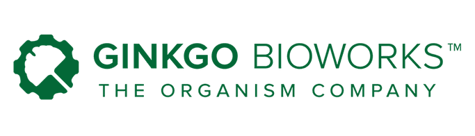
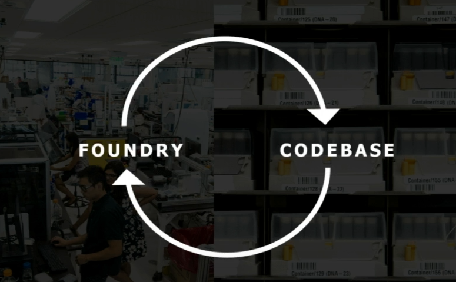
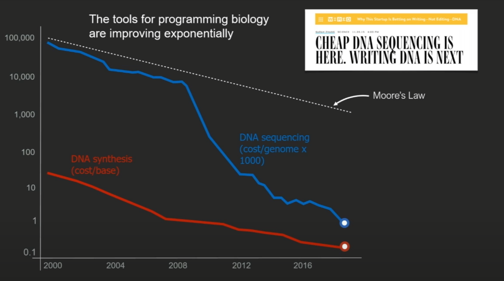
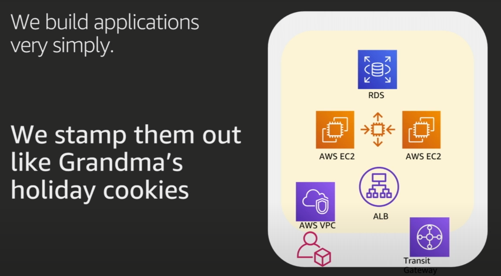
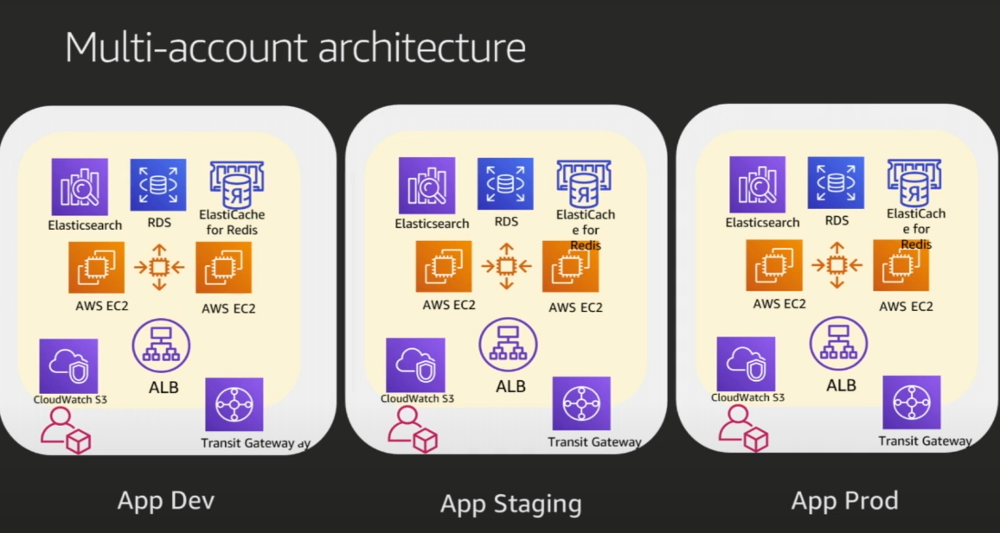
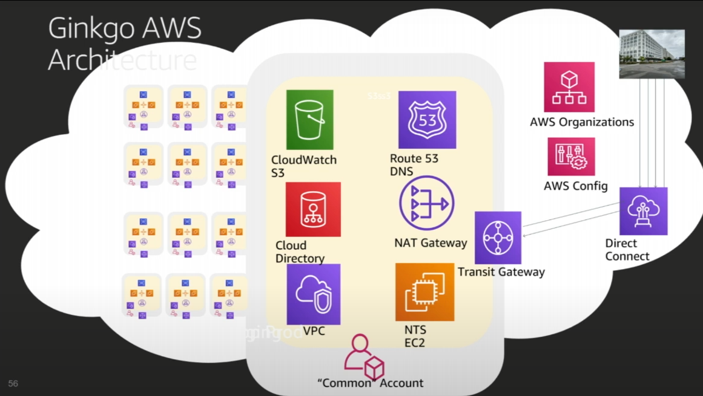
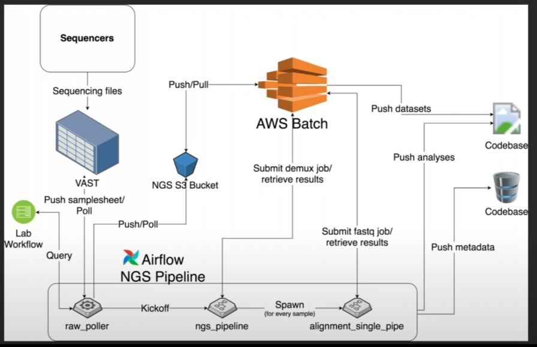
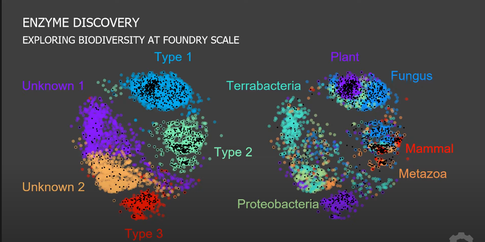
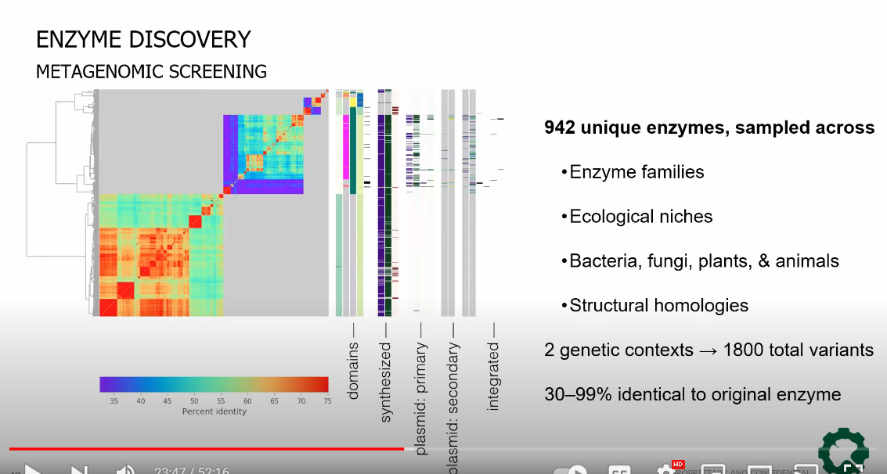
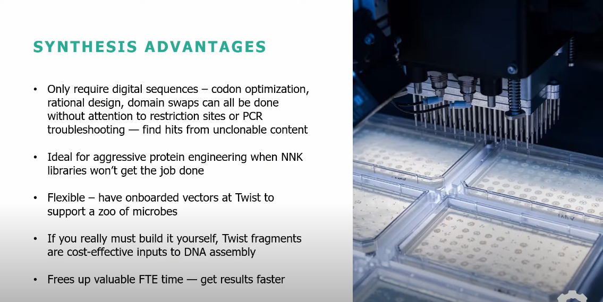

## Learning From Ginkgo Bioworks' Technologies

[Job Descriptions](#jobs), [DevOps](#devops), [References with Summaries](#refs)

## Company Overiew

[Ginkgo](https://www.ginkgobioworks.com/) is among the top companies doing what I want to do: mixing synthetic biology, lab automation, genomics, ML and software/devops. I hope to get a job with them or one of their partners someday.

This post is a loosely organized collections of factoids I've captured from various places and I'll update it as I find out more.

I think Ginkgo is well on it's way to spinning up a "cloud wet labs" product the same way that Amazon created AWS: its not what they set out to do but it is going to be a big deal. I'm following other "cloud wet lab" plays like [Synthace](https://www.synthace.com/) and [Emerald Cloud Lab](https://www.emeraldcloudlab.com/).

At the beginning of 2022, my analysis is that their current business plan focuses on:

1. Developing Prototypes for fees, royalties and equity stakes. Product ideas that employees come up with are "incubated" out into additional business partners.
2. Developing an internal "knowledge base", similar to how 23 and Me works, or Tesla's FSD AI, works. They call it the "Codebase", but its a bit more than that.

   - They design each contract with a third party to allow Ginkgo to keep a copy of what they learn in the process. I don't know how this will play out for future copyright issues. This video has their lawyer Claire Laporte [talking about their situation](https://youtu.be/ZtVytYuSt44?t=792).

   - Ginkgo's codebase will pay compound interest. It will have sequence data, etc, at a scale vastly greater than any competitor. Data is the key to training ML, so Ginkgo's ML should be superior, and continue to be superior, to any competitors without a similar deal. It should give them a lead similar to Tesla's FSD, for similar reasons. The only competitor at this point would be [Twist Bioscience](https://www.twistbioscience.com/), because every Ginkgo project uses Twist.

> I think of Ginkgo's Codebase deal as "the library of Alexandria" because that library required every ship docking in Alexandria to allow the library to copy any documents onboard.

3. Self Serve Cloud Bio Services: Ginkgo is having to exponentially scale up automated Lab equipment and IT infrastructure for their foundry(s). I predict that at some point, to amortize their physical investments, they will create a 3rd business: explicit, AWS like, cloud bio lab services for use by anyone, not just their business partners. Mergers may be involved to build the full offering.

4. Bio Security: It's an interesting field with growth potential but it doesnt fit into their core business. It should be spun off to yet another "Ginkgobated" company. (I made up that term as well: Ginkgo Incubated)

## Gingkgo Technologies

### Technologies From Job Descriptions 

- General Stack: Python, SQL, DNA, Postgres, Snowflake, Airflow, AWS DMS, Spark on EMR
- Data Engineer:
  - Data Pipeline: Airflow, Luigi, etc
  - Big Data tools: Snowflake, Hive, Spark
  - AWS cloud: EC2, EMR, RDS, Redshift, S3
  - Python, Java, Scala, etc
  - Linux
- Syn Bio Engineer: Python, NGS
- Computational Protein Engineer: Python, Rosetta, Schrodinger, molecular simulations (MOE), deep learning
- Computational Biologist: Python/R, bash, bioinformatics tools (samtools/bwa), snakemake/nextflow, SQL, GraphQL, AWS/Google Cloud distributed computing, Docker, git
- IT: IAM, AD/LDAP, GPO?, Okta SSO, Centrify?, AWS in general
- Apps:
  - AWS, Docker, Django, REST, GraphQL, React, MySQL, Postgres, Elastic Search, Airflow
  - Python, Javascript, CI/CD, AWS
- DevOps: see below

### Ginkgo DevOps 

DevOps tech is my main focus, so I broke it out in more detail. The DevOps group at Ginkgo is focused on the following:

- Building network and IOT resources to support exponentially increasing physical infrastucture, mainly for NGSs.
- Automating the provisioning of internal IT resources for each project and it's researchers.
- Automating peering/integrating with project partners.
- Pumping water out of the basement.

#### Devops Resource Provisioning Cases

- Ginkgo's core infrastructure: data center, networking.
- Per Foundry infrastructure as they create more Foundries (think AWS Zones)(I'm predicting here but they may already have this)
- Per External Partner: io security (APIs, network peering), user credentials/federation
- Per Project resources. I suspect there is a "sub project" domain as well.
  - per involved partner
  - per researcher/programmer
- Per Individual Employee by type
  - scientist
  - programmer
  - IT, DevOps
  - Other staff: admins, etc

#### DevOps Tech Stack

I was able to document some things from the references found in the references at the end of this article. If you are looking for technologies per "job role", e.g. "Data Engineer", they are in another blog post [SynBio Company Tech Stacks](/synbio-company-tech-stacks)

- Public Website
- Extranet: Auth, APIs
- Intranet: APIs, Zero Trust Auth?
- Sequencing
  - NGS: [TMO](https://www.thermofisher.com/onelambda/us/en/featured-products/alltype-fastplex.html?filter=%7B%7D) or [Agilent](https://www.agilent.com/en/product/automated-electrophoresis/nucleic-acid-analysis?gclid=CjwKCAiA5t-OBhByEiwAhR-hm4Txf0IiAv6Xx9V_EM2vvWyWQRkMxg8KNQWNL0pwHOlwxHEuF73hGBoCCUYQAvD_BwE&gclsrc=aw.ds)
  - [VAST](https://vastdata.com/) Storage Technology
  - [Apache Airflow](https://airflow.apache.org/): workflow manager. [Amazon MWAA](https://aws.amazon.com/managed-workflows-for-apache-airflow/)?
  - AWS S3
  - [AWS Batch](https://aws.amazon.com/batch/) (not EKS) to manage Docker containers
- ML
  - Batch Jobs with Shephard
    - AWS S3
    - AWS SQS
    - AWS Lambda: Python
    - AWS DynamoDB
    - AWS Secrets Store
    - AWS EC2
    - AWS ECR, Docker in Docker
    - AWS FSX, EFS, EBS
- DNA Design
  - Jupyter, AWS
  - [LIMS](https://www.thermofisher.com/us/en/home/digital-solutions/lab-informatics/lab-information-management-systems-lims.html?ef_id=Cj0KCQiAw9qOBhC-ARIsAG-rdn77CR2eO-Mile7AL3pijsZfcqbsUuOjkHTKOGI8gbFtc8YV7yuCRJkaApodEALw_wcB:G:s&s_kwcid=AL!3652!3!526268159935!p!!g!!define%20lims&gclid=Cj0KCQiAw9qOBhC-ARIsAG-rdn77CR2eO-Mile7AL3pijsZfcqbsUuOjkHTKOGI8gbFtc8YV7yuCRJkaApodEALw_wcB)
  - [Twist API](https://www.twistbioscience.com/tapi)
  - Slack
  - [NNK codon libs](https://en.wikipedia.org/wiki/Saturation_mutagenesis)
- Design Testing
- Organism Build: Twist Bioscience API
- Organism Testing
- Organism Replication (Fermentation)
- Organism Deployment
- Networking
  - AWS VPC
  - AWS ALB
  - AWS Transit Gateway
  - AWS NAT
  - AWS Route 53
  - AWS Direct Connect
  - Cisco
- Data:
  - AWS RDS
  - AWS Elasticache for Redis
  - AWS Open-Search (managed ElasticSearch)
- File mgt and object storage

  - AWS EBS
  - AWS EFS
  - AWS FSX
  - AWS S3

- User Directory, Auth:
  - AWS Organizations
  - AWS Cloud Directory
  - AWS IAM
- Data Storage and transport
- IOT: integration and monitoring
  - NTS (time service) on EC2
- Cloud: mostly AWS
  - EC2
- DevOps
  - AWS Config
  - AWS CloudFormation (some interest in TerraForm)
  - AWS Control Tower (I assume)
  - Ansible
  - Jenkins
  - AWS CloudWatch
- GSuite

## Reference Videos and Articles <a name="refs"><a>

1. [How Ginkgo Bioworks uses AWS at Scale](#ref1)
2. [Shephard HPC on AWS Event](#ref2)
3. [Ginkgo Bioworks, Biology by Design: Applying Gigabases of DNA to Bioengineering](#ref3)
4. [Meet Ginkgo Bioworks, 2010](#ref4)
5. [Ginkgo’s Platform: An Introduction to Codebase and IP Strategy (Ginkgo Bioworks Investor Day 2021)](#ref5)

### Ref 1: "How Ginkgo BioWorks uses AWS at Scale" 

I watched an AWS re:Invent 2019 presentation about [how Ginkgo BioWorks uses AWS at scale]("https://www.youtube.com/watch?v=arDI64ja6KA").

> "Ginkgo Bioworks leverages AWS to create its microbe designs, run workflows, aggregate data, and run analytics, all at an exponentially accelerating speed." Dave Teff

- Dave Treff is the Head of IT and DevOps. Joined 2018.
- Ginkgo FOUNDRY compiles and debugs DNA code
- Located in Boston by the waterfront.
- Tom Knight one of the founders, involved in Human Genome project.
- Cofounder Barry Canton?
- My Question: What is their working relationship to the Broad Institue?

- Foundry has an SOA (Service Oriented Architecture) (hybrid wet lab, robots and software)
  - "Design" group uses custom software, designs and orders DNA
    - Computational protein design/homology modeling
    - Bioprospecting
    - Protein engineering
    - Pathway balancing
    - Metabolic modeling and data science
  - "Build" group injects plasmids into custom yeast or bacteria, test if they produce
    - Megabase-scale DNA synthesis
    - Transformation and conjugation
    - Short and Long-read sequencing
    - Cloning/assembly
  - "Test"
    - Assay dev and miniaturization
    - Enzyme screening
    - Metabolomics
    - Proteomics
    - Strain evolution
  - "Ferment"
    - Fermentation
    - Scale-up and scale-down
    - Downstream process dev
    - Organism deployment
    - Toll manufacturing
  - "Deployment Team"
    - Produce 1,000's of gallons (think Sourdough Starter)

Other cross cutting services:

- Sequencing
- High Throughput Screening
- Protein Eng (fix low DNA protein expression)

Ginkgos Foundry to Codebase to Foundry virtuous cycle:

1. Customer aproaches Ginkgo to create an organism that produces substance
2. Ginkgo returns a "starter" that can do this
3. The information about how to make the organism, most importantly genetic sequences, go into Ginkgo database.

Sometimes Ginkgo creates a spinoff company to exploit a niche.

### DNA Sequencing Cost per genome and DNA Synthesis cost/base pair

The cost for sequencing and printing DNA are falling far faster than Moore's Law.

> "(yearly) The cost to genetically engineer a cell falls by 50% and the number of designs tested increases by 3X (to 4X) per year in Ginkgo's automated cell engineering foundries." Knights Law

- Ginkgo buys core DNA from Twist Biosciences.

### YCombinator + Ginkgo + petri

- petri (a company) is a small incubator that lets startups access Ginko's platform and mentorship in exchange for equity.

- Typical DNA order from Twist on order of $200k
- It fits in a box shipped by FedEx

"In Silico" DNA Design goal is to narrow possible prospects from 4k to 1k before doing wet work.
So reduces Twist bill from 200k to 50k.

### IT and DevOps at Ginkgo Scale, or AWS The Ginkgo Way

1. Output triples every year.
2. Sequencers can grab 1/2 bandwidth of the network core and produce over 12 Tb/day
3. In near future 1Pb/year... then 3Pb/year... then 9/Pb/year (2021)

#### Other Ginkgo-Scale Requirements

- The Foundry has a Service Architecture
- Scientist work on multiple projects at same time
- Each scientist pivots from one project to another several times a day
- Cannot handle any interruption in service
- Data from robots, lab equipment, and software need to accessible immediately
  - No data latency allowed, ever. Scientist expect results immediately.
- Multiple sessions of the same tools open at the same time (e.g. live Jupyter Notebooks)
- 300 people (2019), tens of thousands of sessions
- Hundreds of sensors

#### DevOps Support Load (2019)

- &gt; 30 applications
- &gt; 20 software engineers
- &gt; 10 DNA designers
- 12 DNA fabricators (2 shifts)
- &gt; 10 NGS scientists and operators
- 12 robot engineers
- 140+ robots
- Lots of random scientists

DevOps crew experienced in AWS, HIPPA and GXP. Linux Admins.

### Extreme Automation

1. Automate Everything
2. If go to console to fix, must open Jira ticket to go fix the automation script

- CloudFormation mostly (vs TerraForm)
- Ansible
- Jenkins
- GSuite: created by Jenkins job when onboarding

Jenkins job automatically creates the following per newly onboarded software dev:

- AWS IAM user account
- AWS Dev VPC
- AWS RDS
- AWS EC2
- AWS ALB
- AWS Transit Gateway access (big fan, no more VPC Peering, which was n squared)

### Multi-account Architecture

### Ginkgo AWS Architecture (Strategic View)

#### Single Instance Resources in Common Account

- VPC
- Route 53 DNS
- Cloudwatch Logs in S3 bucket
- Cloud Directory
- NTS (time service) on EC2
- NAT Gateway to Transit Gateway

#### Public Facing

- Direct Connect (from Transit Gateway)
- AWS Config
- AWS Orgs

NGS: networked(?) genetic sequencers
Biggest single bandwidth consumer.

Didn't like [Slurm](https://slurm.schedmd.com/documentation.html), [Luigi](https://luigi.readthedocs.io/en/stable/index.html) workflow managers, so started using AWS Batch.

Ginkgo Sequencing Pipeline

- Sequencer -> VAST Storage Technology (NY based mass storage using consumer grade SSD)
- VAST processing software runs on Docker.
- AWS Airflow
- [NGS](https://www.thermofisher.com/us/en/home/life-science/sequencing/next-generation-sequencing.html?cid=csd_ngs_sbu_r01_co_cp1445_pjt7410_csd00000_0se_gaw_nt_awa_ngsappresbrd&s_kwcid=AL!3652!3!514453027374!e!!g!!next%20generation%20genome%20sequencing&ef_id=CjwKCAiAzrWOBhBjEiwAq85QZ4TVOmfVShps1L9MzpSjWjcpfNL8SEE7Zhgx9jkz2xcGQ-7zSO0BoxoChK4QAvD_BwE:G:s&s_kwcid=AL!3652!3!514453027374!e!!g!!next%20generation%20genome%20sequencing!12742007647!127690085264) to S3 Pipeline
- [AWS Batch](https://aws.amazon.com/batch/) (no EKS (Elastic Kubernetes Service))

### Ginkgo's Favorite AWS Services

- CloudFormation
- Direct Connect (Ginkgo does some EC2 zone arbitrage)
- Transit Gateway
- Systems Manager
- Elastic Container Registry (ECR) for Docker
- CloudTrail
- CloudWatch
- AWS Config
- AWS Organizations
- AWS Control Tower
- AWS Batch!!!! for analytics pipeline

"AWS has all the services you need. Google is too limited."

"AWS has fanatical service orientation."

#### Partners At Scale

- VAST
- Markley: data center in downtown Boston, AWS Direct Connect endpoint. Farraday cages?
- Red River: system integrator, networking
- Cisco

#### Most Important Key to AWS Success

- Enterprise Service Agreement TAM

---

## Ref 2: Shephard HPC on AWS Event 

From Nov 2020 video [HPC on AWS Event -Ginkgo Bioworks Automating the Creation of Batch Processing Workflows in AWS](https://www.youtube.com/watch?v=oXzNs_QfUX8) by Jacob Mevorach, DevOps Eng 2.

> "Genetic Engineering, at Scale, with Robots"

Shephard CloudFormation Schema to Create Scalable Batch Processing Jobs

- Driven by custom CLI app
- Trigger S3 Bucket
- SQS Queue
- DLQ
- Lambda Job Schedular
  - creates Autoscaling Managed Batch Fleet Running Spot or Dedicated EC2
  - Authoratative State DynamoDB -> Secrets Store
  - AWS Lambda using default Python libs only
- Error Log S3 Bucket
- Outputs S3 Bucket
- Optional integrations:
  - FSX
  - EFS
  - EBS: variable sized

### Job Inititiaon

- Job is kicked off by a zip file uploaded to an S3. The file must at least inputs.txt
- Inputs.txt contains json key-value pairs. These become env vars.
- Process creates a row in "authoritative state" object in DynamoDB.
- Program (?) is short enough to include as inline code in the CloudFormation template.

### Authoritative State DynamoDB

- Generates collision free UUID to ID the job
- Database rows have TTL for self cleaning
- Heavy read and write traffic from Lambdas and EC2 involved in job

### Runtime Architecture

- Can select any EC2 type from dropdown.
- Docker in Docker
  - run docker container on AWS batch by using docker:dind (docker in docker)
  - Pass /var/run/docer.sock as a volume mount form the **host** EC2

### Automated Versioning of Workloads in ECR

- Reproducibility in Bioinformatics is a problem
  - Workloads write CloudWatch logs, useful for reproducibility
- ECR is sort of like Git for Containers
- Automatically version workloads
- All workloads for Shepard pass automatically and organically through ECR

### Securly Reconstituting Auths (?)

- Shepard comes with out of box integrations to the AWS Secrets Manager for managing auths
- All secrets are files sotred as base64
- Reconstituted securely at runtime to encrypted EBS volumens on the worker instances
- Can upload a whole directory of files as secrets with one command using Shepard CLI (?)

### Launch Templates

- Shepard auto configures a launch template that can:
  - auto adjust dm.basesize for Docker to allow for the running of arbitrarily large docker containers
  - Auto adjust the EBS volume sizes provisioned by AWS Batch
  - Edit file son the host instances automatically
  - Automounts EFS/FSX (luster) if request at predicatable locations on the host instances.

### EFS/FSX Integrations

- Each workflow gets automated access via automatically configured environment variables to write and read paths to request EFS and/or FSX filesystems for each workflow
- Archs autodetect whether or not a filesystem has been requested and if so uses that instead of the root file sys to store input datasets
- Toggle switch in the CloudFormation for both EFS and FSX
- Write Access to Temp Folder or?
- Read Access to whole Filesystem

Will be open sourced soon/now?

## Ref 3: Ginkgo Bioworks, Biology by Design: Applying Gigabases of DNA to Bioengineering 

[Video](https://www.youtube.com/watch?v=LVb2UBryDVM) May 2019. Patrick Boyle, PhD, "Head of Codebase"

Partnerships 2019:

- JOYN Bio: with Bayer ag-biotech.
- SynLogic: Living Medicines. E.Coli gut biome mods.
- Cronos: canabanoids beyond THC, CBD.
- Motif: food ingredients

Gene Synthesis. By-hand cloning of DNA is going extinct, like Sanger did.
[Twist Biosciences](https://www.twistbioscience.com/) is key. They have an [API to order DNA](https://www.twistbioscience.com/tapi). Ginkgo software integrates with it.

1. Design Tools: Jupyter, AWS
2. [LIMS](https://www.thermofisher.com/us/en/home/digital-solutions/lab-informatics/lab-information-management-systems-lims.html?ef_id=Cj0KCQiAw9qOBhC-ARIsAG-rdn77CR2eO-Mile7AL3pijsZfcqbsUuOjkHTKOGI8gbFtc8YV7yuCRJkaApodEALw_wcB:G:s&s_kwcid=AL!3652!3!526268159935!p!!g!!define%20lims&gclid=Cj0KCQiAw9qOBhC-ARIsAG-rdn77CR2eO-Mile7AL3pijsZfcqbsUuOjkHTKOGI8gbFtc8YV7yuCRJkaApodEALw_wcB)
3. [Twist API](https://www.twistbioscience.com/tapi)
4. Pull info back from Twist after Slack notification. (plate maps and barcodes for them)
5. Material from Twist comes in 384-well plates compat with Labcyte Echo.

### Case Study: Enzyme Discovery

- Sequence similarity space of 5449 enzyme homologs.
- Cheaper sequencing means more noisy data sets.
- Mislabeled sequences from public dbs.
- Metabolomics: "mee tabbuh lomics"

#### Metagenomic Screening

- Edit digitally. Order from Twist.
- Deep Learning searches library of whole organism sequences. Given a known sequence that produces a related protein, it will find similar sequences across all kingdoms.

- [NNK (codon) libraries](https://en.wikipedia.org/wiki/Saturation_mutagenesis)
- Hard to synthesize sequences that are large and have a lot of repeated sequences. High genetic complexity (GC) sequences can be miscreated(?). They use a "complexity checker" function in API.
- DNA code written by evolution, not commented.
- They have an Operons library.
- "Spot Check" sequences at end. Check for "well swaps". Spot check samples from Twist.
- Also collecting "bio systems data"
- Train ML tools, look at many diff "substrates" and diff enzyme types.

## Ref 4: Meet Ginkgo Bioworks (2010) 

[Humor! Smoking! Neckties!](https://www.youtube.com/watch?v=q7fpwmQWCkA)

## Ref 5: [Ginkgo's Platform: An Introduction to Codebase and IP Strategy (Ginkgo Bioworks Investor Day 2021)](https://www.youtube.com/watch?v=ZtVytYuSt44) July, 2021

### "Codebase" DevOps Stuff: Patrick Boyle, Head of Codebase

- Codebase is a knowledge base of "biological code" libraries and modules. Also "an annotated parts library".
- Leverage millions of years of evolution embodied in code.
- 1 trillion cells, 1 trillion bacteria
- Sequencing 50 ml soil (a shot glass), 30 gbps, 30 billion bits
- "Foundry is a way to do scalable experiments"
- 10 million strain tests so far
- Codebase make finding new things like Enzymatic pathways easier because you don't have to start from 0.
- Since all life share a common root, code can be very similar.
- DB with 3.5 Billion sequences from public
- 400 million additional proprietery ones.
- Engineers leveraging 3.5 Billion years of evolution
- 2 types of customers
  - Cell Programmers: with expertise, narrow focus. Ginkgo gives them access to CodeBase so they can find homologs.
  - Product Companies: formulating, new materials, also leverage Code Base
- How to package Codebase for access?
  - SDKs (software development kit). Docs. Higher order representations. Called "CDK" at Ginkgo.
  - Foundry Tools
  - Dutch DNA (a company) filementous fungi CDK (Cell Development Kit). Additional Ref: (["Gingko adds fungal expression platform through Dutch DNA buy"](https://bioprocessintl.com/bioprocess-insider/gingko-adds-fungal-expression-platform-through-dutch-dna-buy/). Its done and called the "Fungal CDK"

### IP Strategy Lawyer Stuff

- Ginkgo is a giant idea/IP factory.
- How to scale patenting?
- "Patent" vs "Trade Secret"
  - Patent more expensive, so using more "Trade Secrets"
  - "Patent Family": a seed, 1 disclosure, get patents worldwide. 200 issued. More pending. Many "provisionals"
  - "Starter Patents"
  - Protein Engineers regularly come up for 1,000's of possible sequence candidates to solve a problem.
  - So many shots on goals, score a lot of goals.
  - 1 patent for a whole "hit set" of possible solutions, even if only 1 is used. Could be 50-100.
  - Ginkgo's copy of the solution means that even if the partner company fails and the solution can be used somehwere else. Normally patent would be locked up in bankruptcy. Good for humanity.
  - Ginkgo refuses to give exclusive rights to solutions!!!! Yay!
