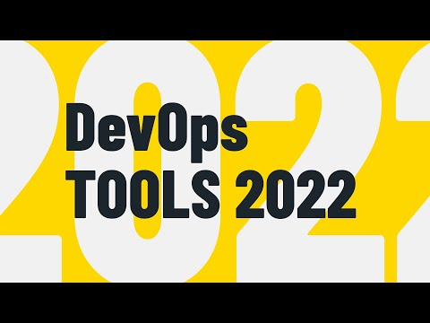

<figure>
  
</figure>

##### Tools, Frameworks, and Platforms in 2022

An outline created from [The Best DevOps Tools, Frameworks, And Platforms In 2022](https://www.youtube.com/watch?v=7wIr6e6b7Ps), by Viktor Farcic at DevOps Toolkit. Subscribe and [support him](https://www.youtube.com/c/DevOpsToolkit/about)!

Category winners have links and more details.

```toc
# This code block gets replaced with the TOC
exclude: Table of Contents
tight: true
ordered: false
from-heading: 2
to-heading: 4
className: "table-of-contents"
```

### Self Service (eg FAAS for local dev)

- convenience wrappers: ketch, shipa
- [Knative](https://knative.dev/docs/): WINNER
  - serverless solutions
- [KubeVela](https://kubevela.io/): WINNER
  - custom resource definitions
  - "Open Application Model", helping shift infrastructure left for developers.

### Managed Containers

- fly.io: simple, limited
- [GCR (Google Cloud Run)](https://cloud.google.com/run): WINNER
  - managed serverless workloads
  - based on Knative
- ACI (Azure Container Images): not so good
- ACA (Azure Container Apps): new, good!
- AWS Lightsail
- AWS ECS: fargate/no fargate. Deprecate. Kubernetes competition
- AWS Lambda: can now use containers

### Infrastructure and Services

- Chef and Puppet deprecated
- Ansible: on prem infrastucture
- Terraform: just works, supported for everybody
- Pulumi: Imperative (vs Declarative)
- eksctl.io: good but limited to kub clusters, only works aws eks
- [Crossplane](https://crossplane.io/): WINNER
  - new
  - Works on entire CNCF ecosystem
  - Drift detection
  - Works with various GitOps tools like: Argo CD, flux, Rancher Fleet
  - Supports all cloud K8s services

### GitOps

- [Flux](https://fluxcd.io/): WINNER
  - they invented GitOps.
- [Argo CD](https://argoproj.github.io/cd/): WINNER
  - open source.
- Rancher Fleet: new, designed to run at scale.

### Progressive Delivery

- Argo Rollouts: works well with ArgoCD
- Flagger: works well with Flux

### Security

- snyk: comprehensive.
- Gatekeeper: powerful, difficult. OPA
- [Kyverno](https://kyverno.io/): WINNER
  - kube native competitor with Gatekeeper.
  - Policy mgt.
- [Kubescape](https://github.com/armosec/kubescape): WINNER
  - new, great promise
  - Scans multi-cloud
  - Combines in one "pane of glass".

### Development

### CI/CD Pipelines

- Jenkins: Jenkins X?
- Circle CI: outlived Travis
- CodeFresh: new. Good for Argo workflows as a service
- [Argo Workflows](https://argoproj.github.io/argo-workflows/) + [Argo Events](https://argoproj.github.io/events/): WINNER
  - not user friendly yet
  - But best Kube native pipeline
- Tekton: like ArgoWF, less friendly than ArgoWF
- [GitHub Actions](https://github.com/features/actions): WINNER
  - so easy but not kube native
- DevTron: opinionated tools. Good but new and rough.

### Logging, Monitoring, Visualization And Troubleshooting

- Logging

  - [Grafana Loki](https://grafana.com/oss/loki/): WINNER
    - self hosted option

- Monitoring

  - [Prometheus](https://prometheus.io/): WINNER

- Visualization

  - [Grafana Dashboards](https://grafana.com/grafana/dashboards/): WINNER

- Troubleshooting
  - [Troubleshoot](https://troubleshoot.sh/): WINNER
    - troubleshoot as service to other companies/teams
    - kubectl plugin
  - [Komodor](https://komodor.com/): WINNER
    - k8s native troubleshooting
    - troubleshoot clusters you own. Gives much context.
    - tracks changes, "ripples" across stack.

### Kubernetes Dashboards

- [K9s](https://k9scli.io/): WINNER

  - works in terminal like VIM

- Kubeapps: collection of Helm charts

- Kubesphere: opinionated

- K8slens: polished

- Octant: dont use

- [Rancher Kubernetes Dashboard](https://rancher.com/docs/k3s/latest/en/installation/kube-dashboard/): WINNER
  - was dont use 2021, but better now
  - Multi clusters
  - Web UI

### Containers: always run in K8s, never Docker

- Docker: deprecated. bloated. no compose, no swarm. no K8s.
- BuildX: demon, ok for local. Already integrated with Docker. No good for pipeline because is demon.
- [Kaniko](https://github.com/GoogleContainerTools/kaniko): WINNER for prod
  - remote builds
  - "One shot" execution, no demon
- [Shipwright](https://github.com/shipwright-io/build): WINNER for prod, using Kaniko
  - CDF member
  - Engine wrapper
  - Engine agnostic (use Kaniko)
- [NerdCTL](https://github.com/containerd/nerdctl): WINNER local builds
  - From ContainerD
  - Not for production, good for laptop

### Kubernetes

#### Managed Clusters (as a service)

##### Big Vendors

- Amazon EKS: lags others
- AWS Fargate: strange beast
- Azure AKS: good but flaky
- [GKE (Google Kube Engine)](https://cloud.google.com/kubernetes-engine): WINNER
  - always ahead
  - Autopilot: fulllly managed GKE, expensive

##### Small Vendors

- Linode LKE: not HA. Cheap.
- Digital Ocean DOKs: not HA. Cheap.
- [Civo](https://www.civo.com/): WINNER
  - Not HA
  - Cheap
  - K3s so best of small guys

#### Self Serve

- OpenShift
- Rancher
