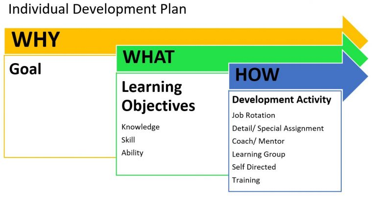
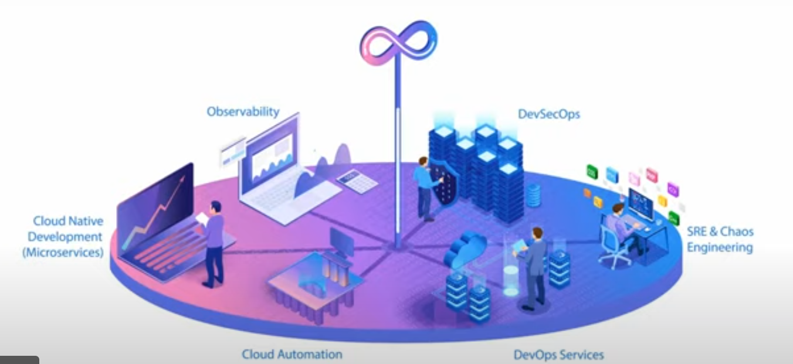

## A Working List of my Goals for 2022 and 2023

Its a bit rambly and meant for my, and my children's, consumption. I'm sharing it here for those who stumble across it.

[Languages/Libraries/Frameworks](#libs), [Demo Projects](#projects), [Learn From Companies](#companies), [Certs/Classes](#training)

### Strategic Goals

1. Become a SynBio DevOps Specialist

I believe that Synthetic Biology can solve many major problems from climate change to starvation, pollution, disease and aging. What could be more exciting and meaningful work?

The core sciences and technologies for a SynBio revolution are in place, and getting rapidly better. Now the world needs to execute, with speed, at scale. Rapid advances depends on automation, hence SynBio DevOps.

2. Prepare For Cloud Bio Labs

- Cloud Bio Labs: Like AWS, but for Bio.
- LabOps (working title), inspired by DevOps CI/CD, will replace manual lab processes which are historically based on prose instructions and unwritten institutional knowledge. LabOps replaces it with version controlled code executed by software and robots. It will do for experiments what Juypter notebooks did for data science: add reproducibility and the ability to rapidly iterate. An epidemic of unreproducibility has been making the news in recent years and this is the cure. Version control also lets multiple people work on the same code project.

- Lab Projects as Code: version control, CloudFormation/Terraform for biology experiments and processes.
- Self serve API's, SDK's and Console web apps are needed just like for digital clouds.
- Command, control, and monitoring for lab robots, sensors (IOT)

3. Prepare for Digital Cloud Arbitrage

- Minimize the digital component of expenses by automatically moving work between cloud vendors. **Digital cloud will become a commodity much sooner than bio clouds will.**
- Breaking vendor lock requires using open standards.
  - Migrate all digital infrastructure to open standards like Kubernetes, various Apache libs

### Languages, Libraries, Frameworks 

- Python: I need to bulk up my Python. I used it in classes that I took and on one production project, but I need more. Django.

- AWS: all of the companies I have researched are using AWS. I have all the associate level certs. I want to work somewhere where I get more hands on experience. Hands on knowledge is the ultimate goal, but it also lets me take the Pro certs. ECR, SQS

- Kubernetes: Key to breaking vendor lock and becoming "multi cloud". I have certs lined up. I'll probably pick up more GoLang, because Kubernetes is written in Go. [Prometheus](https://prometheus.io/).

- Microservice Security: Okta federated auth, securing an AWS Lambda API. Swagger.

- Data Streaming, Transform and Monitoring: Spark, Kafka, Graphana, Airflow

- ML: TensorFlow/Keras, PyTorch, Apache Airflow?

- Data Science: Jupyter, matplotlib

- DevOps: Terraform, Ansible, Travis CI

- Scala, Quarkus, Typescript, TS testing

### Demos and Projects 

Projects to get a job:

- Python College Finder Web App

  - Build from CloudFormation
  - Python college scraper on Lambda
  - Initiate from CloudEvents
  - Drop csv results in S3
  - CloudEvent auto loads file into DynamoDB
  - Monitors lifecycle with CloudWatch. Messages stages with Events, SMS.
  - City, College, Majors info in Postgres on RDS, some seed data
  - Federated GraphQL endpoint on Lambda (DynamoDB, PostGres)
  - CRUDs for City/College DB data
  - Frontend: React, Okta protects forms
  - Search form
    - Search by combo of name, majors, rankings, city
    - Also show results in Google Maps Widget (like Google Maps search)
    - Search by geo using Google Maps API

- Java 17 Web App

  - Docker with Quarkus
  - Spring Boot REST API
  - Maven
  - JUnit, Mockito
  - Jenkins
  - Frontend: ?

- Django Web App
  - on Docker, image in ECR
  - Some sorta DB (Redis?)
  - Spin up with EKS
  - React
  - Python based CRUDS

Projects to support long term strategy:

- An MLOps demo

  - AWS Sagemaker or GCP MLOps, Apache Airflow?
  - data ingestion and prep
  - train
  - publish
  - use?

- Jupyter: set up and version control

### Learn From Existing Companies/Orgs 

- SynBio Companies: I made a list of companies that I'm following, and their tech stacks in [this blog entry](/synbio-company-tech-stacks).
- Digital Cloud Companies: I will continue to watch AWS, GCP and Azure.
- Orgs: [CNCF](https://www.cncf.io/) (cloud native computing foundation)

### Certs and Classes 

If I were starting out again, I'd get a Masters in a biology field, add a big dose of software engineering, and enter a startup ASAP. I've guided my twin 18 year olds to do just that.

Couldah, shouldah, wouldah. In this reality, I've already got the software engineering part, so I'm coming at SynBio DevOps from the opposite direction.

I don't have time for a biology degree. The best realistic thing I can do is take online courses as time permits. I believe that someday soon, cloud bio labs and virtual lab simulators will remove the need for in person labs, opening the field up to people around the world. There is already progress in that area.

[List](/professional-certs-classes) of certificates I've earned and classes I've taken.

<a href="/glossary-biology-biotech#training">List</a>() of courses and classes in my biotech glossary.

I will be very busy with more certs this year. Certs show you've committed time and resources even if you have not done the work professionally _yet_.

Demo projects are the best proof of deep knowledge. However you can make a functional demo and still not know about entire _other ways_ to solve a problem with the same tech. Its a random walk in the forest of possible solution tutorials.

I just got the 3 core AWS Associate certs. I probably won't get the ones below until I get a job using AWS:

- AWS Security
- AWS Networking
- AWS DevOps Professional
- AWS Cloud Architect Proffesional

I have to get these because I've already paid for them. I got a good deal by attending KubeCon online. The options expire by the end of 2022:

- CNCF KCNA (Kubernetes Cloud Native Associate). Its a new entry level cert.
- CNCF CKA (Certified Kubernetes Administrator )
- CNCF CKAD (Certified Kubernetes Developer)

"Now, let me get some action from the back section.": Beastie Boys

### Other

- A company that would be a good fit for me is hiring but they use C# and ASP.NET For their REST. I really like the modern, post-Ballmer, Microsoft, and I've heard .NET core is good stuff. But I've avoided trying to learn yet another tech stack. I'm tempted to do a quick demo just so I can apply to this one job. I used classic ASPs the day they came out, in my first job, near my first day. They worked fine until JSPs came out, which were a huge improvement over _classic_ ASPs, so I left the stack. Torn.
- Move my NPM package publishing GitHub Actions.
