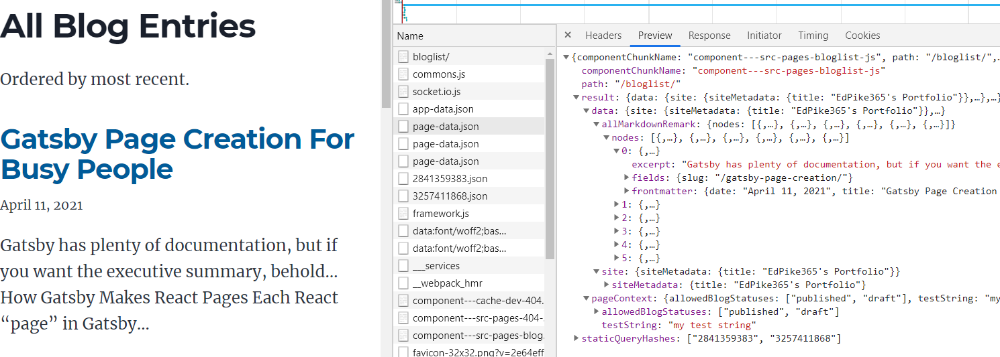
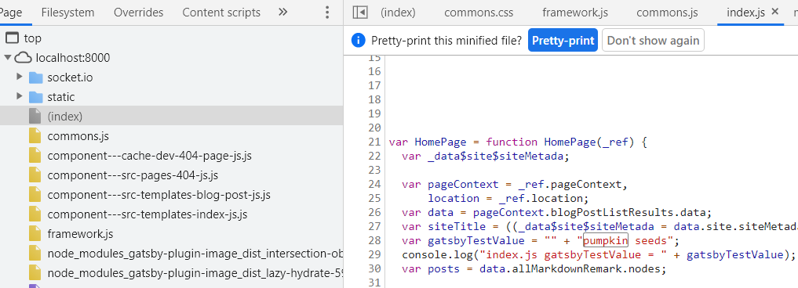
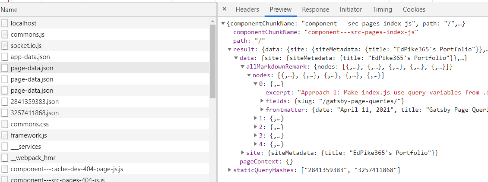

#### Learn GatsbyJS Page Queries with environment variables while Implementing an Markdown Publising Workflow

The core issue we'll cover is using variables with page queries for pages in the `src\pages` folder. This is apparently a common problem ([example](https://github.com/gatsbyjs/gatsby/issues/10023)). I definitely struggled with it before I got it working. 

### The Markdown Publishing Workflow:
My blog uses the Gatsby Starter Blog, which loads blog articles from Markdown (MD) files. It lists and loads *ALL* the blog articles whether you are done writing them or not. 

I want a standard publising workflow: articles will be shown on the web site based on their "status". Status can be "draft", "published" or "archived". 

I want "published" *and* "draft" articles to be published when I'm in "gatsby develop" mode. I can then see what draft articles will look like as I edit/save them. 

When I run 'gatsby build; gatsby serve', I want to only show articles that have status = "published". That is best accomplished using *environment variables*. 

### Frontmatter Status Field

To add a publishing workflow, first I add a `status` field to the [frontmatter](https://www.gatsbyjs.com/docs/how-to/routing/adding-markdown-pages/#frontmatter-for-metadata-in-markdown-files) of each article, at the top of the index.md file.

```js
// Front Matter on a blog md files, status field added
---
title: "Gatsby Page Queries with Environment Variables"
date: "2021-04-11T22:12:03.284Z"
status: published
author: EdPike365
---
```

The queries below will be reading the status field value.

### Using Environment Variables in Gatsby

I'm using the node "environment variable" approach. Gatsby apparently ships with node env vars, you just have to "activate" it. To activate env vars, include this code at the top of `gatsby-config.js` or `gatsby-node.js`. 

```js
// At top of gatsby-config.js
require('dotenv').config({
  path: `.env.${process.env.NODE_ENV}`,
})
```

Now, Gatsby will be looking for 2 files in the site's root folder: 
  - NOTE: any changes to your .env files requires a restart.
  - .env.development : it's values are loaded when you run "gatsby develop"
  - .env.production : it's values are loaded when you run "gatsby build"

```js
// in project root .env.development
# Format is "abc,xyz"
BLOG_STATUSES_TO_SHOW_LIST="published,draft"
```

```js
// in project root .env.production
# Format is "abc,xyz"
BLOG_STATUSES_TO_SHOW_LIST="published"
```

> NOTE: .env files should be *ignored* in your local git. These files typically end up holding __secrets__, like api keys, that should not be in your git repo. Gatsby adds `.env.*` to your .gitignore file automatically. To make env vars available in you hosting environment, they will need to be added there. Options vary by hosting service, like Netlify or Gatsby Cloud.


### Getting Environment Variables into our Code

The variables that we are going to use in our queries can be declared locally or pulled in from Environment Variables (env vars). I'm focusing on env vars. 

We do not need to require dotenv because it was already done in gatsby-config.js, above.
We will use arBlogStatusesToShow to create individual blog pages and lists of blog summaries

```js
// Near top of gatsby-node.js

// CLEAN CODE: 1 operation per line, aids debugging
const strBlogStatusesToShow = process.env.BLOG_STATUSES_TO_SHOW_LIST;

// Change the comma seperated list to an array
const arBlogStatusesToShow = strBlogStatusesToShow.split(",");
console.info("gatsby-node.js: arBlogStatusesToShow = " + arBlogStatusesToShow )

```

### Gatsby graphQL Summary

After getting my code to work, this is my understanding of graphQL variables in Gatsby. There are two major categories:

1. __Static Queries__ (aka "Component Queries") Only run once. No variables allowed. I'm not using any in my workflow.
2. __Page Queries__ (aka "Normal Queries"). These come in two flavors:
    - Page Queries at the bottom of pages in the `src\pages` folder. Gatsby runs `createPage()` on these automatically. __You cannot pass variables directly to these queries during the auto build.__
    - Page Queries executed in `gatsby-node.js`. This can create pages from:
      - Using `src\template` files with the `createPage()` action.
      - Deleting a `src\pages` page using `deletePage()`, then __recreating__ it with `createPage()`. __This is the only way to pass variables, including env vars, to a page in `src\pages`__. 

### Using src\templates Files

This approach is well documented in the [Gatsby Starter Blog](https://www.gatsbyjs.com/starters/gatsbyjs/gatsby-starter-blog). Below, we create an individual page for each blog post using a template file. My workflow modification requires filtering on the status field with a *list* of allowed statuses to show. 

Note the filter code at line 10. I have to use `JSON.stringify(arBlogStatusesToShow)` to have the js array formatted correctly in the query.

```js{numberLines: true}
// Define a template for blog post
const blogPost = path.resolve(`./src/templates/blog-post.js`)

// Get all markdown blog posts sorted by date
const blogPostResults = await graphql(
  `
    {
      allMarkdownRemark(
        sort: { fields: [frontmatter___date], order: ASC }
        filter: {frontmatter: {status: {in: ` + JSON.stringify(arBlogStatusesToShow) + ` }}}
        limit: 1000
      ) {
        nodes {
          ...rest of query `

const posts = blogPostResults.data.allMarkdownRemark.nodes

// Create blog posts pages
// But only if there's at least one markdown file found at "content/blog" (defined in gatsby-config.js)
// `context` is available in the template as a prop and as a variable in GraphQL

console.log("gnode.js: got num posts = " + posts.length)
if (posts.length > 0) {
  // loop over posts
  posts.forEach((post, index) => {
    const previousPostId = index === 0 ? null : posts[index - 1].id
    const nextPostId = index === posts.length - 1 ? null : posts[index + 1].id

    // context variables are automatically mapped
    // to any page query vars in blogPost
    // IF they have the same name
    createPage({
      path: post.fields.slug,
      component: blogPost,
      context: {
        id: post.id,
        previousPostId,
        nextPostId,
      },
    })
  })
}
}

```
Note the use of graphQL query variables. They have the same name as the values in the `context` object that was passed in:

```js
export const pageQuery = graphql`
  query BlogPostBySlug(
    $id: String!
    $previousPostId: String
    $nextPostId: String
  ) {
    site {
      siteMetadata {
        title
      }
    }
    markdownRemark(
        id: { eq: $id }
        ... rest of query
```

### Using src\pages Files, Passing Variables to the Page Query

This is the code at the bottom of my page in `src\pages\bloglist.js`. When it is automatically run during build, it will not return any blog posts because allowedBlogStatuses var will be "undefined":

```js
// from bottom of src\pages\bloglist.js
export const pageQuery = graphql`
  query AboutPageQuery($allowedBlogStatuses: [String]){
    site {
      siteMetadata {
        title
      }
    }
    allMarkdownRemark(
      filter: {frontmatter: {status: { in: $allowedBlogStatuses  }}}
      sort: { fields: [frontmatter___date], order: DESC }) {
      nodes {
        excerpt
```

This is the code to delete then recreate the page and pass in the array of allowed statuses as a variable. 
- Notes:
  - I did not have to `JSON.stringify()` the array.
  - The variable name used by the `src\pages\bloglist.js` page is `allowedBlogStatuses`, as shown in the query above. Below, I pass in the context variable with that name.
  - All of the context variables will be available in the `page-data.json` file in the web browser (see below).

```js
// From gatsby-node.js section
// Whenever a page is created by any method, it emits onCreatePage
exports.onCreatePage = ({ page, actions }) => {
  const { createPage, deletePage } = actions
  // only do this for the bloglist page
  if(page.path == "/bloglist/"){
    deletePage(page)
    createPage({
      ...page,
      context: {
        ...page.context,
        allowedBlogStatuses: arBlogStatusesToShow,
        testString: "my test string" // an example arbitrary context variable
      },
    })
  }
}
```

This shows what is actually delivered to your web page at run time via `page-data.json` for `/bloglist/`. It only contains the blog posts that you want. It also includes the `testString` value. (click to enlarge):



### Using src\templates Files, Passing Query Results (record set)

In this approach, my home page is in `src\templates\index.js`. There is no graphQL query *on the page*. Instead, I'm running the query in `gatsby-node.js` and passing in the entire result set via the `context` object.

```js
exports.createPages = async ({ graphql, actions, reporter }) => {
  const { createPage } = actions

  // Define a template for index
  const indexPage = path.resolve(`./src/templates/index.js`)

  const blogPostListResults = await graphql(
    `
    query IndexPageQuery{
      site {
        siteMetadata {
          title
        }
      }
      allMarkdownRemark(
        filter: {frontmatter: {status: { in: ` + JSON.stringify(arBlogStatusesToShow) + `  }}}
        sort: { fields: [frontmatter___date], order: DESC }) {
        nodes {
          excerpt
          fields {
            slug
          }
          frontmatter {
            date(formatString: "MMMM DD, YYYY")
          ... rest of query
    `
  )

  createPage({
    path: "/",
    component: indexPage,
    context: {
      blogPostListResults,
    },
  })
... create other pages...
```

The `path: "/"` arg will cause the template to become the home page of __www.edpike365.com/__

```js
// From top of src/templates/index.js

// Note we are not dereferencing the data object, it will be empty
// we are using pageContext instead
const HomePage = ({pageContext, location }) => {
  
  // deref data here and we can code as if we had a data object like a normal page
  const data = pageContext.blogPostListResults.data;

  const siteTitle = data.site.siteMetadata?.title || `Title`
    
  const posts = data.allMarkdownRemark.nodes

  if (posts.length === 0) {
    return (
      <Layout location={location} title={siteTitle}>
      ...
```

### Appendix A: Magic `GATSBY_` Environment Variables
Env vars named with `GATSBY_` at the beginning will be available to your server side NodeJS code (gatsby-config.js, gatsby-node.js and any code they import). 

`GATSBY_` env var values are also injected into your page or template JSX wherever you refer to them, before the *page* is sent to the web browser. __They do NOT appear as variables in the page-data.json file__. 

This is a screenshot from Chrome dev tools. Note the line with `var gatsbyTestValue`


**MAJOR GOTCHA**: if your page is in `src\pages`, `GATSBY_` evn vars are NOT available to the "in-page" queries. 

### Appendix B: Using Queries to Filter Results In Client JSX: (Works but flawed)
I thought it was worth noting something that I learned along the way. Thankfully, I caught it before I shipped this version of my publishing work flow.

In this approach, the query on `index.js` page query has no filter. You will get them all of the blog entries, regardless of status, in the page's "data" object. Then they are filtered based on the global `GATSBY_BLOG_STATUS` env var (detailed above). 

Add it to your `.env.development` file. Don't forgot to restart Gatsby:
```js
// in project root .env.development
# Format is "abc,xyz"
BLOG_STATUSES_TO_SHOW_LIST="published,draft"
GATSBY_BLOG_STATUS="published"
```

```js
  // From the top of index.js
  const allowedBlogStatus = `${process.env.GATSBY_BLOG_STATUS}`; 
  console.log("index.js allowedBlogStatus = " + allowedBlogStatus);

  function shouldShowPost(post){
    const status = post.frontmatter.status;
    if (status && allowedBlogStatus.includes(status)) {
      return true;
    } else {
      return false;
    }
  }

  const posts = data.allMarkdownRemark.nodes.filter(shouldShowPost)
  
```

This seems to work; it only shows the summaries of the "published" blog posts. However, it has a scalability problem that you can see in the image below:



As you can see in the "Network>Preview" tab, `result.data.allMarkdownRemark.nodes` contains blog entry summaries. Unfortunately, it contains __*all*__ blog articles, *regardless of status*. That means the summaries of all of my blog entries are shipped over the network every time the site loads. As my blog grows, this will become a serious problem.

## I hope this helped!