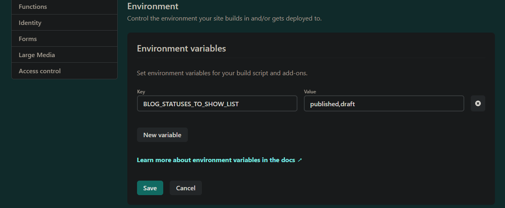

### Learn Page Queries while implementing a Markdown Publishing Workflow


The core issue we'll cover is using environment variables with page queries for pages in the `src\pages` folder. This is apparently a common problem ([example](https://github.com/gatsbyjs/gatsby/issues/10023)). I definitely struggled with it before I got it working. We'll also cover page queries, variables and the `createPage` action.

### The Markdown Publishing Workflow:

My blog uses the [Gatsby Starter Blog](https://www.gatsbyjs.com/starters/gatsbyjs/gatsby-starter-blog), which loads blog articles from Markdown (MD) files. It lists and loads _ALL_ the blog articles whether you are done writing them or not.

I want a standard publishing workflow: articles will be shown on the web site based on their "status". Status can be "draft", "published" or "archived".

I want "published" _and_ "draft" articles to be published when I'm in "gatsby develop" mode. I can then see what draft articles will look like as I edit/save them.

When I run `gatsby build; gatsby serve`, I want to only show articles that have status = "published". That is best accomplished using _environment variables (env vars)_. Env vars are most useful when you want to store information that changes (aka a variable) based on which mode (dev vs prod) or which location (China vs USA) you are publishing into.

### Frontmatter Status Field

To add a publishing workflow, first I add a `status` field to the [frontmatter](https://www.gatsbyjs.com/docs/how-to/routing/adding-markdown-pages/#frontmatter-for-metadata-in-markdown-files) of each article, at the top of the index.md file.

```js
// Front Matter on a blog md file, status field added
---
title: "Gatsby Page Queries with Environment Variables"
date: "2021-04-11T22:12:03.284Z"
status: published
author: EdPike365
---
```

The queries below will be reading the `status` field value.

### Using Environment Variables in Gatsby

I'm using environment variables in node and the most popular package for that is [dotenv](https://www.npmjs.com/package/dotenv). Gatsby ships with `dotenv`. To use env vars, include this code at the top of `gatsby-config.js` or `gatsby-node.js`.

```js
// At top of gatsby-config.js
require("dotenv").config({
  path: `.env.${process.env.NODE_ENV}`,
})
```

Now, Gatsby will be looking for 2 files in the site's root folder:

- `.env.development` : it's values are loaded when you run `gatsby develop`
- `.env.production` : it's values are loaded when you run `gatsby build`

NOTE: any changes to your .env files requires a restart.

```js
// in project root .env.development
# Format is "abc,xyz"
BLOG_STATUSES_TO_SHOW_LIST="published,draft"
```

```js
// in project root .env.production
# Format is "abc,xyz"
BLOG_STATUSES_TO_SHOW_LIST="published"
```

> NOTE: .env files should be _ignored_ in your local git. These files typically end up holding **secrets**, like api keys, that should not be in your git repo. Gatsby adds `.env.*` to your .gitignore file automatically. That means the .env files won't be in you git repo for your publishing service, like [Netlify](https://docs.netlify.com/configure-builds/environment-variables/) or [Gatsby Cloud](https://support.gatsbyjs.com/hc/en-us/articles/360053096753-Managing-Environment-Variables), to read. To make env vars available to your publishing service, you will need to copy them to the publishing service. Environment variable options settings vary by publishing service.

### Getting Environment Variables into our Code

We will use the variable `arBlogStatusesToShow` to filter all the blog posts down to the ones we want to show. We will populate `arBlogStatusesToShow` based on the env var `BLOG_STATUSES_TO_SHOW_LIST`. I added "\_LIST" there to make sure that anybody using the variable knows that it is a list of strings, not an array. (I had an array, but the Netlify env var settings form would not load it properly.)

> From years of experience, I recommend using very descriptive variable and function names. Most of your code will be edited by other people in the future or by you long after you've forgotten what's going on. Almost no one reads docs or the docs will be inaccurate. The code is the base source of truth and if its verbose and "prose like", programmers will [grok](https://en.wikipedia.org/wiki/Grok) it much quicker.

My workflow requires filtering on the status field with a list of allowed statuses. Hence we convert `BLOG_STATUSES_TO_SHOW_LIST = "published,draft"` to a JavaScript array on line 7 below.

```js{numberLines: true}
// Near top of gatsby-node.js

// CLEAN CODE: 1 operation per line, aids debugging
const strBlogStatusesToShow = process.env.BLOG_STATUSES_TO_SHOW_LIST;

// Load the comma seperated list into an array
const arBlogStatusesToShow = strBlogStatusesToShow.split(",");
console.info("gatsby-node.js: arBlogStatusesToShow = " + arBlogStatusesToShow )

```

## Gatsby GraphQL Summary

After getting my code to work, this is my understanding of graphQL variables in Gatsby. **There are two major categories**:

1. **Static Queries** (aka "Component Queries") Only run once. No variables allowed. I'm not using any in my workflow code.
2. **Page Queries** (aka "Normal Queries"). These come in **two flavors**:

   - Page Queries at the bottom of pages in the `src\pages` folder. Gatsby runs `createPage()` on these automatically. **You cannot pass variables directly to these queries during the auto build.**

   - Page Queries executed in `gatsby-node.js`.

Page Queries in `gatsby-node.js` can create pages from 2 sources:

1. Using `src\template` files with the `createPage()` action.
2. Deleting a `src\pages` page result using `deletePage()`, then **recreating** it with `createPage()`. **This is the only way to pass variables, including env vars, to a page in `src\pages`**.

## Option 1: Using src\templates Files

This approach is well documented in the [Gatsby Starter Blog](https://www.gatsbyjs.com/starters/gatsbyjs/gatsby-starter-blog). Below, we create an individual page for each blog post using a template file.

Note the filter code at line 11. I have to use `JSON.stringify(arBlogStatusesToShow)` to have the JavaScript array formatted correctly in the query.

```js{numberLines: true}
// In gatsby-node.js
// Define a template for blog post
const blogPost = path.resolve(`./src/templates/blog-post.js`)

// Get all markdown blog posts sorted by date
const blogPostResults = await graphql(
  `
    {
      allMarkdownRemark(
        sort: { fields: [frontmatter___date], order: ASC }
        filter: {frontmatter: {status: {in: ` + JSON.stringify(arBlogStatusesToShow) + ` }}}
        limit: 1000
      ) {
        nodes {
          ...rest of query `

const posts = blogPostResults.data.allMarkdownRemark.nodes

// Create blog posts pages
// But only if there's at least one markdown file found at "content/blog" (defined in gatsby-config.js)
// `context` is available in the template as a prop and as a variable in GraphQL

console.log("gnode.js: got num posts = " + posts.length)
if (posts.length > 0) {
  // loop over posts
  posts.forEach((post, index) => {
    const previousPostId = index === 0 ? null : posts[index - 1].id
    const nextPostId = index === posts.length - 1 ? null : posts[index + 1].id

    // context variables are automatically mapped
    // to any page query vars in blogPost
    // IF they have the same name
    createPage({
      path: post.fields.slug,
      component: blogPost,
      context: {
        id: post.id,
        previousPostId,
        nextPostId,
      },
    })
  })
}
}

```

Note the use of GraphQL query variables in lines 4-6 below. They have the same names as the values in the `context` object that was passed in above. **This is mandatory if you want the values passed in to the query.**

```js{numberLines: true}
// This is the page query at the bottom of src/templates/blog-post.js
export const pageQuery = graphql`
  query BlogPostBySlug(
    $id: String!
    $previousPostId: String
    $nextPostId: String
  ) {
    site {
      siteMetadata {
        title
      }
    }
    markdownRemark(
        id: { eq: $id }
        ... rest of query
```

## Option 2: Using src\pages Files: Delete Then Recreate

I added the page `src\pages\bloglist.js` to demonstrate one way to pass variables to a page query.

Because its in the `pages` folder, the query on the page will run automatically during build. At that time, it will not return any blog posts because `allowedBlogStatuses` var will be "undefined".

> **It's crucial to understand that the pages folder automatic query parsing, and attempted running, happens with no access to passed in variables. I wasted a lot of time looking for how to do it because I just could not believe it was not doable.**

```js
// from bottom of src\pages\bloglist.js
export const pageQuery = graphql`
  query AboutPageQuery($allowedBlogStatuses: [String]){
    site {
      siteMetadata {
        title
      }
    }
    allMarkdownRemark(
      filter: {frontmatter: {status: { in: $allowedBlogStatuses  }}}
      sort: { fields: [frontmatter___date], order: DESC }) {
      nodes {
        excerpt
```

Next, in the code below, we delete then recreate the "processed" page and pass in the array of allowed statuses as a variable.

- Notes:
  - Using this method, I did NOT have to `JSON.stringify()` the array. Apparently Gatsby automatically does that for you when you use the `context` object.
  - The variable name used above by the `src\pages\bloglist.js` page is `allowedBlogStatuses`. The one we pass in is `arBlogStatusesToShow`. This is fine as long as the variable name on the left side of the `context` object matches the variable name in the page query. The name on the right side is arbitrary, but by convention, it is the same. When the left and right side of the context variable are the same, you can simply state the name of the query variable, with no value assigned.
  - Pay special attention to the `exports.onCreatePage` below, line 3.

```js{numberLines: true}
// From gatsby-node.js section
// Whenever a page is created by any method, it emits onCreatePage
exports.onCreatePage = ({ page, actions }) => {
  const { createPage, deletePage } = actions
  // only do this for the bloglist page
  if(page.path == "/bloglist/"){
    deletePage(page)
    createPage({
      ...page,
      context: {
        ...page.context,
        allowedBlogStatuses: arBlogStatusesToShow,
        testString: "my test string" // an example arbitrary context variable
      },
    })
  }
}
```

The image below is from Chrome dev tools. It shows what is actually delivered to your web page at run time via `page-data.json` for `/bloglist/`. It only contains the blog posts that you want. It also includes the `testString` value. (click to enlarge):


> GOTCHA: Any time you use the `createPage()` function from `gatsby-node.js`, you will no longer get automatic incremental builds. If you want to see changes, you have to restart Gatsby. From [Gatsby Page Creation Docs](https://www.gatsbyjs.com/docs/creating-and-modifying-pages/#trade-offs-of-querying-for-all-fields-in-the-context-object-of-gatsby-nodejs)

## Option 3: Using src\templates Files, Passing Query Results

In this approach, I moved my home page from `src\pages\index.js` to `src\templates\index.js` to show you that file location is fairly arbitrary.

**I also removed the GraphQL from the bottom of index.js. There is no GraphQL query on the page.** Instead, I'm writing and running the query entirely in `gatsby-node.js` and passing in the result set, `blogPostListResults` via the `context` object.

```js
// From gatsby-node.js
exports.createPages = async ({ graphql, actions, reporter }) => {
  const { createPage } = actions

  // Define a template for index
  const indexPage = path.resolve(`./src/templates/index.js`)

  const blogPostListResults = await graphql(
    `
    query IndexPageQuery{
      site {
        siteMetadata {
          title
        }
      }
      allMarkdownRemark(
        filter: {frontmatter: {status: { in: ` + JSON.stringify(arBlogStatusesToShow) + `  }}}
        sort: { fields: [frontmatter___date], order: DESC }) {
        nodes {
          excerpt
          fields {
            slug
          }
          frontmatter {
            date(formatString: "MMMM DD, YYYY")
          ... rest of query
    `
  )

  createPage({
    path: "/",
    component: indexPage,
    context: {
      blogPostListResults,
    },
  })
... create other pages...
```

The `path: "/"` arg will cause the template to become the home page of [**www.edpike365.com/**](https://www.edpike365.com/).

The code below does not use the `data` object. It will be empty. The `pageContext.blogPostListResults` object will contain a data object that contains all the info that the information that `data` normally contains.

```js
// From top of src/templates/index.js

// Note we are NOT dereferencing the data object, it will be empty.
// We are using pageContext instead
const HomePage = ({pageContext, location }) => {

  // deref data here and we can code as if we had a data object like a normal page
  const data = pageContext.blogPostListResults.data;

  const siteTitle = data.site.siteMetadata?.title || `Title`

  const posts = data.allMarkdownRemark.nodes

  if (posts.length === 0) {
    return (
      <Layout location={location} title={siteTitle}>
      ...
```

### Appendix A: Magic `GATSBY_` Environment Variables

Env vars named with `GATSBY_` at the beginning will be available to your server side NodeJS code just like any env var (gatsby-config.js, gatsby-node.js and any code they import).

`GATSBY_` env var values are **also** injected into your page or template JSX wherever you refer to them, **before** the _page_ is sent to the web browser. **They do NOT appear as variables in the page-data.json file**.

Declare `GATSBY_XYZ` in an .env file:

```js
// From .env.development
# Format is "abc,xyz"
BLOG_STATUSES_TO_SHOW_LIST="published"
GATSBY_MAGIC_VAR="pumpkin pie"
```

Use in your page JSX (line 7):

```js{numberLines: true}
const HomePage = ({pageContext, location }) => {

  const data = pageContext.blogPostListResults.data;

  const siteTitle = data.site.siteMetadata?.title || `Title`

  const gatsbyTestValue = process.env.GATSBY_MAGIC_VAR;
  console.log("index.js gatsbyTestValue = " + gatsbyTestValue);

  const posts = data.allMarkdownRemark.nodes
```

The value is injected into the source code. This is a screenshot from Chrome dev tools. Note line 28 with var `gatsbyTestValue`.


> **MAJOR GOTCHA**: if your page is in `src\pages`, `GATSBY_` env vars are NOT available to the "in-page" queries. I tried to use a GATSBY\_ env var to inject a filter value into the GraphQL query on the page and it would not compile.

### Appendix B: Deploying to Netlify

I'm hosting on Github and Netlify. I'm not using the Gatsby Netlify plugin.

There are two options to store the env vars:

### Option 1: Netlify Config File

Put your env vars in a `netlify.toml` file in the root folder. They will be available in `process.env` just like using `.env` files. However, you MUST have this file in you git repo. This is not preferred because you will need to store secrets at some point.

```
# Example netlify.toml
# Production context: all deploys from the Production branch set in your site’s
# deploy contexts will inherit these settings.
[build.environment]
  # Format is "abc,xyz"
  BLOG_STATUSES_TO_SHOW_LIST="published"
```

### Option 2: Netlify Build Settings

Got to [app.netlify.com/sites/_your_project_name_/settings/deploys](app.netlify.com/sites/_your_project_name_/settings/deploys).

On that page go to **> Build & Deploy > Environment > Edit Settings** button

> _GOTCHA: Do not put the "Values" in quotation marks. They will be added for you when you refer to the process.env var. I use an array, so it looks like this:_



## Appendix C: Using Queries to Filter Results In Client JSX:

I thought it was worth noting something that I learned along the way. Thankfully, I caught it before I shipped this version of my publishing work flow.

In this approach, the query on `src\pages\index.js` page query has no filter. You will get all of the blog entries, in the page's "data" object, regardless of the `status`. Then I filter them based on the magic `GATSBY_BLOG_STATUS` env var (detailed above).

Add `GATSBY_BLOG_STATUS` to your `.env.development` file. Don't forgot to restart Gatsby:

```js
// in project root .env.development
# Format is "abc,xyz"
BLOG_STATUSES_TO_SHOW_LIST="published,draft"
GATSBY_BLOG_STATUS="published,draft"
```

Then filter the nodes with a filter function:

```js
// From the top of index.js
const allowedBlogStatus = `${process.env.GATSBY_BLOG_STATUS}`
console.log("index.js allowedBlogStatus = " + allowedBlogStatus)

function shouldShowPost(post) {
  const status = post.frontmatter.status
  if (status && allowedBlogStatus.includes(status)) {
    return true
  } else {
    return false
  }
}

const posts = data.allMarkdownRemark.nodes.filter(shouldShowPost)
```

This seems to work; it only shows the summaries of the "published" and "draft" blog posts when you look at the web page. However, it has a scalability problem that you can see in the `page-data.json` below:


As you can see in the Chrome dev tools "Network>Preview" tab, `result.data.allMarkdownRemark.nodes` contains blog entry summaries. Unfortunately, it contains **_all_** blog articles, **_regardless of status_**. So even my "archived" blog post will be there.

The summaries of **all** of my blog entries are shipped over the network every time the site loads ([PWA](https://web.dev/storage-for-the-web/) storage not withstanding). As my blog grows, this will become a serious problem.

On the other hand, if I want to be able to filter during run time, I have them all available. I could even add them all to a Redux store.

## Well, that is all. I hope this helped!
