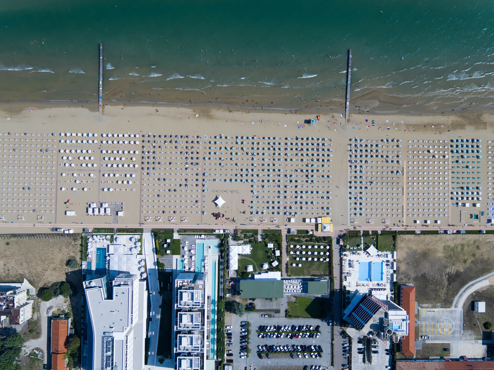

 _Photo by
[Joshua Earle](https://unsplash.com/@joshuaearle) via
[Unsplash](https://unsplash.com/photos/CatpolIjez8)_


**_Note how all headlines below show an anchor link when you hover them?_**\
That's [gatsby-remark-autolink-headers][5] hooking up all `MarkdownRemark` headers
with anchor links for us.

## Markdown in Gatsby

Markdown parsing in Gatsby is done with [gatsby-transformer-remark][1], which
uses the excellent [remark][2] under the hood.\
Alongside remark we also use [gatsby-remark-smartypants][6], which provides smart
punctuation through [retext-smartypants][7].

The examples on this page cover the basic Markdown syntax and are adapted from
[Markdown Here's Cheatsheet][3] ([CC-BY][4]).

---

This is intended as a quick reference and showcase. For more complete info, see
[John Gruber's original spec](https://daringfireball.net/projects/markdown/) and
the
[GitHub-flavored Markdown info page](https://github.github.com/github-flavored-markdown/).

##### Table of Contents

[Headers](#headers) [Emphasis](#emphasis) [Lists](#lists) [Links](#links)
[Images](#images) [Tables](#tables) [Footnotes](#footnotes)
[Blockquotes](#blockquotes) [Inline HTML](#html) [Horizontal Rule](#hr)
[Line Breaks](#lines)

<a name="headers"></a>

## Headers

```no-highlight
# H1
## H2
### H3
#### H4
##### H5
###### H6

Alternatively, for H1 and H2, an underline-ish style:

Alt-H1
======

Alt-H2
------
```

# H1

## H2

### H3

#### H4

##### H5

###### H6

Alternatively, for H1 and H2, an underline-ish style:

# Alt-H1

## Alt-H2

<a name="emphasis"></a>

## Emphasis

```no-highlight
Emphasis, aka italics, with *asterisks* or _underscores_.

Strong emphasis, aka bold, with **asterisks** or __underscores__.

Combined emphasis with **asterisks and _underscores_**.

Strikethrough uses two tildes. ~~Scratch this.~~
```

Emphasis, aka italics, with _asterisks_ or _underscores_.

Strong emphasis, aka bold, with **asterisks** or **underscores**.

Combined emphasis with **asterisks and _underscores_**.

Strikethrough uses two tildes. ~~Scratch this.~~

<a name="lists"></a>

## Lists

In this example, leading and trailing spaces are shown with dots: ⋅

```no-highlight
1. First ordered list item
2. Another item
⋅⋅⋅⋅* Unordered sub-list.
1. Actual numbers don't matter, just that it's a number
⋅⋅⋅⋅1. Ordered sub-list
4. And another item.

⋅⋅⋅You can have properly indented paragraphs within list items. Notice the blank line above, and the leading spaces (at least one, but we'll use three here to also align the raw Markdown).

⋅⋅⋅To have a line break without a paragraph, you will need to use two trailing spaces.⋅⋅
⋅⋅⋅Note that this line is separate, but within the same paragraph.⋅⋅

* Unordered list can use asterisks
- Or minuses
+ Or pluses
```

1.  First ordered list item
2.  Another item
    - Unordered sub-list.
3.  Actual numbers don't matter, just that it's a number
    - This was a "1.", but it did not indent
    - sub 2, I added, does not work with "1.", becomes a "2."
        - sub sub, I added
4.  And another item.

You can have properly indented paragraphs within list items. Notice the blank
line above, and the leading spaces (at least one, but we'll use three here to
also align the raw Markdown).

To have a line break without a paragraph, you will need to use two trailing
spaces.\
 Note that this line is separate, but within the same paragraph.

- Unordered list can use asterisks

* Or minuses

- Or pluses

<a name="links"></a>

## Links

There are two ways to create links.

```no-highlight
[I'm an inline-style link](https://www.google.com)

[I'm an inline-style link with title](https://www.google.com "Google's Homepage")

[I'm a reference-style link][Arbitrary case-insensitive reference text]

[I'm a relative reference to a repository file](../blob/master/LICENSE)

[You can use numbers for reference-style link definitions][1]

Or leave it empty and use the [link text itself].

URLs and URLs in angle brackets will automatically get turned into links.
http://www.example.com or <http://www.example.com> and sometimes
example.com (but not on GitHub, for example).

Some text to show that the reference links can follow later.

[arbitrary case-insensitive reference text]: https://www.mozilla.org
[1]: https://slashdot.org
[link text itself]: https://www.reddit.com
```

[I'm an inline-style link](https://www.google.com)

[I'm an inline-style link with title](https://www.google.com "Google's Homepage")

[I'm a reference-style link][arbitrary case-insensitive reference text]

[I'm a relative reference to a repository file](../blob/master/LICENSE)

[You can use numbers for reference-style link definitions][1]

Or leave it empty and use the [link text itself].

URLs and URLs in angle brackets will automatically get turned into links.
http://www.example.com or <http://www.example.com> and sometimes example.com
(but not on GitHub, for example).

Some text to show that the reference links can follow later.

[arbitrary case-insensitive reference text]: https://www.mozilla.org
[1]: http://slashdot.org
[link text itself]: http://www.reddit.com

<a name="images"></a>

## Images

```no-highlight
Here's our logo (hover to see the title text):

Inline-style:


Reference-style:
![alt text][logo]

[logo]: https://pbs.twimg.com/profile_images/875556871427375106/Xuq8DypK_bigger.jpg "Logo Title Text 2"
```

Here's our logo (hover to see the title text):

Inline-style:


Reference-style: ![alt text][logo]

[logo]: https://upload.wikimedia.org/wikipedia/commons/thumb/0/0c/The_Great_Gatsby_cover_1925.jpg/640px-The_Great_Gatsby_cover_1925.jpg "Logo Title Text 2"

<a name="tables"></a>

## Tables

Tables aren't part of the core Markdown spec, but they are part of our
implementation. They are an easy way of adding tables to your email -- a task
that would otherwise require copy-pasting from another application.

```no-highlight
Colons can be used to align columns.

| Tables        | Are           | Cool  |
| ------------- |:-------------:| -----:|
| col 3 is      | right-aligned | $1600 |
| col 2 is      | centered      |   $12 |
| zebra stripes | are neat      |    $1 |

There must be at least 3 dashes separating each header cell.
The outer pipes (|) are optional, and you don't need to make the
raw Markdown line up prettily. You can also use inline Markdown.

Markdown | Less | Pretty
--- | --- | ---
*Still* | `renders` | **nicely**
1 | 2 | 3
```

Colons can be used to align columns.

| Tables        |      Are      |   Cool |
| ------------- | :-----------: | -----: |
| col 3 is      | right-aligned | \$1600 |
| col 2 is      |   centered    |   \$12 |
| zebra stripes |   are neat    |    \$1 |

There must be at least 3 dashes separating each header cell. The outer pipes (|)
are optional, and you don't need to make the raw Markdown line up prettily. You
can also use inline Markdown.

| Markdown | Less      | Pretty     |
| -------- | --------- | ---------- |
| _Still_  | `renders` | **nicely** |
| 1        | 2         | 3          |

<a name="footnotes"></a>

## Footnotes

Footnotes are also not a core feature of markdown, but they're a common
extension feature. The footnote syntax looks like this:

```markdown
This line has a footnote [^1]. Scroll down or click the link to see it.
```
```markdown
This line has another footnote [^2]. Scroll down or click the link to see it.
```
That renders like this:

This line has a footnote [^1]. Scroll down or click the link to see it.
This line has a second footnote [^2]. Scroll down or click the link to see it.

<a name="blockquotes"></a>

## Blockquotes

```no-highlight
> Blockquotes are very handy in email to emulate reply text.
> This line is part of the same quote.

Quote break.

> This is a very long line that will still be quoted properly when it wraps. Oh boy let's keep writing to make sure this is long enough to actually wrap for everyone. Oh, you can *put* **Markdown** into a blockquote.
```

> Blockquotes are very handy in email to emulate reply text. This line is part
> of the same quote.

Quote break.

> This is a very long line that will still be quoted properly when it wraps. Oh
> boy let's keep writing to make sure this is long enough to actually wrap for
> everyone. Oh, you can _put_ **Markdown** into a blockquote.

<a name="html"></a>

## Inline HTML

You can also use raw HTML in your Markdown, and it'll mostly work pretty well.

```html
<dl>
  <dt>Definition list</dt>
  <dd>Is something people use sometimes.</dd>

  <dt>Markdown in HTML</dt>
  <dd>Does *not* work **very** well. Use HTML <em>tags</em>.</dd>
</dl>
```

<dl>
  <dt>Definition list</dt>
  <dd>Is something people use sometimes.</dd>

  <dt>Markdown in HTML</dt>
  <dd>Does *not* work **very** well. Use HTML <em>tags</em>.</dd>
</dl>

<a name="hr"></a>

## Horizontal Rule

```
Three or more...

---

Hyphens

***

Asterisks

___

Underscores
```

Three or more...

---

Hyphens

---

Asterisks

---

Underscores

<a name="lines"></a>

## Line Breaks

Here are some things to try out:

```
Here's a line for us to start with.

This line is separated from the one above by two newlines, so it will be a *separate paragraph*.

This line is also a separate paragraph, but...
This line is only separated by a single newline, so it's a separate line in the *same paragraph*.
```

Here's a line for us to start with.

This line is separated from the one above by two newlines, so it will be a
_separate paragraph_.

This line is also begins a separate paragraph, but...\
This line is only separated by a single newline, so it's a separate line in the _same
paragraph_.

[^1]: The footnote appears at the bottom of the page
[^2]: The second footnote appears at the bottom of the page

[1]: https://www.gatsbyjs.com/plugins/gatsby-transformer-remark/
[2]: http://remark.js.org/
[3]: https://github.com/adam-p/markdown-here/wiki/Markdown-Cheatsheet
[4]: https://creativecommons.org/licenses/by/3.0/
[5]: https://www.gatsbyjs.com/plugins/gatsby-remark-autolink-headers/
[6]: https://www.gatsbyjs.com/plugins/gatsby-remark-smartypants/
[7]: https://github.com/wooorm/retext-smartypants

---
## Below here is the [Responsive Image and IFrames page](https://using-remark.gatsbyjs.org/responsive-images-and-iframes/) code addition

Note that the foonotes from the first test appear down below anyway.

---

 _Photo by
[Joshua Earle](https://unsplash.com/@joshuaearle) via
[Unsplash](https://unsplash.com/photos/CatpolIjez8)_

[gatsby-remark-images][11] and [gatsby-remark-responsive-iframe][22] are here to
take care of all your basic Markdown image and iframe issues.

## Images

[gatsby-remark-images][11] provides _out-of-the-box progressive image loading_
(as popularized by [Medium][33] and [Facebook][44]) for all local JPGs and PNGs in
your Markdown documents.

You aren't just limited to markdown image tags either. You can either use
markdown image tags:

```

```

Or HTML image tags:

```
&lt;img src="image.png" alt=""&gt;
```

Let's see some more photos by
[Max Boettinger](https://unsplash.com/@maxboettinger)
([I](https://unsplash.com/photos/T7Lnl3PFISM),
[II](https://unsplash.com/@maxboettinger?photo=SUFS6CPjB5Q)):





### What about retina images? 

Absolutely, these are supported too! Gatsby takes care to retain images' pixel
density.


### Okay, nice! But what about GIFs?

Sadly, [Sharp](https://github.com/lovell/sharp) – the library that does the
actual image processing for us in [gatsby-plugin-sharp][55] – is not able to
write out the GIF file format. We will just copy them over for you, instead, and
also do that with SVGs.

An animated GIF of the Select2 Logo: 

An inline example  SVG. Tremendous!

And here's an awesome SVG tiger:

 

## iFrames and video embeds 

Let's add a YouTube video to show off responsive iFrames real quick:

<iframe width="560" height="315" src="https://www.youtube.com/embed/hbjR5N6IhDU" frameborder="0" allowfullscreen></iframe>

[11]: https://www.gatsbyjs.com/plugins/gatsby-remark-images/
[22]: https://www.gatsbyjs.com/plugins/gatsby-remark-responsive-iframe/
[33]: https://jmperezperez.com/medium-image-progressive-loading-placeholder/
[44]: https://code.facebook.com/posts/991252547593574/the-technology-behind-preview-photos/
[55]: https://www.gatsbyjs.com/plugins/gatsby-plugin-sharp/

---
## Below here is the [Copying Linked Files and Intercepting Local Links](https://using-remark.gatsbyjs.org/copy-linked-files-intercepting-local-links/) code addition

Note that the foonotes from the first test appear down below anyway.

---
 _Photo by
[Joshua Earle](https://unsplash.com/@joshuaearle) via
[Unsplash](https://unsplash.com/photos/CatpolIjez8)_

## Copying Linked Files

[gatsby-remark-copy-linked-files][111] copies files linked to from Markdown to
your `public` folder.

Let's try with a PDF, that you should be able to preview and/or download by
clicking this link:
[Creative Commons Informational Flyer.pdf](Creativecommons-informational-flyer-eng.pdf)

## Intercepting Local Links 

[gatsby-plugin-catch-links][222] intercepts local links from Markdown and other
non-react pages and does a client-side `pushState` to avoid the browser having
to refresh the page.

Let's try linking to the 
"[Hellow World Blog Enty](../hello-world/)"
article using a relative path.

Also, let's link to "[Hello World Blog Entry](http://localhost:8000/hello-world/)" article using an absolute path.

And this [link will be excluded](/excluded-link).

[111]: https://www.gatsbyjs.com/plugins/gatsby-remark-copy-linked-files/
[222]: https://www.gatsbyjs.com/plugins/gatsby-plugin-catch-links/