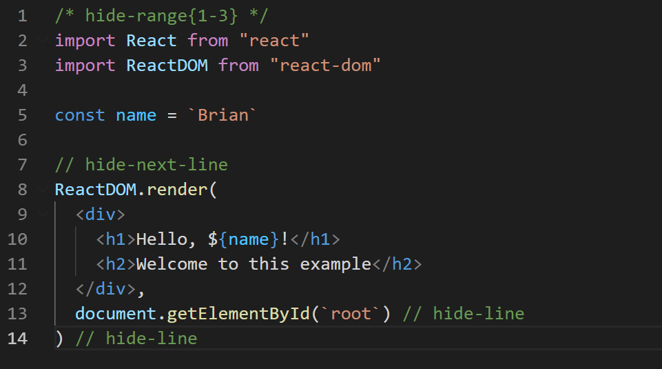

I've combined every page from the original Gatsby Markdown demo [mini site](https://using-remark.gatsbyjs.org/?__hstc=247646936.594c7150d69ca018c6dac822d8ef1a73.1611340662237.1617462079360.1617466517732.129&__hssc=247646936.1.1617466517732&__hsfp=4183638795). Why put them all together in this gigantic page? I want to see if there are any CSS or MD processing conflicts. Also, it's nice to be able to scroll through a single demo instead of jumping back and forth.


- Section Links:
  - [Hello World: The remark Kitchen Sink](#hello)
  - [Responsive Image and IFrames](#responsive-image)
  - [Copying Linked Files and Intercepting Local Links](#copying-linked-files-a)
  - [Code and Syntax Highlighting with PrismJS](#code-and-syntax)
  - [Embed file contents within PrismJS blocks](#embed-file-contents)
  - [Rendering math equations with KaTeX](#rendering-math-equations)
  - [Using Exceprts](#using-excerpts)
  - [Custom Components](#custom-components)
  - [Graphviz](#graphviz)

I tried to stay true to the original demo content so we can compare apples to apples. I added some notes and additional examples where I thought they were sorely needed. You'll see !TODO marking where I need to do some more work. 

If you run Lighthouse on this it won't do well for several reasons. As of posting, this blog site is not optimized for SEO, links, etc. But mainly the page is huge and apparently the large SVG files are causing some trouble.

The content from each original demo page is seperated by a <span style="color:#bbbe74;">colored title div</span> like the one just below. I've added useful links for each section: to the original page and the MD source code.

> EdPike365: Notes and changes are added in a block quote like this.

> EdPike365: Original mini site [on github](https://github.com/gatsbyjs/gatsby/tree/master/examples/using-remark)

<a name="hello"></a>
<div style="background-color:#bbbe74; padding: 1px 10px 10px 10px;">
<h2>Hello World: The remark Kitchen Sink:</h2>
Links: <a href="https://using-remark.gatsbyjs.org/hello-world-kitchen-sink/" target="_blank" >page</a>, <a href="https://raw.githubusercontent.com/gatsbyjs/gatsby/master/examples/using-remark/src/pages/2016-04-15---hello-world-kitchen-sink/index.md" target="_blank"> source </a>
</div>
<br>

 _Photo by
[Joshua Earle](https://unsplash.com/@joshuaearle) via
[Unsplash](https://unsplash.com/photos/CatpolIjez8)_

**_Note how all headlines below show an anchor link when you hover them?_**\
That's [gatsby-remark-autolink-headers][5] hooking up all `MarkdownRemark` headers
with anchor links for us.

## Markdown in Gatsby

Markdown parsing in Gatsby is done with [gatsby-transformer-remark][1], which
uses the excellent [remark][2] under the hood.\
Alongside remark we also use [gatsby-remark-smartypants][6], which provides smart
punctuation through [retext-smartypants][7].

The examples on this page cover the basic Markdown syntax and are adapted from
[Markdown Here's Cheatsheet][3] ([CC-BY][4]).

---

This is intended as a quick reference and showcase. For more complete info, see
[John Gruber's original spec](https://daringfireball.net/projects/markdown/) and
the
[GitHub-flavored Markdown info page](https://github.github.com/github-flavored-markdown/).

##### Table of Contents

[Headers](#headers) [Emphasis](#emphasis) [Lists](#lists) [Links](#links)
[Images](#images) [Tables](#tables) [Footnotes](#footnotes)
[Blockquotes](#blockquotes) [Inline HTML](#html) [Horizontal Rule](#hr)
[Line Breaks](#lines)

<a name="headers"></a>

## Headers

```no-highlight
# H1
## H2
### H3
#### H4
##### H5
###### H6

Alternatively, for H1 and H2, an underline-ish style:

Alt-H1
======

Alt-H2
------
```

# H1

## H2

### H3

#### H4

##### H5

###### H6

Alternatively, for H1 and H2, an underline-ish style:

# Alt-H1

## Alt-H2

<a name="emphasis"></a>

## Emphasis

```no-highlight
Emphasis, aka italics, with *asterisks* or _underscores_.

Strong emphasis, aka bold, with **asterisks** or __underscores__.

Combined emphasis with **asterisks and _underscores_**.

Strikethrough uses two tildes. ~~Scratch this.~~
```

Emphasis, aka italics, with _asterisks_ or _underscores_.

Strong emphasis, aka bold, with **asterisks** or **underscores**.

Combined emphasis with **asterisks and _underscores_**.

Strikethrough uses two tildes. ~~Scratch this.~~

<a name="lists"></a>

## Lists

In this example, leading and trailing spaces are shown with dots: ⋅

```no-highlight
1. First ordered list item
2. Another item
⋅⋅⋅⋅* Unordered sub-list.
1. Actual numbers don't matter, just that it's a number
⋅⋅⋅⋅1. Ordered sub-list
4. And another item.

⋅⋅⋅You can have properly indented paragraphs within list items. Notice the blank line above, and the leading spaces (at least one, but we'll use three here to also align the raw Markdown).

⋅⋅⋅To have a line break without a paragraph, you will need to use two trailing spaces.⋅⋅
⋅⋅⋅Note that this line is separate, but within the same paragraph.⋅⋅

* Unordered list can use asterisks
- Or minuses
+ Or pluses
```

1.  First ordered list item
2.  Another item
    - Unordered sub-list.
3.  Actual numbers don't matter, just that it's a number
    - sub 1 (EdPike365: This was a "1.", but it did not indent properly until I used "-")
    - sub 2 (EdPike365: added, does not work with "1.", becomes a "2.")
        - sub sub,(added by EdPike365)
4.  And another item.

You can have properly indented paragraphs within list items. Notice the blank
line above, and the leading spaces (at least one, but we'll use three here to
also align the raw Markdown).

To have a line break without a paragraph, you will need to use two trailing
spaces.\
 Note that this line is separate, but within the same paragraph.

- Unordered list can use asterisks

* Or minuses

- Or pluses

<a name="links"></a>

## Links

There are two ways to create links.

```no-highlight
[I'm an inline-style link](https://www.google.com)

[I'm an inline-style link with title](https://www.google.com "Google's Homepage")

[I'm a reference-style link][Arbitrary case-insensitive reference text]

[I'm a relative reference to a repository file](../blob/master/LICENSE)

[You can use numbers for reference-style link definitions][1]

Or leave it empty and use the [link text itself].

URLs and URLs in angle brackets will automatically get turned into links.
http://www.example.com or <http://www.example.com> and sometimes
example.com (but not on GitHub, for example).

Some text to show that the reference links can follow later.

[arbitrary case-insensitive reference text]: https://www.mozilla.org
[1]: https://slashdot.org
[link text itself]: https://www.reddit.com
```

[I'm an inline-style link](https://www.google.com)

[I'm an inline-style link with title](https://www.google.com "Google's Homepage")

[I'm a reference-style link][arbitrary case-insensitive reference text]

[I'm a relative reference to a repository file](../blob/master/LICENSE)

[You can use numbers for reference-style link definitions][1]

Or leave it empty and use the [link text itself].

URLs and URLs in angle brackets will automatically get turned into links.
http://www.example.com or <http://www.example.com> and sometimes example.com
(but not on GitHub, for example).

Some text to show that the reference links can follow later.

[arbitrary case-insensitive reference text]: https://www.mozilla.org
[1]: http://slashdot.org
[link text itself]: http://www.reddit.com

<a name="images"></a>

## Images

```no-highlight
Below are two ways to display an image (hover to see the title text):

Inline-style:


Reference-style:
![alt text][logo]

[logo]: https://pbs.twimg.com/profile_images/875556871427375106/Xuq8DypK_bigger.jpg "Logo Title Text 2"
```

Below are two ways to display an image (hover to see the title text):

Inline-style:


Reference-style: ![alt text][logo]

[logo]: https://upload.wikimedia.org/wikipedia/commons/thumb/0/0c/The_Great_Gatsby_cover_1925.jpg/640px-The_Great_Gatsby_cover_1925.jpg "Logo Title Text 2"

<a name="tables"></a>

## Tables

Tables aren't part of the core Markdown spec, but they are part of our
implementation. They are an easy way of adding tables to your email -- a task
that would otherwise require copy-pasting from another application.

```no-highlight
Colons can be used to align columns.

| Tables        | Are           | Cool  |
| ------------- |:-------------:| -----:|
| col 3 is      | right-aligned | $1600 |
| col 2 is      | centered      |   $12 |
| zebra stripes | are neat      |    $1 |

There must be at least 3 dashes separating each header cell.
The outer pipes (|) are optional, and you don't need to make the
raw Markdown line up prettily. You can also use inline Markdown.

Markdown | Less | Pretty
--- | --- | ---
*Still* | `renders` | **nicely**
1 | 2 | 3
```

Colons can be used to align columns.

| Tables        |      Are      |   Cool |
| ------------- | :-----------: | -----: |
| col 3 is      | right-aligned | \$1600 |
| col 2 is      |   centered    |   \$12 |
| zebra stripes |   are neat    |    \$1 |

There must be at least 3 dashes separating each header cell. The outer pipes (|)
are optional, and you don't need to make the raw Markdown line up prettily. You
can also use inline Markdown.

| Markdown | Less      | Pretty     |
| -------- | --------- | ---------- |
| _Still_  | `renders` | **nicely** |
| 1        | 2         | 3          |

<a name="footnotes"></a>

## Footnotes

Footnotes are also not a core feature of markdown, but they're a common
extension feature. The footnote syntax looks like this:

```markdown
This line has a footnote [^1]. Scroll to page bottom or click the link to see it.
```
```markdown
This line has another footnote [^2]. Scroll to page bottom or click the link to see it.
```
That renders like this:

This line has a footnote [^1]. Scroll to page bottom or click the link to see it.
This line has a second footnote [^2]. Scroll to page bottom or click the link to see it.

<a name="blockquotes"></a>

## Blockquotes

```no-highlight
> Blockquotes are very handy in email to emulate reply text.
> This line is part of the same quote.

Quote break.

> This is a very long line that will still be quoted properly when it wraps. Oh boy let's keep writing to make sure this is long enough to actually wrap for everyone. Oh, you can *put* **Markdown** into a blockquote.

> EdPike365: I'm adding nested blockquotes 3 layers deep. Seperated by 1 space each.

> Block 1
> > Block 2
> > > Block 3

```
The above code yields:

> Blockquotes are very handy in email to emulate reply text. This line is part
> of the same quote.

Quote break.

> This is a very long line that will still be quoted properly when it wraps. Oh
> boy let's keep writing to make sure this is long enough to actually wrap for
> everyone. Oh, you can _put_ **Markdown** into a blockquote.

> EdPike365: I'm adding nested blockquotes 3 layers deep, seperated by 1 space each. 

> Block 1
> > Block 2
> > > Block 3

> EdPike365: The nested blocks should work like [CommonMark](https://commonmark.org/help/tutorial/05-blockquotes.html#:~:text=To%20create%20a%20blockquote%2C%20start,can%20also%20contain%20other%20formatting.&text=To%20keep%20the%20quote%20together,quote%20must%20contain%20the%20%3E%20character.). The generated HTML is correct so it must be a CSS problem.

!TODO: modify CSS to add space between indents and trailing indents below content.

<a name="html"></a>

## Inline HTML

You can also use raw HTML in your Markdown, and it'll mostly work pretty well.

```html
<dl>
  <dt>Definition list</dt>
  <dd>Is something people use sometimes.</dd>

  <dt>Markdown in HTML</dt>
  <dd>Does *not* work **very** well. Use HTML <em>tags</em>.</dd>
</dl>
```

<dl>
  <dt>Definition list</dt>
  <dd>Is something people use sometimes.</dd>

  <dt>Markdown in HTML</dt>
  <dd>Does *not* work **very** well. Use HTML <em>tags</em>.</dd>
</dl>

<a name="hr"></a>

## Horizontal Rule

```
Three or more...

---

Hyphens

***

Asterisks

___

Underscores
```

Three or more...

---

Hyphens

---

Asterisks

---

Underscores

<a name="lines"></a>

## Line Breaks

Here are some things to try out:

```
Here's a line for us to start with.

This line is separated from the one above by two newlines, so it will be a *separate paragraph*.

This line is also a separate paragraph, but...
This line is only separated by a single newline, so it's a separate line in the *same paragraph*.
```

Here's a line for us to start with.

This line is separated from the one above by two newlines, so it will be a
_separate paragraph_.

This line is also begins a separate paragraph, but...\
This line is only separated by a single newline, so it's a separate line in the _same
paragraph_.

[^1]: The footnote appears at the bottom of the page
[^2]: The second footnote appears at the bottom of the page

[1]: https://www.gatsbyjs.com/plugins/gatsby-transformer-remark/
[2]: http://remark.js.org/
[3]: https://github.com/adam-p/markdown-here/wiki/Markdown-Cheatsheet
[4]: https://creativecommons.org/licenses/by/3.0/
[5]: https://www.gatsbyjs.com/plugins/gatsby-remark-autolink-headers/
[6]: https://www.gatsbyjs.com/plugins/gatsby-remark-smartypants/
[7]: https://github.com/wooorm/retext-smartypants

<a name="responsive-image"></a>
<div style="background-color:#bbbe74; padding: 1px 10px 10px 10px;">
<h2>Responsive Image and IFrames:</h2>
Links: <a href="https://using-remark.gatsbyjs.org/responsive-images-and-iframes/" target="_blank">page</a>, <a href="https://raw.githubusercontent.com/gatsbyjs/gatsby/master/examples/using-remark/src/pages/2017-01-02---responsive-images-and-iframes/index.md" target="_blank"> source </a>
</div>
<br>

> EdPike365: I removed a hero image from the original content. It did not demonstrate new functionality.

[gatsby-remark-images][11] and [gatsby-remark-responsive-iframe][22] are here to
take care of all your basic Markdown image and iframe issues.

## Images

[gatsby-remark-images][11] provides _out-of-the-box progressive image loading_
(as popularized by [Medium][33] and [Facebook][44]) for all local JPGs and PNGs in
your Markdown documents.

You aren't just limited to markdown image tags either. You can either use
markdown image tags:

```

```

Or HTML image tags:

```
&lt;img src="image.png" alt=""&gt;
```

Let's see some more photos by
[Max Boettinger](https://unsplash.com/@maxboettinger)
([I](https://unsplash.com/photos/T7Lnl3PFISM),
[II](https://unsplash.com/@maxboettinger?photo=SUFS6CPjB5Q)):

> EdPike365: I believe these images are lazy loading. Sometimes they appear as broken while I'm scrolling in dev mode. !TODO: Figure out what is going on.


### What about retina images? 

Absolutely, these are supported too! Gatsby takes care to retain images' pixel
density.


### Okay, nice! But what about GIFs?

Sadly, [Sharp](https://github.com/lovell/sharp) – the library that does the
actual image processing for us in [gatsby-plugin-sharp][55] – is not able to
write out the GIF file format. We will just copy them over for you, instead, and
also do that with SVGs.

An animated GIF of the Select2 Logo: 

An inline example  SVG. Tremendous!

And here's an awesome SVG tiger:

> EdPike365: !TODO figure out how to resize the svg

 

## iFrames and video embeds 

Let's add a YouTube video to show off responsive iFrames real quick:

<iframe width="560" height="315" src="https://www.youtube.com/embed/hbjR5N6IhDU" frameborder="0" allowfullscreen></iframe>

[11]: https://www.gatsbyjs.com/plugins/gatsby-remark-images/
[22]: https://www.gatsbyjs.com/plugins/gatsby-remark-responsive-iframe/
[33]: https://jmperezperez.com/medium-image-progressive-loading-placeholder/
[44]: https://code.facebook.com/posts/991252547593574/the-technology-behind-preview-photos/
[55]: https://www.gatsbyjs.com/plugins/gatsby-plugin-sharp/

<br>
<a name="copying-linked-files-a"></a>
<div style="background-color:#bbbe74; padding: 1px 10px 10px 10px;">
<h2>Copying Linked Files and Intercepting Local Links:</h2>
Links: <a href="https://using-remark.gatsbyjs.org/copy-linked-files-intercepting-local-links/" target="_blank">page</a>, <a href="https://raw.githubusercontent.com/gatsbyjs/gatsby/master/examples/using-remark/src/pages/2017-03-21---copy-linked-files-intercepting-local-links/index.md" target="_blank"> source </a>
</div>
<br>

> EdPike365: I removed a hero image from the original page. It did not demonstrate new functionality.

## Copying Linked Files

[gatsby-remark-copy-linked-files][111] copies files linked to from Markdown to
your `public` folder.

Let's try with a PDF, that you should be able to preview and/or download by
clicking this link:
[Creative Commons Informational Flyer.pdf](Creativecommons-informational-flyer-eng.pdf)

## Intercepting Local Links 

[gatsby-plugin-catch-links][222] intercepts local links from Markdown and other
non-react pages and does a client-side `pushState` to avoid the browser having
to refresh the page.

Let's try linking to the 
"[Emoji](../gatsby-remark-emoji/)"
article using a relative path.

Also, let's link to "[Emoji](https://www.edpike365.com/gatsby-remark-emoji/)" article using an absolute path.

And this [link will be excluded](/excluded-link), based on the plugin config.

[111]: https://www.gatsbyjs.com/plugins/gatsby-remark-copy-linked-files/
[222]: https://www.gatsbyjs.com/plugins/gatsby-plugin-catch-links/

<br>
<a name="code-and-syntax"></a>
<div style="background-color:#bbbe74; padding: 1px 10px 10px 10px;">
<h2>Code and Syntax Highlighting with PrismJS:</h2>
Links: <a href="https://using-remark.gatsbyjs.org/code-and-syntax-highlighting/" target="_blank">page</a>, <a href="https://github.com/gatsbyjs/gatsby/blob/master/examples/using-remark/src/pages/2017-04-04---code-and-syntax-highlighting/index.md" target="_blank"> source </a>
</div>
<br>

Code blocks are part of the Markdown spec, but syntax highlighting isn't.
However, many renderers support syntax highlighting. In
[gatsby-remark-prismjs][1], we use 🤔 [PrismJS][2].

## Inline code

```no-highlight
Inline `code` has `back-ticks around` it.
```

Inline `code` has `back-ticks around` it.

## Code blocks

In Markdown, blocks of code are either fenced by lines with three back-ticks
<code>&#96;&#96;&#96;</code>, or are indented with four spaces. Fenced code
blocks are easier to write and maintain, and only they support syntax
highlighting by indicating a language.

To see the complete list of supported languages, and how to write language
names, see the [PrismJS homepage][3].

    ```javascript
    var s = "JavaScript syntax highlighting";
    alert(s);
    ```

    ```python
    s = "Python syntax highlighting"
    print s
    ```

    ```
    No language indicated, so no syntax highlighting.
    But let's throw in a &lt;b&gt;tag&lt;/b&gt;.
    ```

    ```diff
    const App = () => {
    -	return <div>This line was removed</div>;
    +	return <div>This line was added</div>;
    }
    ```

```javascript
var s = "JavaScript syntax highlighting"
alert(s)
```

```python
s = "Python syntax highlighting"
print s
```

```
No language indicated, so no syntax highlighting.
But let's throw in a <b>tag</b>.
```
> EdPike365: I added the "diff" example. Note that the - and + have to be left justified.

```diff
const App = () => {
-	return <div>This line was removed</div>;
+	return <div>This line was added</div>;
}
```

> EdPike365: For File Title and Copy Code Button, see my UPCOMING blog on [Gatsby For STEM Bloggers](www.edpike365.com/gatsby-remark-stem).

## Line highlighting & numbering

[gatsby-remark-prismjs][1] has its own line highlighting & numbering implementation which
differs a bit from PrismJS's own. You can find out everything about it in the
[corresponding README][1].

> EdPike365: You must implement special CSS code to get Highlighting and Line Numbering to work.   
> Hightlighting: I'm currently using a styles.css file in the root folder. I added this block:
```css
/* used by gatsby-remark-prismjs, colors for Okaidia theme */
.gatsby-highlight-code-line {
    background-color: #474643;
    display: block;
    margin-right: -1em;
    margin-left: -1em;padding-right: 1em;
    padding-left: 0.75em;
    border-left: 0.25em solid #569c3b;
}
```

> EdPike365: Line Numbering: We have to add some CSS, below the highlighting CSS, to move the padding-left to make room for the line numbers. I also had to add padding-top as noted in the CSS.

```css
/* If using PrismJS line numbering, add this. */
.gatsby-highlight pre[class*="language-"].line-numbers {
  padding-left: 2.8em;
  padding-top: var(--spacing-0); /* I had to add this to mine because otherwise the line numbers column was ignoring the padding-top of the code block to the right and was nearly 1 line above it. */
}
```
> EdPike365: Below here, the code is not rendering (which is what we want), and I can't tell how :-(. It is indented by 2 tabs or 4 spaces, but I can't reproduce it. 

    ```javascript{1-2,22}{numberLines: true}
    // In your gatsby-config.js
    // Let's make this line very long so that our container has to scroll its overflow…
    plugins: [
      {
        resolve: `gatsby-transformer-remark`,
        options: {
          plugins: [
            {
              resolve: `gatsby-remark-images`,
              options: {
                maxWidth: 756,
              },
            },
            {
              resolve: `gatsby-remark-responsive-iframe`,
              options: {
                wrapperStyle: `margin-bottom: 1.0725rem`,
              },
            },
            `gatsby-remark-copy-linked-files`,
            `gatsby-remark-smartypants`,
            `gatsby-remark-prismjs`,
          ]
        }
      }
    ]
    ```

Yields: 

```javascript{1-2,22}{numberLines: true}
// In your gatsby-config.js
// Let's make this line very long so that our container has to scroll its overflow…
plugins: [
  {
    resolve: `gatsby-transformer-remark`,
    options: {
      plugins: [
        {
          resolve: `gatsby-remark-images`,
          options: {
            maxWidth: 756,
          },
        },
        {
          resolve: `gatsby-remark-responsive-iframe`,
          options: {
            wrapperStyle: `margin-bottom: 1.0725rem`,
          },
        },
        `gatsby-remark-copy-linked-files`,
        `gatsby-remark-smartypants`,
        `gatsby-remark-prismjs`,
      ],
    },
  },
]
```

Line numbers can start from anywhere, here's an example showing a small extract from a larger chunk of code:

    ```{numberLines: 549}
    ...
    a long imaginary code block
    ...
    ```

```{numberLines: 549}
...
 a long imaginary code block
...
```

Let's do something crazy and add a list with another code example:

- **A list item**

  …and a paragraph! In my younger and more vulnerable years my father gave me
  some advice that I’ve been turning over in my mind ever since.

  -  A nested numbered list
  -  “Whenever you feel like criticizing any one,” he told me, “just remember
      that all the people in this world haven’t had the advantages that you’ve
      had.”

- Roger that, now back to topic: _Highlighted code blocks work here, too_:
  
  (This code gives the highlight command for lines 10 and 13.)
  <pre>
    ```css{10,13}
    .clearfix:after {
      visibility: hidden;...
    
    ```
  </pre>

  ```css{10,13}
  .clearfix:after {
    visibility: hidden;
    display: block;
    font-size: 0;
    content: " ";
    clear: both;
    height: 0;
  }
  .clearfix {
    display: inline-table;
  }
  /* Hides from IE-mac \*/
  * html .clearfix {
    height: 1%;
  }
  .clearfix {
    display: block;
  }
  /* End hide from IE-mac */
  ```

  Wow, "IE-mac"?
  [Yeah, that was a thing](https://en.wikipedia.org/wiki/Internet_Explorer_for_Mac)
  back in the day … a good one at the time, too:

  > Initial versions were developed from the same code base as Internet Explorer
  > for Windows. Later versions diverged, particularly with the release of
  > version 5 which included the cutting edge,
  > [fault-tolerant](https://en.wikipedia.org/wiki/Fault-tolerant) and highly
  > standards-compliant
  > [Tasman](<https://en.wikipedia.org/wiki/Tasman_(layout_engine)>) >
  > [layout engine](https://en.wikipedia.org/wiki/Layout_engine).

  Source: https://en.wikipedia.org/wiki/Internet_Explorer_for_Mac

- **The last list item** –- no more list items after this one, pinky swear!

[1]: https://www.gatsbyjs.com/plugins/gatsby-remark-prismjs/
[2]: http://prismjs.com/
[3]: http://prismjs.com/#languages-list

<br>
<a name="embed-file-contents"></a>
<div style="background-color:#bbbe74; padding: 1px 10px 10px 10px;">
<h2>Embed file contents within PrismJS blocks:</h2>
Links: <a href="https://using-remark.gatsbyjs.org/embed-snippets/" target="_blank">page</a>, <a href="https://raw.githubusercontent.com/gatsbyjs/gatsby/master/examples/using-remark/src/pages/2017-04-05---embed-snippets/index.md" target="_blank"> source </a>
</div>
<br>

> EdPike365: \
> Note 1: you must create a src/code-examples/ folder. Files for the folder are [here](https://github.com/gatsbyjs/gatsby/tree/master/examples/using-remark/src/code-examples).\
> Note 2: to get highlighting, see the ["Code and Syntax Highlighting with PrismJS"](#code-and-syntax) section above.

You can embed the contents of existing files within your Markdown using the [`gatsby-remark-embed-snippet`][1111] with [`gatsby-remark-prismjs`][2222].

Let's start by displaying file contents as a highlighted code block, then see how to control line highlighting and visibility from within the source file.

## Embedding files

After installing the required plugins you can embed a file within your Markdown by using `embed` snippets. To embed the file `src/code-examples/plain.js` you could write the following:

<pre>`embed:plain.js`</pre>

This will look like:

`embed:plain.js`

## Highlight lines

You can highlight specific lines by adding special comments **_to the source file_**. Let's see how this works in `src/code-examples/highlight-lines.js`.

Take a look at the `highlight-line` comment on line 4 and the `highlight-range` comment on line 8:


When the file is embedded with:

<pre>`embed:highlight-lines.js`</pre>

it will display like this:

`embed:highlight-lines.js`

## Hide lines

You can use similar comments **_in the source file_** to hide specific lines. Here's another example, this time using `src/code-examples/hide-lines.js`. Check out the `hide-line` comments on lines 1, 7, 13 and 14:



Which will display like this:

`embed:hide-lines.js`

## All together now

You can mix line highlighting and hiding in the same file. This is from `src/code-examples/hide-and-highlight-lines.js`


It will look like this:

`embed:hide-and-highlight-lines.js`

## Related info

You've learnt how to embed the contents of existing files into your Markdown using [`gatsby-remark-embed-snippet`][1111] with [`gatsby-remark-prismjs`][2222]. Hurray!

If you'd prefer to write your code blocks directly within your Markdown, take a look at the example [Code and Syntax Highlighting with PrismJS][4444].

[1111]: https://www.gatsbyjs.com/plugins/gatsby-remark-embed-snippet/
[2222]: https://www.gatsbyjs.com/plugins/gatsby-remark-prismjs/
[3333]: http://prismjs.com/
[4444]: /code-and-syntax-highlighting/


<br>
<a name="rendering-math-equations"></a>
<div style="background-color:#bbbe74; padding: 1px 10px 10px 10px;">
<h2>Rendering math equations with KaTeX:</h2>
Links: <a href="https://using-remark.gatsbyjs.org/katex/" target="_blank">page</a>, <a href="https://raw.githubusercontent.com/gatsbyjs/gatsby/master/examples/using-remark/src/pages/2017-08-07---katex/index.md" target="_blank"> source </a>, <a href="https://katex.org/">KaTeX</a>
</div>
<br>

> EdPike365: Gatsby did not document this well. KaTeX is a fast, easy-to-use JavaScript library for TeX math rendering on the web. It *should* render anything from the popular [LaTeX](https://www.math.ubc.ca/~pwalls/math-python/jupyter/latex/) scientific notation library.

[gatsby-remark-katex][15] adds math equation support to gatsby using
[remark-math][25] and [katex][35].

**Add Katex CSS to your template** Katex's CSS file is required to render the
formulas correctly. Include the CSS file in your template ([example][45])

```
require(`katex/dist/katex.min.css`)
```

## Math Equations in Inline Mode

Surround your equation with `$` to generate a math equation in inline mode.

**Example markdown:**

```
$a^2 + b^2 = c^2$
```

**Example output:** $a^2 + b^2 = c^2$

## Math Equations in Display Mode

Surround your equation with `$$` and new-lines to generate a math equation in
display mode.

**Example markdown:**

```
$$
a^2 + b^2 = c^2
$$
```

**Example output:**

$$
a^2 + b^2 = c^2
$$

> EdPike365: I added some more advanced tests, below.

### Advanced Examples:


#### Fractions, Super and Subscripts
```
Lift($L$) can be determined by Lift Coefficient ($C_L$) like the following equation.

$$
L = \frac{1}{2} \rho v^2 S C_L
$$
```

Lift($L$) can be determined by Lift Coefficient ($C_L$) like the following equation.

$$
L = \frac{1}{2} \rho v^2 S C_L
$$

---

#### Sum Sigma with Ranges

``` 
\\ "\sum" is Sigma
$$
\sum_{i=1}^n a_i
$$
```

$$
\sum_{i=1}^n a_i
$$
---
####  Integral and Function Symbol

` $\int_a^b f(x) = F(b) - F(a)$ `   

yields:  
  $\int_a^b f(x) = F(b) - F(a)$

---
#### Limit with Approaches Subscript

` $$f'(a) = \lim_{x \to a} \frac{f(x) - f(a)}{x-a}$$ ` 

yields:
 
 $$
 f'(a) = \lim_{x \to a} \frac{f(x) - f(a)}{x-a}
 $$

[15]: https://www.gatsbyjs.com/plugins/gatsby-remark-katex/
[25]: https://github.com/Rokt33r/remark-math
[35]: https://github.com/Khan/KaTeX
[45]: https://github.com/gatsbyjs/gatsby/blob/master/examples/using-remark/src/templates/template-blog-post.js

<br>
<a name="using-excerpts"></a>
<div style="background-color:#bbbe74; padding: 1px 10px 10px 10px;">
<h2>Using Excerpts:</h2>
Links: <a href="https://using-remark.gatsbyjs.org/excerpts/" target="_blank">page</a>, <a href="https://raw.githubusercontent.com/gatsbyjs/gatsby/master/examples/using-remark/src/pages/2017-11-14---excerpts/index.md" target="_blank"> source </a>
</div>
<br>

`gatsby-transformer-remark` allows you to get an excerpt from a markdown post. By default, it will prune the first 140 characters, but you can optionally specify a `pruneLength` in the graphql query.

```graphql
{
  allMarkdownRemark {
    edges {
      node {
        excerpt(pruneLength: 280)
      }
    }
  }
}
```

You can also manually mark in your markdown where to stop excerpting—similar to Jekyll. `gatsby-transformer-remark` uses [gray-matter](https://github.com/jonschlinkert/gray-matter) to parse markdown frontmatter, so you can specify an `excerpt_separator`, as well as any of the other options mentioned [here](https://github.com/jonschlinkert/gray-matter#options), in the `gatsby-config.js` file.

```json
{
  "resolve": `gatsby-transformer-remark`,
  "options": {
    "excerpt_separator": `<!-- end -->`
  }
}
```

Any file that does not have the given `excerpt_separator` will fall back to the default pruning method.

You can see the results [here](https://using-remark.gatsbyjs.org/excerpt-example)

<br>
<a name="custom-components"></a>
<div style="background-color:#bbbe74; padding: 1px 10px 10px 10px;">
<h2>Custom Components:</h2>
Links: <a href="https://using-remark.gatsbyjs.org/custom-components/" target="_blank">page</a>, <a href="https://raw.githubusercontent.com/gatsbyjs/gatsby/master/examples/using-remark/src/pages/2018-01-27---custom-components/index.md" target="_blank"> source </a>
</div>
<br>

> EdPike365: I'm leaving this out because its a little confusing and I think the functionality has been superceded by MDX. IE, if you need custom components, you should really consider using MDX instead of MD.

<br>
<a name="graphviz"></a>
<div style="background-color:#bbbe74; padding: 1px 10px 10px 10px;">
<h2>Graphviz</h2>
Links: <a href="https://using-remark.gatsbyjs.org/graphviz/" target="_blank">page</a>, <a href="https://github.com/gatsbyjs/gatsby/tree/master/examples/using-remark/src/pages/2019-02-06---graphviz" target="_blank"> source </a>, <a href="https://www.gatsbyjs.com/plugins/gatsby-remark-graphviz/" target="_blank">gatsby-remark-graphviz install</a>
</div>
<br>

> EdPike365: *** It is very important that you follow the linked install directions above ***. The plugin must be added above the PrismJS plugin in your gatsby-config.js.

## Rendering dot code blocks

By adding [gatsby-remark-graphviz](https://www.gatsbyjs.com/plugins/gatsby-remark-graphviz/) to your Gatsby site, you can create graphs powered by [Viz.js](https://github.com/mdaines/viz.js) by adding `dot` code blocks in your Markdown files:

    ```dot
    digraph graphname {
      a -> b;
      b -> c;
      a -> c;
    }
    ```

Will render as:


A code block without a `dot` or `circo` will not be processed:

```
digraph graphname {
  a -> b;
  b -> c;
  a -> c;
}
```

## Adding custom attributes

> EdPike365: The custom style code below does NOT work in the original demo either. !TODO

You can add custom attributes to the resulting SVG:

    ```dot id="small-digraph" style="border: solid 3px tomato; box-shadow: 5px 5px 5px; padding: 15px; box-sizing: content-box" class="graphviz-figure" data-mydata123
    digraph graphname {
      a -> b;
      b -> c;
      a -> c;
    }
    ```

Will render as:

```dot id="small-digraph" style="border: solid 3px tomato; box-shadow: 5px 5px 5px; padding: 15px; box-sizing: content-box" class="graphviz-figure" data-mydata123
digraph graphname {
  a -> b;
  b -> c;
  a -> c;
}
```

Don't be shy, go ahead and inspect that SVG and see all the attributes added to it.

## Width, height and responsiveness

You can control the layout, spacing and size of the rendered SVG by using [Graphviz attributes](https://graphviz.gitlab.io/_pages/doc/info/attrs.html) like this:

    ```dot
    digraph graphname {
      graph [size="1.5,1.5"];
      a -> b;
      b -> c;
      a -> c;
    }
    ```

This will give you a slightly smaller SVG:


> EdPike365: Below: the custom width and height CSS does NOT work in the original demo either. !TODO

Alternatively, you can overwrite those values by passing custom SVG attributes like this:

    ```dot width="178pt" height="auto"
    digraph graphname {
      a -> b;
      b -> c;
      a -> c;
    }
    ```

Whoa!


By default, gatsby-remark-graphviz is adding the following inline style to every rendered SVG:

```css
max-width: 100%;
height: auto;
```

This will make graphs work as expected most of the time - small graphs will remain small and big ones will shrink to fit the parent's box. Graphs can get really big ([from Gatsby the docs](https://www.gatsbyjs.com/docs/behind-the-scenes/)):


You can overwrite the `style` attribute if you don't like that behaviour:

    ```dot style=""
    digraph graphname {

      node [ style = filled, fillcolor = white ];

      ## Legend

      subgraph cluster_legend {
        ...
    ```
> EdPike365: The custom CSS does NOT work in the original demo either. !TODO

There:


> EdPike365: Well thats it. When I have spare time I'll try to fix the !TODO's that you saw. This will mostly mean doing PR's on those plugins. If you work on any of the !TODO's in this article, make sure to share.

---

> EdPike365: Any Footnotes in *any* of the code above will appear below here.

---