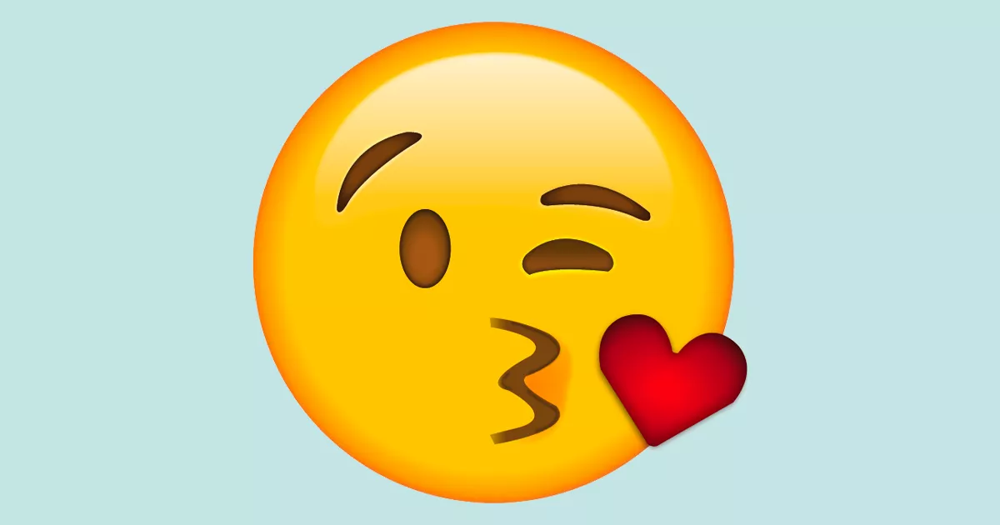
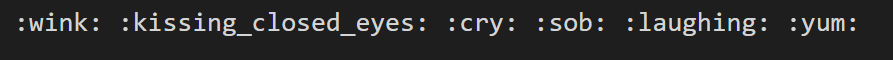
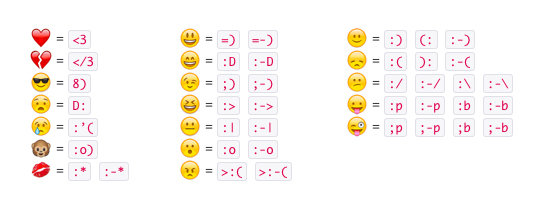

### A Light Hearted Project For April Fools

If you've tried adding Emoji to your Gatsby Markdown blog, you will see that it's very hit or miss.
Below is a quick guide to what works and what doesn't on April Fools Day, 2021.

I used [gatsby-remark-emoji](https://www.gatsbyjs.com/plugins/gatsby-remark-emoji/). NOTE: there is no trailing s. This is just a wrapper for the [emojione](https://www.npmjs.com/package/emojione) library.
That library, in turn, seems to be pulling some free emojis from [joypixels](https://www.joypixels.com/emoji). Thats as far as I was willing dive for this project :-(. When I want to work on something fun I'll loop back around to see if I can get more of these working.

Contrary to the plugin's docs on Gatsby, it supports many more "conversion styles" than the [JS functions on JoyPixels](https://demos.joypixels.com/latest/index.html#js). In the options, I tried "shortnameToImage", and it worked but the emoji were not scaled correctly, so I switched back.

#### Slack Emoji Codes:

You can use [Slack Codes](https://www.webfx.com/tools/emoji-cheat-sheet/):
 

Yields: :wink: :kissing_closed_eyes: :cry: :sob: :laughing: :yum: :point_right: :eyes:

 

#### Slack Emoticon Text Shortcuts

This plugin docs poorly document these. My best guess is they cover a _subset_ of the Slack emoticon list. !TODO: dig through the plugin code.

[Emoticons List](https://en.wikipedia.org/wiki/List_of_emoticons)

<table class="emoji-table" >
  <tr><th colspan=3> Brute Force Test of Slack Specific Codes Yields</th></tr>
  <tr><td> <3  </td><td> =) &nbsp; =-) </td><td> :) &nbsp; (: &nbsp; :-) </td></tr> 
  <tr><td> </3  </td><td> :D  &nbsp; :-D </td><td> :( &nbsp; ): &nbsp; :-(  </td></tr> 
  <tr><td> 8)  </td><td>  ;) &nbsp; ;-)  </td><td> :/ &nbsp; :-/ &nbsp; :\ &nbsp; :-\ </td></tr> 
  <tr><td> D: </td><td> :> &nbsp; :->  </td><td> :p &nbsp; :-p  &nbsp; :b &nbsp; :-b </td></tr> 
  <tr><td> :'( </td><td> :| &nbsp; :-| </td><td> ;p &nbsp; ;-p &nbsp; ;b &nbsp; ;-b </td></tr> 
  <tr><td> :o)  </td><td>  :o &nbsp; :-o  </td><td>  &nbsp;  &nbsp;  </td></tr> 
  <tr><td> :* &nbsp; :-*  </td><td> >:( &nbsp; >:-( </td><td>  &nbsp;  &nbsp;  </td></tr> 
</table>

#### Troll Face

Some [Troll Face Emoticons](https://emoticoncentral.com/category/troll) work too:  
( ͡❛ ͜ʖ ͡❛)  
༼ ºل͟º ༽  
( ͡°Ɛ ͡°)  
( ͡ ͜ʖ ͡ )  
ლ(ಠ 益 ಠლ)  
ლ (ಠ_ಠ ლ)  
༼ノ ◕ ヮ ◕ ༽ノ︵┻━┻  
( ͡°( ͡° ͜ʖ( ͡° ͜ʖ ͡°)ʖ ͡°) ͡°)

See the [reference page](https://emoticoncentral.com/category/troll) for more!
