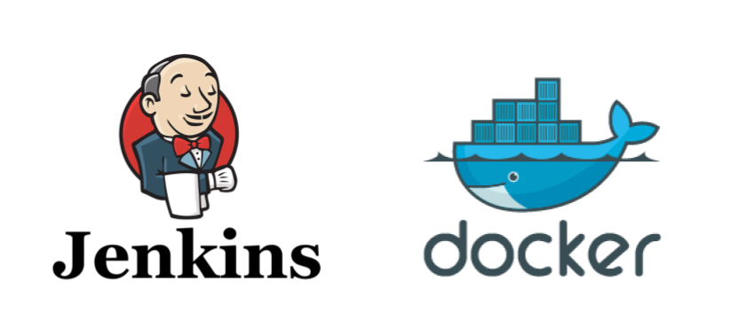

#### Garaunteed to work in Windows WSL2, and probably in Linux and MacOS



This is part 1 of a series "Local CI/CD With Jenkins in Docker":

- Part 2: [Jenkins Docker Agents with DindD Cloud](/blog/jenkins-docker-agents)
- Part 3: Jenkins with SonarQube Docker Agent

The stack we build in the series can be used as the base stack for Mannings Live Project: [CI/CD Pipeline for a Web Application Using Jenkins](https://www.manning.com/liveprojectseries/ci-cd-pipeline-ser).

Below, we will:

- build a custom Jenkins docker image
- run and test it for basic function
- add credentials to talk to GitHub
- test the certificate with a simple pipeline to GitHub

### Why Jenkins in Docker?

I try to keep my dev stack off of Windows. I only use Windows for gaming so I don't want the dev resources loading unless I need them. WSL works great for that. The WSL Ubuntu "VM" (sorta kinda), does not even load until I tell it to.

I also have Ubuntu desktop via dual boot, but it keeps failing for various reasons, NVIDIA drivers key among them. So I use WSL and I'll show you how.

Putting Jenkins in Docker also avoids getting tangled up in Java VM hell on your dev machine. If you install Jenkins from the ground up, you also have to install Java. Jenkins images already have the correct version of Java installed for the Jenkins version in the image.

Running Jenkins as a Docker container is problematic if you want to use Docker containers in your pipelines. Jenkins [recommends](https://www.jenkins.io/doc/book/installing/docker/) using a DinD (Docker in Docker) container. This is [problematic](https://jpetazzo.github.io/2015/09/03/do-not-use-docker-in-docker-for-ci/) for production, but should work for a local dev stack.

If you have a dedicated VM for Jenkins, where you are not worried about java VM version differences, etc, then you should consider installing Jenkins in standalone mode, with Docker CLI installed on the same VM. That simplifies using Docker in your pipelines. ***The instructions below are still somewhat useful because they lay out how to user JCasC and plugins, in preparation of automating Jenkins setup.***

> We are doing this step-by-step to increase learning. If this were for efficiency, we'd use some IaC tools like Ansible. A blog entry for that is on my TODO list.

## Required Apps

### Git CLI and a remote SCM

I installed git on Ubuntu in WSL2, so the daemon runs the same as it would in a linux VM. I keep the IaC faith and don't install anything for the CLI.

I use GitHub in this tutorial.

### Docker Daemon

- I installed Docker Daemon directly on Ubuntu in WSL.

- I do ***NOT*** recommend installing Docker Desktop for Windows, though it can be "passed through" to your WSL VM. It is helpful to do everything via Docker CLI to increase your DevOps skills and to simulate a production Linux VM.

- Use these directions to [Install Docker in WSL 2 without Docker Desktop](https://nickjanetakis.com/blog/install-docker-in-wsl-2-without-docker-desktop) I originally set up Docker for use with VSCode devcontainers and it was available for this project with no additional work. TODO: script the install with Ansible or some such

- The Jenkins docs has instructions for [running Jenkins as a Docker Container](https://www.jenkins.io/doc/book/installing/docker/)
  - Because we're running in WSL, we use the instructions to manage Docker as a non-root user ***in Linux***. It links to [Linux post-installation steps for Docker Engine](https://docs.docker.com/engine/install/linux-postinstall/).
  - TLDR:
    - After installing Docker, you will create a group called Docker, add your user to it, and hot load the group membership.

    ```Bash
    sudo groupadd docker && sudo usermod -aG docker $USER && newgrp docker
    ```

    - Test by running `docker run hello-world`
    - You should also make Docker boot on WSL start with systemd.

    ```Bash
    sudo systemctl enable docker.service
    sudo systemctl enable containerd.service
    ```

## Step 0: Create A Git Repo for this project

We will create several files for this project. I recommend that you create a git repo on GitHub called `docker-cicd`.

I have a `dev` folder in my home dir that I use for all my projects. I cd to `~/dev/` and pull down my repo, resulting in `~/dev/docker-cicd/`.

The core containers for our CI/CD stack are Jenkins, DinD, and SonarQube. When are using the stack they all need to be running, otherwise they are stopped to save local machine resources.

We will add startup scripts for each container to a central sh script. Create an empty file: `touch ~/dev/docker-cicd/launch-stack.sh`.

## Step 1: Create Jenkins Automation Code

Each container gets its own subdirectory. Jenkins gets `~/dev/docker-cicd/jenkins/`.

### The Plugin Installation Manager

We are automating the installation of all of our plugins using [jenkins-plugin-cli](https://github.com/jenkinsci/plugin-installation-manager-tool).

These days, the app is built into [Jenkins Docker images](https://hub.docker.com/r/jenkins/jenkins), so we don't need to install it. We use it to bake all the plugins in to our custom Docker image.

The list below will add all default/recommended plugins, plus a few extra ones we need, including the [Configuration As Code Plugin](https://github.com/jenkinsci/configuration-as-code-plugin#getting-started). It also includes plugins that we will be using later in this series for creating a Docker "cloud" using DinD, and integrating a SonarQube server docker container.

The format is "shortname:version". If no version is specified, it will pull the latest version.

> See ["Addendum: How To Output A List of your Installed Jenkins Plugins"](#addendum-how-to-output-and-use-a-list-of-your-installed-jenkins-plugins) below to learn how to get a list of installed plugins in an existing Jenkins server. Its how I generated the plugins list below.

- Create `plugins.txt` in `~/dev/docker-cicd/jenkins/`.
- Copy and past the text below into `plugins.txt`.

```Text
ant
antisamy-markup-formatter
apache-httpcomponents-client-4-api
authentication-tokens
blueocean
blueocean-bitbucket-pipeline
blueocean-commons
blueocean-config
blueocean-core-js
blueocean-dashboard
blueocean-display-url
blueocean-events
blueocean-git-pipeline
blueocean-github-pipeline
blueocean-i18n
blueocean-jwt
blueocean-personalization
blueocean-pipeline-api-impl
blueocean-pipeline-editor
blueocean-pipeline-scm-api
blueocean-rest
blueocean-rest-impl
blueocean-web
bootstrap5-api
bouncycastle-api
branch-api
build-timeout
caffeine-api
checks-api
cloudbees-bitbucket-branch-source
cloudbees-folder
command-launcher
commons-lang3-api
commons-text-api
configuration-as-code
credentials
credentials-binding
display-url-api
docker-commons
docker-workflow
durable-task
echarts-api
email-ext
favorite
font-awesome-api
git
git-client
github
github-api
github-branch-source
gradle
handy-uri-templates-2-api
htmlpublisher
instance-identity
ionicons-api
jackson2-api
jakarta-activation-api
jakarta-mail-api
javax-activation-api
javax-mail-api
jaxb
jdk-tool
jenkins-design-language
jjwt-api
jquery3-api
junit
ldap
mailer
matrix-auth
matrix-project
mina-sshd-api-common
mina-sshd-api-core
okhttp-api
pam-auth
pipeline-build-step
pipeline-github-lib
pipeline-graph-analysis
pipeline-groovy-lib
pipeline-input-step
pipeline-milestone-step
pipeline-model-api
pipeline-model-definition
pipeline-model-extensions
pipeline-rest-api
pipeline-stage-step
pipeline-stage-tags-metadata
pipeline-stage-view
plain-credentials
plugin-util-api
pubsub-light
quality-gates
resource-disposer
scm-api
script-security
snakeyaml-api
sonar
sonar-quality-gates
sse-gateway
ssh-credentials
ssh-slaves
sshd
structs
timestamper
token-macro
trilead-api
variant
workflow-aggregator
workflow-api
workflow-basic-steps
workflow-cps
workflow-durable-task-step
workflow-job
workflow-multibranch
workflow-scm-step
workflow-step-api
workflow-support
ws-cleanup
```

### JCasC (Jenkins Configuration As Code)

We use the [Configuration As Code Plugin](https://github.com/jenkinsci/configuration-as-code-plugin) to automate as much of the Jenkins setup routine as possible and we bake it into our custom Jenkins Docker image.

We set up a CasC folder for the config yaml files so we can break our configs into seperate files, based on config "roots". The rule is that the config files cannot try to config the same settings or it will cause an error.

> Addendum: [Useful JCasC articles](#addendum-useful-jcasc-articles) that I used to create this.

- Create a subdirectory below the Dockerfile: `~/dev/docker-cicd/jenkins/casc_configs/`
- Create the files `/casc_configs/jenkins.yaml` and `/casc_configs/unclassified.yaml`.

Jenkins core is not a plugin, but we can config it in CasC. Examples are [here](https://github.com/jenkinsci/configuration-as-code-plugin/blob/master/demos/jenkins/jenkins.yaml). Jenkins is one of the config "roots" so, by convention, it gets its own yaml file.

Whats happening?

- users:
  - We create a user to be the admin using the `docker run` args.
  - We create a non admin user `edpike365`. I added some example user configs there as well.
- globalMatrix:
  - The matrix config gives the admin full power with the line `- "Overall/Administer:${JENKINS_ADMIN_ID}"`, which takes our `docker run` arg by the same name and reuses it here.
  - Other authenticated users can only do job stuff.

```yaml
# jenkins.yaml
jenkins:
  systemMessage: "EdPike365: Automating Jenkins Setup using Docker and Jenkins Configuration as Code\n\n"
  remotingSecurity:
   enabled: true
  securityRealm:
    local:
      allowsSignup: false
      users:
       - id: ${JENKINS_ADMIN_ID}
         password: ${JENKINS_ADMIN_PASSWORD}
       - id: edpike365
         name: "Ed Pike"
         password: edpike365
         properties:
         - mailer:
             emailAddress: "edpike365@gmail.com"
  authorizationStrategy:
    globalMatrix:
      permissions:
        - "Overall/Administer:${JENKINS_ADMIN_ID}"
        - "Overall/Read:authenticated"
        - "Job/Build:authenticated"
        - "Job/Cancel:authenticated"
        - "Job/Configure:authenticated"
        - "Job/Create:authenticated"
        - "Job/Delete:authenticated"
        - "Job/Discover:authenticated"
        - "Job/Move:authenticated"
        - "Job/Read:authenticated"
        - "Job/Workspace:authenticated"
        - "View/Read:anonymous"
```

"Unclassified" is another config root and gets its own file.

```yaml
# unclassified.yaml
unclassified:
  location:
    adminAddress: you@example.com
    url: http://localhost:8080
```

## Step 2: Custom Jenkins Docker Image

### Custom Dockerfile

The customizations will add:

- install Docker hub credentials to the keyring
- install Docker CE CLI
- disable the setup wizard
- copy our local CasC config folder to /var/jenkins_home/casc_configs on the image
- copy our local plugins list file to /usr/share/jenkins/ref/plugins.txt on the image

```Dockerfile
# Dockerfile
# Jenkins LTS as of 2023-05-03
FROM jenkins/jenkins:2.387.3

USER root

# Update and install modules, show Linux Standard Base info
RUN apt-get update && apt-get install -y lsb-release

# Setup access to docker hub
RUN curl -fsSLo /usr/share/keyrings/docker-archive-keyring.asc \
  https://download.docker.com/linux/debian/gpg
RUN echo "deb [arch=$(dpkg --print-architecture) \
  signed-by=/usr/share/keyrings/docker-archive-keyring.asc] \
  https://download.docker.com/linux/debian \
  $(lsb_release -cs) stable" > /etc/apt/sources.list.d/docker.list

# Install the Docker community edition CLI
# Our docker run code specifies DOCKER_HOST so local Docker commands are executed on a remote Docker daemon
RUN apt-get update && apt-get install -y docker-ce-cli

USER jenkins

ENV JAVA_OPTS -Djenkins.install.runSetupWizard=false

COPY ./casc_configs /var/jenkins_home/casc_configs
ENV CASC_JENKINS_CONFIG /var/jenkins_home/casc_configs

COPY plugins.txt /usr/share/jenkins/ref/plugins.txt
RUN jenkins-plugin-cli --plugin-file /usr/share/jenkins/ref/plugins.txt
```

### Build The Custom Image

Build the image from within `~/dev/docker-cicd/jenkins/`. We add "my" to the front to clearly mark it as a custom image:

`docker build -t myjenkins:2.387.3 .`

## Step 3: Custom Jenkins Container

### Create a bridge network

This is so all of our containers can talk to each other easily later. This will become useful in Part 2 of this Series (DinD). We set it up now so we can add the Jenkins container to it and not have to edit our Docker run code later.

`docker network create jenkins`

### Create Docker run bash script

Explaining the settings:

- While we are experimenting, we want the container to disappear when it is stopped, so `--rm`.
- We use the `jenkins` network created above.
- To save local computer resources, we set up our stack with `--restart=no` so that the stack is only loaded when I `docker start` it.
- Our JCasC setup (above) requires that we pass in the `JENKINS_ADMIN_ID` and `JENKINS_ADMIN_PASSWORD`.

Create a file named `run-jenkins.sh` and paste the code below into it. Modify to taste.

```bash
docker run --name jenkins \
  --detach --rm --restart=no \
  --network jenkins \
  --env DOCKER_HOST=tcp://docker:2376 \
  --env DOCKER_CERT_PATH=/certs/client \
  --env DOCKER_TLS_VERIFY=1 \
  --publish 8080:8080 \
  --publish 50000:50000 \
  --env JENKINS_ADMIN_ID=myadmin --env JENKINS_ADMIN_PASSWORD=myadmin \
  --volume jenkins-data:/var/jenkins_home \
  --volume jenkins-docker-certs:/certs/client:ro \
  myjenkins:2.387.3
```

Type `bash run-jenkins.sh`

Log in to Jenkins at [http://localhost:8080](http://localhost:8080). It should be ready to go!

- Log in as the admin we created dynamically in JCasC from the Docker env vars:
  - user: "myadmin", password: "myadmin"
  - Everything should be available in the GUI, including Jenkins mgt.

- Logout, then login as the hardcoded, non-admin user from JCasC:
  - user: "edpike365", password: "edpike365"
  - You should not see any Jenkins admin options

> Don't forget that you can access the Jenkins container via `docker exec -it jenkins bash`

### If Jenkins Doesn't Work

I made this useful bash script while developing this tutorial. It deletes the old stuff and reruns the Docker build and run.

```Bash
# reset.sh
CONTAINERID=$(docker ps -aqf "name=jenkins")
if [[ ! -z "$CONTAINERID" ]]
then
  echo "Jenkins was running"
  echo "CONTAINERID is $CONTAINERID"
  docker stop $CONTAINERID
else
  echo "CONTAINERID was empty, jenkins container was not running"
fi
docker volume rm jenkins-data
docker volume rm jenkins-docker-certs
docker build -t myjenkins:2.387.3 .
sh ./run-jenkins.sh
```

## Step 4: Tests

### Test 1: Hello World Pipeline

Use the built in "Hello World" pipeline to test for basic functionality.

- Jenkins Dashboard > New Item > Item Name "hello test" > Choose Pipeline > OK
- Scroll down to the Pipeline Script area.
- In the upper right corner, use the "try sample Pipeline" dropdown to select "Hello World".
- Save > Build Now
- After it completes, it should have a green block in "Stage View".
- To view the details, click on "Build History" > #1 (in lower left corner)

### Test 2: Pipeline to Public Github Repo

#### 2.1: Prepare a Public Repo

The repo needs at least one branch with a Jenkinsfile in the root directory.

- Option 1: Use one of your existing public repos

- Option 2: Create a simple public repo:
  - In GitHub (any SCM), create a public repo. I called mine `jenkins-docker-public-test`.
  - Set as public. Leave all other values default. "Create Repository".
  - Choose "Quick Setup" and click the little "Get started by creating a new file" link.
  - Using the web GUI, create a `Jenkinsfile` in project root. Paste in the "Hello World" content bellow.
    - I use `main` as the default branch name; yours might be `master`
  - Click the "Commit changes" button.
  
```groovy
pipeline {
    agent any

    stages {
        stage('Hello') {
            steps {
                echo 'Hello World from PUBLIC repo MAIN branch.'
            }
        }
    }
}
```

#### 2.2: Run a Pipeline

In Jenkins:

- click "New Item"
- "Item Name": jenkins-docker-public-test (arbitrary but useful name)
- click "Pipeline"
- click "OK"
- leave everything blank until the Pipeline section:
  - set Definition dropdown to "Pipeline script from SCM"
  - "SCM": Git
  - follow the directions below to get the Repo URL

In GitHub:

- click the `<> Code` button in the upper left corner
- then click the other `<> Code` button in the somewhat upper right
- select HTTPS and click the copy icon to get the link
- paste it into the "Repository URL" field
- leave Credentials as "-none-"
- change Branches to build to match your main (and likely only branch). I had to change mine from "*/master" to "*/main"

- click `Save`, then click "Build Now". It should complete and show 2 stages in green:
  - "Declarative Checkout SCM"
  - "Hello"
- click on "Build History" job link
- click on "Console Output" and scan it
  - it should end in "Finished: SUCCESS"

### Test 3: Private Repo Pipeline Test With JCasC Credentials

Boss Fight!

#### 3.1: JCasC Credential Code

We are creating a Jenkins "usernamePassword" type credential, though technically the password is a PAT (Personal Access Token). We're using a PAT because password auth was removed in 2021.

The code below is looking for SCM_TOKEN and SCM_USERNAME to be passed in. We don't want to hard code those anywhere that Git might git them.

- "Credentials" are a JCasC root config object, so it should get its own file.
- Add a `credentials.yaml` file to your `jcasc` directory. Paste this content:

```yaml
credentials:
  system:
    domainCredentials:
      - credentials:
          - usernamePassword:
              id: "github-credentials"
              password: ${SCM_TOKEN}
              scope: GLOBAL
              username: ${SCM_USERNAME}
```

> If you want to know more, sample JCasC credential configurations can be found at [jenkins_credentials.yaml](https://gist.github.com/apr-1985/9b5cf46497f82c11f00e05363ad45107#file-jenkins_credentials-yaml).

#### 3.2: Modify Docker Run Code

We are passing in Host based ENV VARS to the `docker-run.sh`.

Add the following lines to `docker-run.sh`, under the existing `JENKINS_ADMIN_ID` line:

```bash
  --env SCM_USERNAME=$HOST_SCM_USERNAME \
  --env SCM_TOKEN=$HOST_SCM_TOKEN \
```

#### 3.3: Create GitHub Personal Access Token

[This video](https://www.youtube.com/watch?v=HSA_mZoADSw) from CloudBeesTV is helpful if you don't know how. It will also show you the traditional way to create credentials in Jenkins (vs using JCasC).

The short version:

On GitHub:

- click on ***your*** icon in the top right corner to produce a dropdown
- select "Settings" > Developer Settings (bottom left) > Personal access tokens > Tokens (classic) > Generate new token > Generate new token (classic) (sic)
- use "Note" as a name field
  - I named mine `jenkins-docker-private-token`
  - "Select scopes" Checkboxes:
    - "repo"
    - "user > user:email"
    - "admin:org > read:org"
  - Click "Generate token" button
  - Copy the PAT token using the copy icon. You won't have access to it again!

On the Jenkins Linux Host:

- Choose how to persist the env vars:

  - Permanent (recommended)
    - Choose where to persist the env vars. In Linux there are many options. [How to permanently set environmental variables](https://unix.stackexchange.com/questions/117467/how-to-permanently-set-environmental-variables). Your choice affects  how many users can see the variables so its a very important choice in a production environment. Also, make sure the credentials don't get picked up by Git.
    - I added the below `export` lines to `/etc/profile.d/docker-cicd.sh`
      - Don't forget sudo as in `sudo vim /etc/profile.d/docker-cicd.sh`
    - Then I ran `source /etc/profile.d/docker-cicd.sh` to load them so I did not have to re-login.

  - Temporary (won't persist on next boot):
    - This is problematic because if you want to use this next day, you'll have to create a new GitHub token, etc.
    - OTOH your experiments are cleaned up when you shut down the VM.
    - Use your GitHub id and the PAT token to run the script below on your Host:

    ```bash
    export HOST_SCM_USERNAME=<your SCM user name>
    export HOST_SCM_TOKEN=<your SCM token>
    ```

- Run the `reset-jenkins.sh` script.

#### 3.4: Verify Credentials Exist in Jenkins

Log in as "myadmin".

Navigate to Dashboard > Manage Jenkins > Scroll to "Credentials".

You should see a system Credential there with ID as "github-credentials".

#### 3.5: Prepare a Private Multi Branch Repo

Create, or use an existing, private repo. It needs two branches. Each branch needs a Jenkinsfile.

I'm creating a private repo just for this tutorial:

- In GitHub (or any cloud SCM), create a private repo.
- I named mine `jenkins-docker-private-test`.
- On the`main` branch, create a Jenkinsfile. Paste in the "Hello World" content.

```groovy
pipeline {
    agent any

    stages {
        stage('Hello') {
            steps {
                echo 'Hello World from PRIVATE repo MAIN branch.'
            }
        }
    }
}
```

- Create a `feature` branch. Edit the Jenkins file to say "FEATURE branch" at the end.

#### 3.6: Use the Credentials to Run a Pipeline

We test our credentials with our private multi branch repo.

Create an MB Multibranch Pipeline job:

- Dashboard > New Item
  - "Item Name": jenkins-docker-private-test (arbitrary but useful name)
  - Choose Multibranch Pipleline
  - OK
- General
  - Display Name: jenkins-docker-private-test (arbitrary)
  - Branch Sources > Add Source
    - GitHub
  - Credentials Dropdown
    - "github-credentials" will be listed as the "username/****"
  - Repo HTTPS URL > Get the HTTPS link to your test repo
  - Click "Validate" button
  - Behaviors > Discover branches > Strategy > All branches
  - Everything else leave as defaults
  - Save
  - The log should show that both branches had a Jenkinsfile.

- Click on the job (for convenience use the Dashboard > jenkins-docker-private-test breadcrumb in the upper left corner)
- You will see 2 branchs listed by name. Each represents a normal pipeline
- Click on one, view the Build History > Console Output and see the "Hello World" message.

### FINALLY: When the tests pass, edit docker-run.sh

Now that it works, we make our custom Jenkins container persistant over restarts.

Edit the `~/dev/docker-cicd/jenkins/docker-run-jenkins.sh` on your Jenkins host.

- Remove the `--rm`
- Change `--restart=no` to `--restart=unless-stopped` (See [Start containers automatically](https://docs.docker.com/config/containers/start-containers-automatically/))
- Run the script again: `bash ./run-jenkins.sh`

To pick up the changes and test that the GitHub credentials survive a restart, run:

`~/dev/docker-cicd/jenkins/reset-jenkins.sh`

The pipelines will be gone, but the credentials should be there.

<br/>
Edit `~/dev/docker-cicd/launch-stack.sh` to add our Jenkins container.

```bash
#!/bin/bash
bash ./jenkins/docker-run-jenkins.sh
```

## Addendums

### Addendum: Useful JCasC Articles

- [Getting started with Jenkins Configuration as Code](https://www.eficode.com/blog/start-jenkins-config-as-code)
- [The JCasC (Jenkins Configuration As Code) Plugin](https://plugins.jenkins.io/configuration-as-code/)
- [Automating Jenkins Setup using Docker and Jenkins Configuration as Code](https://abrahamntd.medium.com/automating-jenkins-setup-using-docker-and-jenkins-configuration-as-code-897e6640af9d)
- [How To Automate Jenkins Setup with Docker and Jenkins Configuration as Code](https://www.digitalocean.com/community/tutorials/how-to-automate-jenkins-setup-with-docker-and-jenkins-configuration-as-code)
- [Jenkins JCasC for Beginners](https://medium.com/globant/jenkins-jcasc-for-beginners-819dff6f8bc)

### Addendum: How To Output And Use A List of Your Installed Jenkins Plugins

We are using [Plugin Installation Manager Tool for Jenkins](https://github.com/jenkinsci/plugin-installation-manager-tool/#readme). It replaces `install-plugins.sh` from ye olden days.

We can specify a `--plugin-file /path/to/file` ***and*** also `--plugins "space delimited list of plugins"`

The expected formats for plugins in the `plugins.txt` file, or entered in the `--plugins "space delimited list of plugins"` option, are:

- `artifact ID:version` (if no version specified, `latest` is used)
- `artifact ID:url`
- `artifact:version:url`

Run this script to display list of current plugins in jenkins/script interface. The results are in two formats:

- A summary that gives you the most useful info.
- An abbreviated version that will get the `latest` of each plugin that we can use for `plugins.txt`.

Edit the second list if you want to use one of the other formats for the Plugin Tool.

To run the script go to http://localhost:8080/script, or go to Dashboard > Manage Jenkins > Script Console.

```groovy
def pluginList = new ArrayList(Jenkins.instance.pluginManager.plugins)

//List them with full info
println ("Format: DisplayName ShortName: Version: URL")
println ("=======================================")
pluginList.sort { it.getShortName() }.each{
  plugin -> 
    println ("${plugin.getDisplayName()} (${plugin.getShortName()}): ${plugin.getVersion()}: ${plugin.getUrl()}")
}

println()
println()

//List them in a version that will fetch the latest, if thats what you are in to.
println ("Format: DisplayName")
println ("=======================================")
pluginList.sort { it.getShortName() }.each{
  plugin -> 
    println ("${plugin.getShortName()}")
}

//If these are not here, the function appends some useless text here.
println()
println()

```
