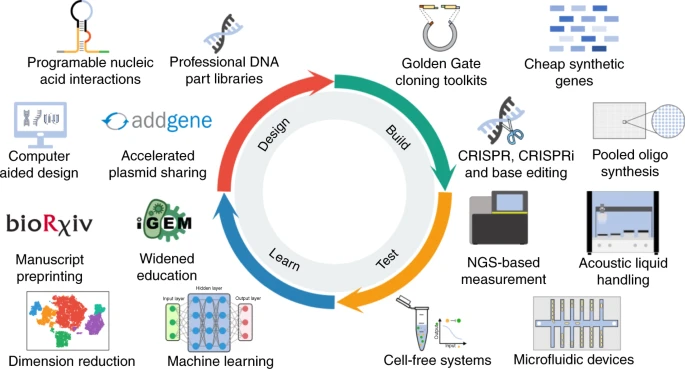
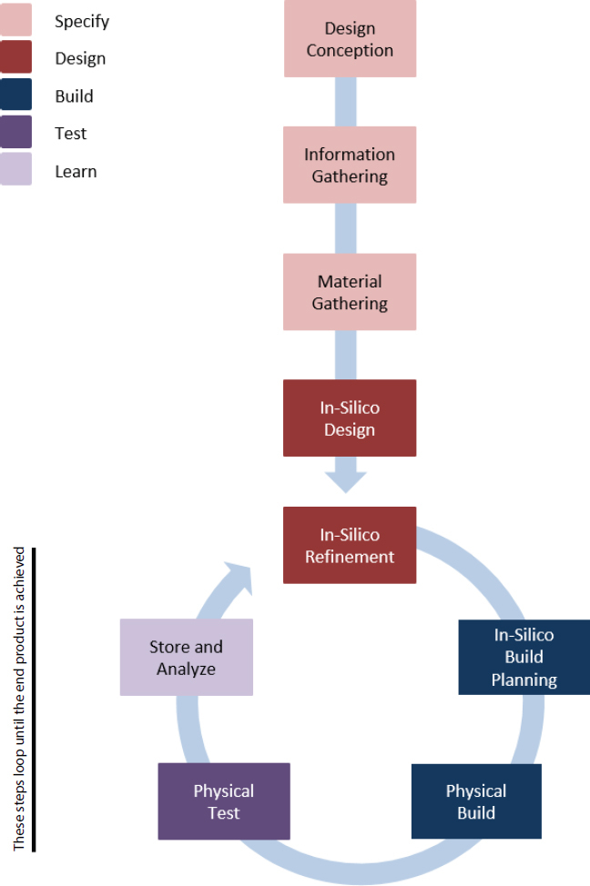
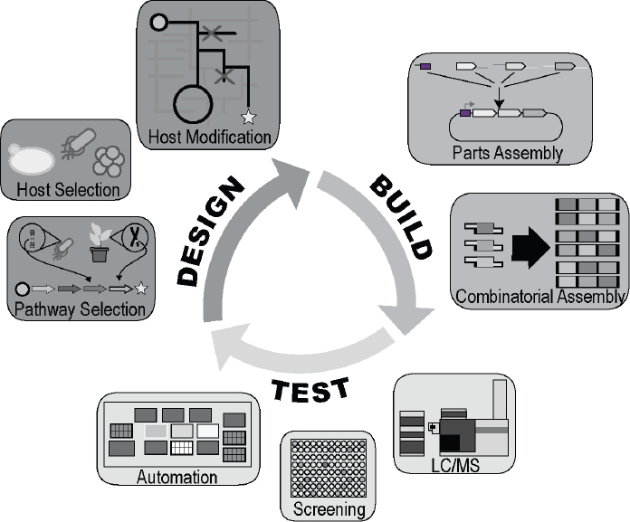

## BioDevOps: DevOps for Synthetic Biology

As part of defining my professional goals for 2022 onwards, I made this blog entry as a breakout to explain what SynBio DevOps was.

> SynBio DevOps is awkwardly long. After brainstorming, I'm going with BioDevOps. I think its broad enough to also include CloudBioServices (working title), which is like AWS for Self Service Cloud Bioloy Labs.

In the image above, from ["The second decade of synthtic biology: 2010-2020"](https://www.nature.com/articles/s41467-020-19092-2) in Nature magazine, you can see that they have left out the software glue that holds it all together. That's a real shame, but an opportunity for DevOps engineers from the software industry.

> "It is decidedly non-trivial for a company in a non-tech traditional industry to start thinking and acting like a software company." From [Software is still eating the world](https://techcrunch.com/2016/06/07/software-is-eating-the-world-5-years-later/), TechCrunch, 2016

If you are learning about SynBio, and you come from "generic" DevOps, this article will help you.

If you entered SynBio from academia, and you are realizing that [your solutions don't scale and need improved reproducibility](https://www.nature.com/articles/463288a), this article will help you.

### What exactly is Synthetic Biology?

Many terms surrounding SynBio are actually ill defined. [Synthetic Biology](https://www.ncbi.nlm.nih.gov/books/NBK535871/) is a subset of BioTech. SynBio was created as an enhanced version of Genetic Engineering. The word "Engineering" was there, but "Genetic Engineering" had not really outgrown its academic roots. At a high level, SynBio adds a focus to iterative Design-Build-Test to Genetic Engineering.

### What is DevOps?

[DevOps](https://en.wikipedia.org/wiki/DevOps) is a set of practices that combines software development (Dev) and IT systems operations (Ops). It aims to speed up development by:

- defining all processes, infrastructure and resources as code
- automatically _unit testing_ code when changes are made in the development environment
- placing that code under version control
- automatically _integration testing_ everything whenever a change is made in the central version control repository (continuous integration)
- automatically deploying changes to production if all integration tests pass (continuos deployment)

DevOps is complementary with [Agile software development](https://en.wikipedia.org/wiki/Agile_software_development). Agile believes in creating self-organizing cross-function teams in direct contact with the customer.

SynBio will benefit greatly from lessons in agility learned by DevOps over the years.

### Two Ways that Science and Engineering Relate

If you've studied the relationship between Science and Engineering, you'll know that they feed each other.

1. Engineers, driven by business interests, can generate science breakthroughs, e.g. Mendeleev was simply trying to create some new glass colors to sell, but ended up creating the periodic table.
2. Scientist, driven by pure curiosity, discover principles that engineers use to grow businesses.

SynBio DevOps needs to be able to handle both a scientific/academic design mode and an engineeing production mode.

### SynBio: Perhaps The Most Demanding Industry For DevOps

It is common for many modern industries to need expertise in software expertise to support:

- web, SEO, social media
- intranet, extranet, security, APIs
- software products, i.e. an app
- manufacturing, ERPs (Enterprise Resource Planning), BI (Business Intelligence)
- embedded "product software", e.g. [Furby's](https://en.wikipedia.org/wiki/Furby) control app, or your thermostat's OS

A further subset have to ALSO manage:

- IOT data streaming and processing (time sequenced, small payloads)
- fleets or field personnel streaming data

SynBio businesses have the above IT needs, minus fleets, but also need:

- Continuous sequencing, which generates "big data"
- MLOps (continuous data preperation, ML train-test-update)
- Realtime big data sharing with partners (B2B Big Data)

#### DNA Genome Size Comparison and Sequencer Output File Sizes

If you come to this article from DevOps, here is a quick summary of the range of size genome sizes and some intuition about how big the derived files might be. NOTE that the NGS output files contain a lot more information than just the bps (base pairs).

- each bp (base pair) can be identified by its Haploid, so 1 of 4 letters: GTCA (the other half will always be the same, so it can be computed)
- 4 letter options = 2 bits, 8 bits = 1 Byte
- (bps x 2bits)/8bits = bytes, bytes/1,000 = MB (Mega Byte)
- Sequencing machines output file formats are much bigger
- Illumna NGS outputs [FASTQ](https://support.illumina.com/bulletins/2018/01/approximate-sizes-of-sequencing-run-output-folders.html) format files
- Illumina run output folders depend on which machine used.
- TODO: finish filling this out

  | Organism                                | "pure" num base pairs              | MB size |
  | --------------------------------------- | ---------------------------------- | ------: |
  | Carsonelli ruddi bacterium              | 160 x 10^3 bp                      |      10 |
  | T2 phage virus                          | 170 x 10^3 bp                      |         |
  | Escherichia coli bacterium              | 4.6 x 10^6 bp                      |         |
  | Fruit Fly                               | 130 x 10^6 bp                      |         |
  | Human Genome                            | 3.2 x 10^9 bp                      |     725 |
  | - compressed                            |                                    |       4 |
  | - Fresh off sequencer, in FASTQ format? |                                    | 200,000 |
  | - If only mutation variant file?        |                                    |     125 |
  | Lung Fish (largest animal)              | 43 x 10^9                          |         |
  | Maize (Corn) Genome                     |                                    |   2,400 |
  | Paris japonica plant (largest plant)    | 150 x 10^9 bp                      |         |
  | A milliliter of sewer water?            |                                    |         |
  | 50 ml soil (shot glass)                 | 30 gbp = 30 x 10^9, 30 billion bps |         |

#### Cheaper/Faster Sequencing + CI/CD = massive network, compute, storage

Sequencing was historically only done during research, but as they adopt DevOps practices, SynBio companies will need to sequence during every step of the process, including continous, automated, quality control.

Bringing agile CI/CD (continuous integration, continuous delivery/deployment) to SynBio is a problem worth solving.

### SynBio Molecule Production Workflow

- Design Conception: choose a molecule to produce
- Pathway Selection:
  - use ML to search sequence DB (aka [codebase](https://www.youtube.com/watch?v=ZtVytYuSt44)) for genetic sequences that produce a similar molecule.
  - choose subset of best candidate
- Host Selection:
  - choose one or more host organisms/strains
  - add the sequence plasmid
  - the host will produce the desired molecule (typical host is yeast)
- Host Modification
  - In-silico build and test
  - choose subset of in-silico successes
  - physical build modify hosts with appropriate sequences
- Physical Test
  - test for expression using LC-MS (liquid chromatography-mass spectrometry)
- Store and Sequence Successes (add to knowledge base)
- Ferment
  - Once successful candidates tested, produce starter to be shipped to customer

### SynBio Eukaryot Modification Workflow

I'm winging this based on my current understanding.

- Similar to protein/molecule workflow. Differences:
  - Vector Host: design a vector host to deliver the mutation to mutation host.
  - Mutation Host: eukaryot genome
  - End Goal: germ line mutation, successful reproduction

## Practices and Infrastructure: current and expected

These are some buzzwords and concepts that I think will become important.

- Cloud Bio Labs: Like AWS, but for SynBio.

- [MLOps](https://en.wikipedia.org/wiki/MLOps): DevOps for machine learning.

- Experiments-as-code:

  - Like [Infrastructre-As-Code](https://en.wikipedia.org/wiki/Infrastructure_as_code). Replace manual lab processes, which are historically based on prose instructions and unwritten institutional knowledge, with version controlled code executed by software and robots. Manual interventions are iteratively removed.
  - It will do for experiments what Jupyter Notebooks did for numeric research and Git did for software development: add reproducibility and the ability to rapidly iterate _while working as a group_. An epidemic of unreproducibility has been making the news in recent years and this is the cure.
  - Defined in files like [CloudFormation](https://aws.amazon.com/cloudformation/resources/templates/)/[Terraform](https://www.hashicorp.com/products/terraform?utm_campaign=22Q1_NA_TERRAFORMCLOUDGOOGLEADS_TRIAL&utm_source=GOOGLE&utm_medium=SEA-PD&utm_offer=TRIAL&gclid=CjwKCAiA5t-OBhByEiwAhR-hm2JTnjXCTT0kq30MMLui0dC4nNAAGUn9wM7uEMgshBv97cxCnYVb2RoCtuUQAvD_BwE).

- Production-as-code: like Experiments-as-code but at a larger scale. There are companies developing easy to use UI that will create the code for you.

> SRE (Site Reliability Engineer) Mindset: "SRE is fundamentally doing work that has historically been done by an operations team, but using engineers with software expertise, and banking on the fact that these engineers are inherently both predisposed to, and have the ability to, substitute automation for human labor." Ben Treynor Sloss, VP Eng, Google
