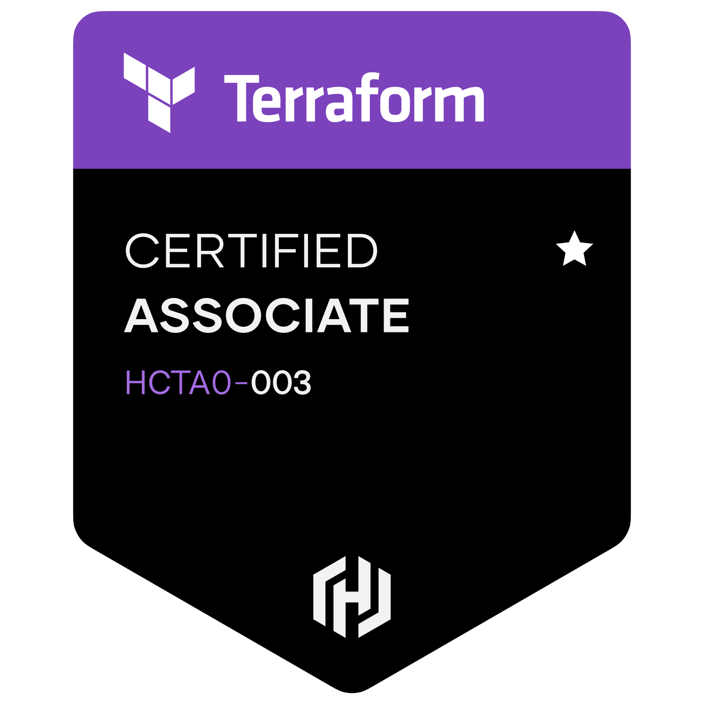
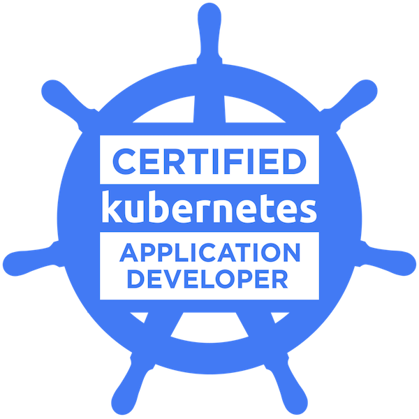
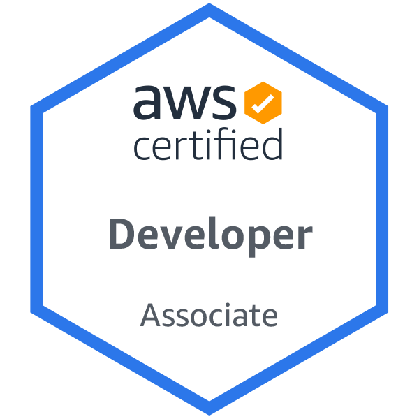
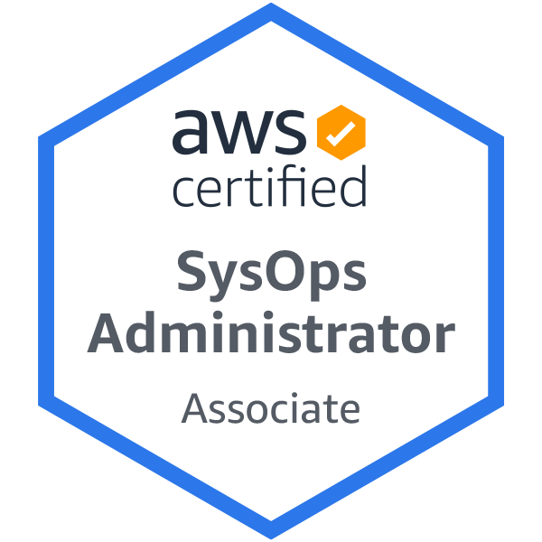

[Certifications](#certifications) | [Certified Classes](#certified-classes)

---

<!-- excerpt-end -->

### Certifications

[Credly Badges](https://www.credly.com/users/edward-pike.e09625c7)

Certs do NOT prove expertise. However, earning a cert takes an investment of time and money and definitely proves interest and commitment. The Kubernetes tests are hands on, time limited, and in a league of their own. However, even Kubernetes details start to fade as soon as I don't use it for a week.

I like certs because they reduce the **unknown unknowns**.

A cert shows that I've at least scouted out the full offerings of the cert topic. I have seen a map of the territory and I at least know my options; though I might not retian implementation details, now they are _known unknowns_ vs _unknown unknowns_. The skeleton of the knowledge remains.

When I rely purely on googling solutions and tutorials, who knows what other options I've missed? One way to get a well rounded understanding is to read a good book from OReilly or Manning, but there is no way to _quickly_ prove to a potential employer that I read it or focused on it; certs do.

<section style="display:flex; justify-content: center; align-content:center;">

  <a href="https://www.youtube.com/watch?v=JEB7O1K1ZXI">
    
    "For the World Is Hollow and I Have Touched the Sky": Star Trek Episode
  </a>
  Before he got the cert, he didn't know his whole world was a spaceship.

</section>
 

### Certified Classes

Generally, starting in 2020, I explored getting into SynBio, via ML, starting with DevOps. I realized that to be good at it I'd need to take a lot more math and then risk still not getting a job. Instead, I plotted a course that would leverage what I already know: Full Stack and DevOps.

These courses were not wasted; they put me in a much better position to support biologists, ML, and data scientists.

These classes included certificates. Earning the certificate _usually_ involves more rigourous testing.

- Proctored:

  - [MIT: Intro to Bio - The Secret of Life with Eric Landers](https://www.edx.org/course/introduction-to-biology-the-secret-of-life-3)

  - [Imperial College: Linear Algebra for ML](https://www.coursera.org/learn/linear-algebra-machine-learning?specialization=mathematics-machine-learning)

  - [Stanford: Machine Learning (Andrew Ng's seminal course)](https://www.coursera.org/learn/machine-learning)

- Not Proctored

  - [Coursera: Prep for Google Cloud Cert: ML Engineer Professional Cert](https://www.coursera.org/professional-certificates/preparing-for-google-cloud-machine-learning-engineer-professional-certificate). The course labs used actual GCP infrastructure, which was changing so fast that the course material was already often out of date. I decided to pause on this front until I was much closer to "going to market".

    - ✔️ Course 1: [Google Cloud Big Data and Machine Learning Fundamentals](https://www.coursera.org/learn/gcp-big-data-ml-fundamentals?specialization=preparing-for-google-cloud-machine-learning-engineer-professional-certificate) 
    - ✔️ Course 2: [How Google does Machine Learning](https://www.coursera.org/learn/google-machine-learning?specialization=preparing-for-google-cloud-machine-learning-engineer-professional-certificate)
    - The rest are on hold

  - [Stanford: AI in Healthcare Specialization](https://www.coursera.org/specializations/ai-healthcare#about)
    - ✔️ Course 1: [Introduction to (American) Healthcare](https://www.coursera.org/learn/intro-to-healthcare?specialization=ai-healthcare) This course forced me to stare at the eldritch horror that is the US health insurance industry. My wife normally handles that because she's medical (and because the system's inefficiencies drive me nuts). 
    - Coures 2-5 on hold..
      - Course 2: [Intro to Clinical Date](https://www.coursera.org/learn/introduction-clinical-data?specialization=ai-healthcare). 
      - Course 3: [Fundamentals of Machine Learning in Healthcare](https://www.coursera.org/learn/fundamental-machine-learning-healthcare?specialization=ai-healthcare)
      - Course 4: [Evaluations of AI Applications in Healthcare](https://www.coursera.org/learn/evaluations-ai-applications-healthcare?specialization=ai-healthcare)
      - Course 5: [AI in Healthcare Capstone](https://www.coursera.org/learn/ai-in-healthcare-capstone?specialization=ai-healthcare)

In Sunken R'lyeh Dead Cthulhu Lies Dreaming of USA's Health Insurance Industry

 
 
