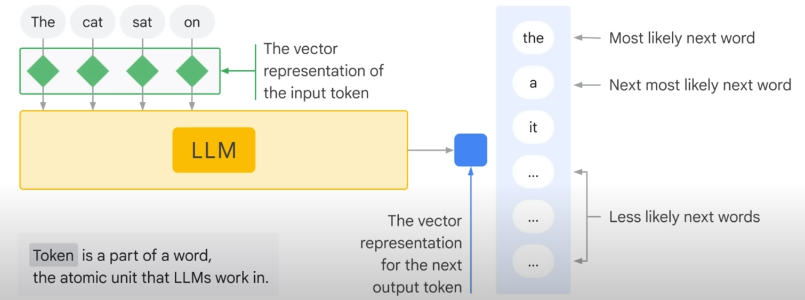

## Under Construction, Watch Your Step

## AI Overview

Big surprise! MLOps is helped tremendously by knowing a fair bit about AI.

- NLP
- CNN vs ANN?
- CV
- Transfer Learning

## AI

AI is

- ML
  A subset of AI dedicated to taking data from the past and training algorithms to create models that can perform highly complex tasks without being explicitly programmed.

  - Supervised (labeled): learn from past example to make future predictions
    - Reinforcement Learning ???
      Each iteration, weights are changed to minimize **error**
    - Gradient Decent
  - Unsupervised: raw data and look for correlations (grouping)
    

  - Deep Learning
    A subset of ML that uses artificial neural networks to process more complex patterns than traditional ML. Uses ANNs.
    - ANN (Artificial Neural Networks)(aka NN)
      - Multiple hidden layers (Input Layer - Hidden Layers - Output Layer)
      - Can process labeled and unlabeled data.
      - "Semi-Supervised Learning": small amount of labeled data, large amount of unlabeled.
        - Labeled helps learn basics of task
        - Unlabeled helps the NN generalize to new examples
    - Generative AI
      - Subset of Deep Learning.
      - Uses ANNs so can process labled and unlabeled data.
      - Uses Semi, supervised, unsupervised learning.
      - Typically involves the Transformer architecture. Essentially, it’s a type of AI that can map long-range dependencies and patterns in large training sets, then use what it learns to produce new content, including text, imagery, audio, and synthetic data.
      - Relies on large models, such as large language models (LLMs) that can classify and generate text, answer questions, and summarize documents
    - LLM (Large Language Models)
      - Subset of Deep Learning

### ML/Deep Learning Model Types

- Model types: Discriminative vs Generative
  
- Discriminative (aka Predictive) used to **_classify_** (is this a dog or a cat or something else)
- Generative (aka GenAI) used to **_generate_** (create a dog based on all the dog's you were trained on)
  - Part of flow is to check with Discriminative model to see if the generated object passes classification check.
  - Uses unstructured content to learn patterns in content.
  - NOTE: "model" can also be called a "function" with a multidimensional tensor/matrix with adjustable weights/values.
    
- Classical Supervised and Unsupervised Learning
  
- New Gen AI Supervised, Semi and Unsupervised Learning
  Generate a **Foundation Model** (aka a statistical model)
  
- Gen Lang models can be asked questions (prompted)
  - PaLM ?
  - LaMDA ?
  - GPT ?

### Transformers

Transformers are "the 2018 revolution" that enabled Generative AI via NLP (Natural Language Processing).

> Hallucinations are words or phrases that are generated by the model that are often nonsensical or grammatically incorrect.

Causes of Hallucinations:

- Model not trained on enough data.
- Model trained on noisy or dirty data.
- Model is not given enough context
- Model is not given enough constraints

> Prompt Design: the quality of the input determines the quality of the output.

Model Types??

- text-to-text
  - NLP lang input to lang output.
  - Learn mapping between pairs, e.g. lang translation
    - Generation
    - Classification
    - Summarization
    - Translation
    - (Re)Search
    - Extraction
    - Clustering
    - Content editing/rewriting
- text-to-image
- text-to-video and text-to-3D
  - video gen
  - video editing
  - Game assets
- text-to-task
  - Software agents
  - Virtual assistants
  - Automation (e.g.: navigate a web GUI)
- Foundation Model
  Large Model pre trained on a vast amount of data designed to be adapted or fine-tuned.
  

### Vertex AI Task Specific Foundation Models

Examples:

- Sentiment Analysis: use Language > Extraction > Syntax Analysis > Classification > Sentiment Analysis
- Occupancy Analytics: use Vision > Classification > Object Detector > Detection > Occupancy Analytics

#### GenAI Studio

On Google Cloud. See also SageMaker?

#### Gen AI App Builder

- No code. Visual WYSIWIG.
- Create your own
  - digital asst.
  - knowledge base

#### PaLM API and MakerSuite

- Simplifies Gen Dev Cycle
  

## Intro to LLMs

- [Video by Google, May,2023](https://www.youtube.com/watch?v=zizonToFXDs)
- AI > ML > Deep Learning > LLM
- Generative AI
- LLMs: large, gen purpose lang models that are pre-trained and then fine-tuned
  - Large
    - Petabyte scale dataset
    - Large num parameters (called hyperparameters in ML)
  - General Purpose
    - commonality of human lang
    - resource restriction (not many orgs can train an LLM)
  - Pre-trained and fine-tuned
- Benefits of LLMs
  - Single LLM can be used for different tasks
  - Fine-tune requires minimal field data (aka domain training data)
    - Decent performance with "few-shot" (little data) or "zero-shot" (never been trained but works anyway) scenarios
- Performance is continuosly growing with more data and parameters.

### Example: PaLM (Pathways Language Model)

- April 2022, Google released it.
- 540 Billion parameters
- Dense decoder only model
- Leverage the new Pathway system (distributed training on multiple TPU (Tensor Processing Units) V4 pods)

### LLM Transformers

- Encoding Component > Decoding Component

- NN (Neural Networks) circa 2012.
- Generative: user can train
  - Ex:
    - LaMDA (Lang Model for Dialogue Apps)
    - PaLM
    - GPT

LLM Development vs. Traditional Devlopment

### QA (Question Answering)

#### Traditional QA

- Subfield of NLP that deals with answering questions posed in nat lang
- Retrieves answers from a **_given text_**
  - Depending on model, answer can be directly extracted from text or generated from scratch
- Requires Domain Knowlege to train

#### VS Generative QA

- Generates based on context
- Leverages Text Gen models
- No need for domain knowledge

### Prompts Design

Prompt Design:

- Process of creating prompts that **_elicit the desired response_** from a language model.
- Instructions and context passed to lang model **_for specific task_**.

Prompt Engineering:

- Practice of developing and optimizing prompts to efficiently use lang models, for a wide variety.

### 3 Types of LLM

First 2 are easily confused but very diff.

- Generic (or Raw): predict next word (aka token)

  - Token is a part of a word, the atomic unit that LLMs work in.
    

- Instruction Tuned: predict a response to the instruction given in the input
  

- Dialog Tuned: have a dialog by predicting the next response.
  - subset of Instruction Tuned
    

### Chain of Thought Reasoning

Models are better at getting the right answer when they first output text that explains the reason for the answer.

### PETM (Parameter-Efficient Tuning Methods)

Fine-tuning an LLM on your own custom data without duplicating the model. The base model itself is not altered. Instead, a small number of **_add-on layers_** are tuned, which can be sswapped in and out at inference time.

Prompt Tuning: easiest PETM

### VertexAI

Google Clouds **_Fully Manage_** ML platform. VS SageMaker, KubeFlow, Azure ML

- [Model Garden](https://cloud.google.com/model-garden)
- [Generative AI Studio](https://cloud.google.com/generative-ai-studio)
- [PaLM 2 for Text and Chat and Embedding API for Text.](https://cloud.google.com/blog/products/ai-machine-learning/google-cloud-launches-new-ai-models-opens-generative-ai-studio)
- [BigQuery ML](https://cloud.google.com/bigquery-ml/docs/introduction)
- [BigQuery](https://cloud.google.com/bigquery)
- [Vertex Data Labeling](https://cloud.google.com/vertex-ai/docs/datasets/data-labeling-job)

## Generative AI on Google Cloud

## AI Roles

- Data Scientist
- Data Engineer
- DataOps
- ML Engineer
- MLOps
- Prompt Designer
- Prompt Engineer

## ?

- AGI

- Training
  - Gradient Descent
  - Sigmoid Functions
  - Attention

### Types of Models

#### Open Source

See [Hugging Face](https://huggingface.co/)

- BLOOM by BigScience
- LLaMA by Meta AI
- Flan-T5 by Google
- GPT-J by Eleuther AI

#### Proprietary

- OpenAI
- co:here
- AI21 Labs
- Antrhopic

#### To File

- Google Imagen
- Dall-E 2

### Misc

### Libs and Langs

#### Libraries

- Pytorch
- TensorFlow
- LLM
  - LangChain
    - [Getting Started with LangChain: A Beginner’s Guide to Building LLM-Powered Applications](https://towardsdatascience.com/getting-started-with-langchain-a-beginners-guide-to-building-llm-powered-applications-95fc8898732c)

#### LLMs

- ChatGPT (OpenAI)

  - [Plugins 2023/05/17 ](https://medium.com/pcmag-access/what-are-chatgpt-plugins-the-next-phase-of-conversational-ai-is-here-a4c288300aa1)

- Google Bard
- MS Bing AI

#### Langs

- Python
- R Lang

### Autonomous Agents

GPT/LLM backed

- AutoGPT
  - GTP-4 undelying
- BabyAGI
- AgentGPT
- Interactive Simulacra (Stanford)
  - NPCs controlled by GPT

#### AutoML Frameworks

- Semantic Kernel

#### External Tools Access

Thanks to [A comprehensive and hands-on guide to autonomous agents with GPT](https://bootcamp.uxdesign.cc/a-comprehensive-and-hands-on-guide-to-autonomous-agents-with-gpt-b58d54724d50)

> Autonomous agents can now try to achieve a long-term goal by thinking through the sub-tasks, planning which actions to take, executing the actions with the help of external tools, and reflecting on the results.

- Toolformer
- JARVIS (HuggingGPT)
- VisualChatGPT (TaskMatrix)
- ReAct (Reasoning-Acting)
- Reflexion

#### Vector DBs

Used by above

- Pinecone
- Weaviate
- Milvus
- Faiss
- Chroma

### Websites

OpenAI
Hugging Face

## ML Ops

### Cloud Offerings

### Certs

[Google Generative AI Training](https://cloud.google.com/blog/topics/training-certifications/new-google-cloud-generative-ai-training-resources)

### Articles

[Building Your Own DevSecOps Knowledge Base with OpenAI, LangChain, and LlamaIndex](https://betterprogramming.pub/building-your-own-devsecops-knowledge-base-with-openai-langchain-and-llamaindex-b28cda15abb7)
