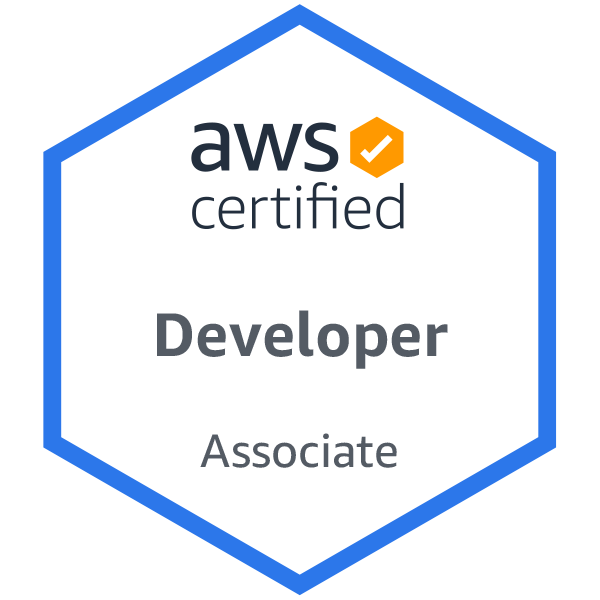
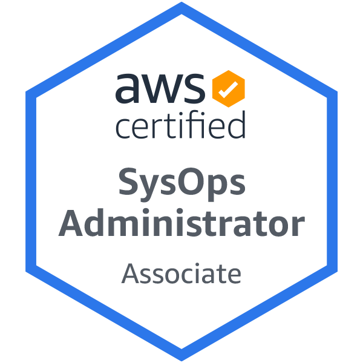

<!--- Why this HTML code block?
1. gatsby markdown remark grabs the img tag and mangles it, makes it full page, so I am having to hide it inside a section and div.
2. gatsby markdown remark also grabs tables and mangles them, so I am using sections and divs to control image size
3. These badges are transparent png's, but gatsby sharper is creating blurring rasters as part of its resize. I need to find a fix for that.
-->
<section style="display:flex; flex-wrap: wrap; justify-content: center; align-content:center; background-color: var(--color-background-default);">
  

    
  

  

    
  

  

    
  

  

    
  

</section>

|   |   |   |
|---|---|---|
| |   |   |
|    |   |   |
|   |   |   |

 If I knew then what I know now...

---
[Credly Badges](https://www.credly.com/users/edward-pike.e09625c7)
[Certifications](#certifications) | [Certified Classes](#certified-classes)

If I were starting out again, I'd get a Masters in a biology field, add a big dose of software engineering, and enter a startup ASAP. I've guided my twin 18 year olds to do just that.

<!-- excerpt-end -->

I've already got the software engineering part, so I'm coming from the opposite direction. I don't have time for a biology degree. The best realistic thing I can do is take online courses as time permits.

I hope that someday soon, cloud bio labs and virtual lab simulators will remove the need for in person labs, opening the field up to people around the world. Working in physical labs will be as alien as hosting a webserver on a computer in your closet. There is already progress in that area.

### Certifications

I've never been a snob towards certifications, though clearly they do NOT proove that you have ready skills. However, earning a cert takes an investment of time and money and definitely proves interest and commitment.

I may look like a "cert hound", and I admit to a lifelong "collect them all" disposition to many things. Getting many certs means that I have broad exposure and perspective.

Company code bases and tribal knowledge often settles on a narrow tech stack and methodologies. It could be working fine, but could it possibly be working better? When is the last time anyone checked? Does the team have a single software hammer, making problem a nail?

Many companies are understaffed relative to their technical debt needs and don't make technical debt or researching current best practices a KPI. Based on surveys I've seen in 2021, apparently many companies are not even using DevOps yet.

When I rely purely on googling solutions and tutorials, who knows what other options I've missed? One way to get a well rounded understanding is to read a good book from OReilly or Manning, but there is no way to _quickly_ prove to a potential employer that I read it.

A cert shows that I've at least scouted out the full offerings of the cert topic. I have seen a map of the territory and at least know my options; though I might not retian implementation details, now they are _known unknowns_ vs _unknown unknowns_.

<section style="display:flex; justify-content: center; align-content:center;">

  <a href="https://www.youtube.com/watch?v=JEB7O1K1ZXI">
    
    "For the World Is Hollow and I Have Touched the Sky": Star Trek Episode
  </a>
  He got a cert, touched the sky, now knows his whole world is a spaceship.

</section>
 

I earned all three AWS Associate certs because my near term goal is AWS DevOps Profesional cert. I won't be working on the Pro cert until I've had more time in an AWS shop.

### Certified Classes

Generally, in late 2019 and early 2020, I explored getting into SynBio via ML. I realized that to be good at it I'd need to take a lot more math and then risk still not getting a job. Instead, I plotted a course that would leverage what I already know: Full Stack and DevOps.

These courses were not wasted; they put me in a much better position to support biologists, ML and data scientists.

These classes included certificates. Earning the certificate involves more rigourous testing.

- [MIT: Intro to Bio - The Secret of Life with Eric Landers](https://www.edx.org/course/introduction-to-biology-the-secret-of-life-3)

- [Stanford: Machine Learning (Andrew Ng's seminal course)](https://www.coursera.org/learn/machine-learning)

- [Imperial College: Linear Algebra for ML](https://www.coursera.org/learn/linear-algebra-machine-learning?specialization=mathematics-machine-learning)

- [Coursera: Prep for Google Cloud Cert: ML Engineer Professional Cert](https://www.coursera.org/professional-certificates/preparing-for-google-cloud-machine-learning-engineer-professional-certificate). The course labs used actual GCP infrastructure, which was changing so fast that the course material was already often out of date. I decided to pause on this front until I was much closer to "going to market".

  - Course 1: [Google Cloud Big Data and Machine Learning Fundamentals](https://www.coursera.org/learn/gcp-big-data-ml-fundamentals?specialization=preparing-for-google-cloud-machine-learning-engineer-professional-certificate)
  - Course 2: [How Google does Machine Learning](https://www.coursera.org/learn/google-machine-learning?specialization=preparing-for-google-cloud-machine-learning-engineer-professional-certificate)

- [Stanford: AI in Healthcare Specialization](https://www.coursera.org/specializations/ai-healthcare#about)
  - Course 1: [Introduction to (American) Healthcare](https://www.coursera.org/learn/intro-to-healthcare?specialization=ai-healthcare) This course forced me to stare at the eldritch horror that is the US health insurance industry. My wife normally handles that because she's medical (and because the system's inefficiencies drive me nuts). Now that I've been away from the course for a while, I can imagine taking Course 2: [Intro to Clinical Date](https://www.coursera.org/learn/introduction-clinical-data?specialization=ai-healthcare). That will get me to the classes that I'm actualy interested in:
    - Course 3: [Fundamentals of Machine Learning in Healthcare](https://www.coursera.org/learn/fundamental-machine-learning-healthcare?specialization=ai-healthcare)
    - Course 4: [Evaluations of AI Applications in Healthcare](https://www.coursera.org/learn/evaluations-ai-applications-healthcare?specialization=ai-healthcare)
    - Course 5: [AI in Healthcare Capstone](https://www.coursera.org/learn/ai-in-healthcare-capstone?specialization=ai-healthcare)

In Sunken R'lyeh Dead Cthulhu Lies Dreaming of USA's Health Insurance Industry

 
 
