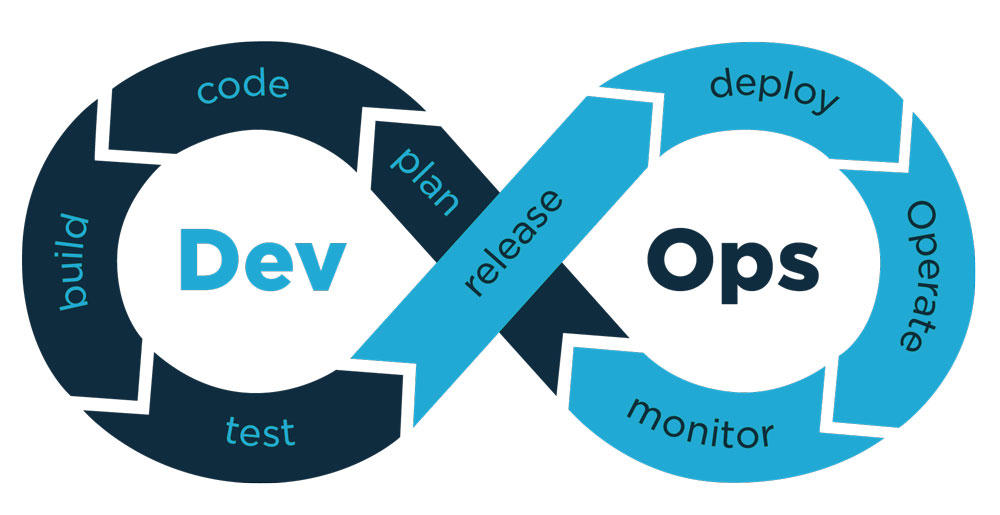

<h3>Just Thinkin About DevOps Stuff (and Dune)</h3>

<!-- excerpt-end -->

> "In this time, the most precious substance in the universe is the spice (DevOps)... The spice is vital to (Agility). The (IT Dept) and its (engineers), who the spice has mutated over (10) years, use the spice (Code), which gives them the ability to fold (time)."

DevOps enables high speed evolution.

DevOps eliminates wasted resources.

**"Software is Eating the World"**, **"Everything Is Code"**, therefore DevOps is key to all success.

## The DevOps Cycle

### Design/Plan

- Planning docs should be in version control

#### TDD (Test Driven Design)

[TDD](https://en.wikipedia.org/wiki/Test-driven_development) is key to AI Assisted/No Code future. Took me a bit to come around, but GitHub Copilot AI was the last straw because it will clearly someday be able to write code to pass your tests, so ultimately, software development will consist of designing tests using some sort of high level language plus drag-and-drop.

Programmers will write [DDD](https://en.wikipedia.org/wiki/Domain-driven_design) libraries to translate domain definitions and diagrams to generate the test for TDD. The human in the loop can approve or overwrite the autogenerated test conditions.

- Design docs need to clearly define exactly **_what success looks like_** in the form of tests and expected results. Written by product managers.
- Eventually, changing DDD and/or TDD code will automatically kick off the entire dev lifecycle. AI will handle implementation.

#### Architecture Diagrams

Overview: [Diagraming Tools For Cloud Infrastructure (redhat)](https://www.redhat.com/architect/diagramming-tools-cloud-infrastructure)

- [Diagrams.net](https://www.diagrams.net/) formerly Draw.io
- [RedHat Portfolio Arch Center](https://www.redhat.com/architect/portfolio/)
- [Gliffy](https://www.gliffy.com/solutions/diagrams-for-software-engineering)
- [MS Visio](https://www.microsoft.com/en-us/microsoft-365/visio/flowchart-software)
- [FigJam](https://help.figma.com/hc/en-us/articles/1500004362321-Guide-to-FigJam) Figma team whiteboard
- [Mermaid](https://mermaid.js.org/) Works on GitHub
- [Lucidchart](https://www.lucidchart.com/pages/)

#### Diagram As Code

- [Structurizr](https://structurizr.com/)
- [PlantUML](https://plantuml.com/)
- [Terrastruct](https://terrastruct.com/)
- [Graphviz](https://graphviz.org/)

#### UI Design Tools

- [Figma](https://www.figma.com/)
- [Adobe XD](https://www.adobe.com/products/xd.html)
- [Storybook](https://storybook.js.org/)

#### Manage Tasks, Issues

- [Jira](https://www.atlassian.com/software/jira/agile)
- [Asana](https://asana.com/)
- [Azure Boards](https://azure.microsoft.com/en-us/services/devops/boards/) Part of Azure DevOps Server (was MS TFS).
- [Trello](https://trello.com/en-US) Kanban, bought by Atlassian (Jira).
- [GitHub Issues](https://github.com/features/issues)
- [UrbanCode Velocity](https://www.urbancode.com/product/urbancode-velocity/)
- [Confluence](https://www.atlassian.com/software/confluence)
- [zendesk](https://www.zendesk.com/)
- [servicenow](https://www.servicenow.com/)

#### Version Control

##### Source Code, Designs and Docs

- [Git](https://git-scm.com/)
  - [GitHub](https://github.com/) Owned by Microsoft.
  - [GitLab](https://about.gitlab.com/)
  - [AWS CodeCommit](https://aws.amazon.com/codecommit/)
  - [Azure Repos](https://azure.microsoft.com/en-us/services/devops/repos/)
- Workflows For Devs
  - Branching Strategies
    - [Trunk Based](https://www.atlassian.com/continuous-delivery/continuous-integration/trunk-based-development). Good for microservices, small teams, closed source.
    - [Git Flow](https://www.atlassian.com/git/tutorials/comparing-workflows/gitflow-workflow) Good for monoliths, open source, security centric.
- Workflows for Ops
  - [GitOps](https://www.redhat.com/en/topics/devops/what-is-gitops)
  - [Git Flow](https://nvie.com/posts/a-successful-git-branching-model/)
  - [GitHub flow](https://docs.github.com/en/get-started/quickstart/github-flow) Branch/feature based.
  - [Trunk Based](https://trunkbaseddevelopment.com/)
  - [Feature Based](https://www.atlassian.com/git/tutorials/comparing-workflows/gitflow-workflow) AKA GitFlow
  - [Trunk vs Feature](https://circleci.com/blog/trunk-vs-feature-based-dev/)

##### Artifacts

- [Github Package Registry (GPR)](https://github.com/features/packages)
  - NPM, Maven Java. Container Registry moved to GHCR (below)
- [Artifactory](https://jfrog.com/artifactory/): JFrog. Universal Artifact Mgt.
- [UrbanCode Release](https://www.urbancode.com/product/release/)
- [Azure Artifacts](https://azure.microsoft.com/en-us/services/devops/artifacts/)
- [Nexus](https://www.sonatype.com/?hsLang=en-us): Sonatype. Repository. Containers.
- Language Specific Artifacts
  - [NPM Packages](https://www.npmjs.com/package/package-list): only for node packages
  - [PYPI (Python Package Index)](https://pypi.org/)
  - [Maven Repo](https://mvnrepository.com/) Java. Gradle uses Maven repos. Defaults to [Maven Central](https://repo.maven.apache.org/maven2/). Google also has a [Maven Repo](https://maven.google.com/web/index.html).
  - [GoLang](https://pkg.go.dev/)
- Images/Containers
  - [Docker Hub](https://hub.docker.com/): limited to docker images
  - [GitHub Container Registry (Docker and OCI)](https://docs.github.com/en/packages/working-with-a-github-packages-registry/working-with-the-container-registry) ghcr.io
  - [JFrog Container Registry](https://jfrog.com/container-registry/) docker, OCI
  - [Helm Registries](https://helm.sh/docs/topics/registries/): Roll your own Docker or OCI.

#### CLI First and Automation

- Everything should be code; therefore software should have codeable API's or SDKSs so that it can be automatable.
- If an app offers a GUI, try not to use it. Use the CLI.
- If a solution looks good but it does not offer a CLI, an SDK, or at least a REST API, skip it.
- VSCode is my default because it was conceptually built from the ground up to run in a web browser. They made a desktop version while they worked out the pure web kinks. Terminals are first class citizens.
- Learn VI or VIM because they are available on most Linux distros. Nano is easier but less likely to be installed.

### Build, Test Coverage

- [Hamcrest](http://hamcrest.org/): Matchers that can be combined to create flexible expressions of intent. Was just Java, now available for most languages.

- Java:

  - Build
    - [Apache Maven](https://maven.apache.org/)
    - [Gradle](https://gradle.org/) Highly scriptable. Uses Groovy language that can embed Java.
  - Test
    - [JUnit](https://junit.org/junit5/)
    - [Mockito](https://site.mockito.org/)
    - [TestNG](https://en.wikipedia.org/wiki/TestNG)
    - Cucumber
  - Quality
    - [JaCoCo](https://www.jacoco.org/jacoco/): IDE and Jenkins plugin versions available. Emma replacement.
    - [JTest](https://www.parasoft.com/products/parasoft-jtest/)

- Python

  - Uses [setup.py](https://www.educative.io/answers/what-is-setuppy) file (setup script).
  - [PyBuilder](https://pybuilder.io/)
  - Security
    - [ossaudit](https://github.com/illikainen/ossaudit/#readme)
    - [Jake](https://github.com/sonatype-nexus-community/jake/#readme) BOM

- JS WebApps:

  - Build
    - [WebPack](https://webpack.js.org/)
    - [Parcel](https://parceljs.org/) Also supports Webassembly
    - [Snowpack](https://www.snowpack.dev/): trying to replace WebPack and Parcel. O(1) build times.
    - [Rollup.js](https://rollupjs.org/guide/en/)
    - [esbuild](https://esbuild.github.io/) The new hotness. Written in GoLang.
    - [Packem](https://packem.github.io/) Written in Rust.
    - [Babel](https://babeljs.io/): ES transpiler
  - Unit Testing
    - [Jest](https://jestjs.io/)
    - [Mocha.js](https://mochajs.org/): Test framework/suite. Modular.
    - [Chai](https://www.chaijs.com/): TDD and BDD assertion framework. Mocah pluginable.
    - [Sinon.js](https://sinonjs.org/): stub, spy, mock. Standalone or plugin.
    - [Jasmine](https://jasmine.github.io/) No external dependencies!
  - Security
    - [AuditJS](https://www.npmjs.com/package/auditjs)
    - [Sonatype Nexus IQ Extension for VSCode](https://marketplace.visualstudio.com/items?itemName=SonatypeCommunity.vscode-iq-plugin)

- GoLang: builtin. [Lean Go with Tests](https://quii.gitbook.io/learn-go-with-tests/)

  - Security
    - [Nancy](https://github.com/sonatype-nexus-community/nancy/#readme): Dependency vulnerabilities

- WebApp Run Time Testing: language neutral

  - [Selenium](https://www.selenium.dev/): many language options
  - [Puppeteer](https://github.com/puppeteer/puppeteer): (NOT Puppet)
  - [LogRocket](https://logrocket.com/): Web client js logging and usage analytics.
  - Load Testing
    - [LightHouse](https://developers.google.com/web/tools/lighthouse/) Build time score generation with Lighthouse CLI for Node. Consider as "code quality" tool.
    - [Apache JMeter](https://jmeter.apache.org/)
    - [Gatling](https://gatling.io/)
    - [The Grinder](http://grinder.sourceforge.net/)
  - A11y (Accessibility)
    - [LightHouse](https://developers.google.com/web/tools/lighthouse/) Build time score generation with Lighthouse CLI for Node. Consider as "code quality" tool.

### CI/CD Tools

- Leverages local build scripting and runtime testing tools, adds integration, optional deployment and delivery

  - [Jenkins](https://www.jenkins.io/)
    - [SonarQube](https://docs.sonarqube.org/latest/) Static code analysis
  - [GitHub Actions](https://github.com/features/actions)
  - UrbanCode
    - [UrbanCode Build](https://www.urbancode.com/product/build/)
    - [UrbanCode Deploy](https://www.urbancode.com/product/deploy/)
  - [CloudBees (CodeShip)](https://cloudbees.com)
  - [TeamCity: JetBrains](https://www.jetbrains.com/teamcity/)
  - [Travis CI](https://www.travis-ci.com/)
  - [Circle CI](https://circleci.com/)
  - [AWS CodePipeline](https://aws.amazon.com/codepipeline/)
    - [AWS CodeBuild](https://aws.amazon.com/codebuild/)
    - [AWS CodeDeploy](https://aws.amazon.com/codedeploy/)
  - [Azure DevOps](https://azure.microsoft.com/en-us/services/devops/#overview)
    - [Azure Test Plans](https://azure.microsoft.com/en-us/services/devops/test-plans/)
    - [Azure Pipelines](https://azure.microsoft.com/en-us/services/devops/pipelines/)
  - Security Scan
    - [OWASP (Open Web App Security Project)](https://owasp.org/)
    - [Probely (sic) Security Scanner](https://probely.com/)
    - [Sonatype Integrations](https://ossindex.sonatype.org/integrations)

### Operations

- SysOps practices and tooling overlap with DevOps.
- For more details, see my [SysOps](/edpike365-sysops) and/or [Containers](/edpike365-containers) pages.

### Monitor

- Remote monitoring should include anonymous monitoring agents in webapps.
- Promethius
- Grafana

#### Continuous Feedback

New tickets or new issues on old tickets feed back into the [Plan](#designplan) phase.

### The DevOps journey "goes on and on and on and on"; don't stop believin'.

