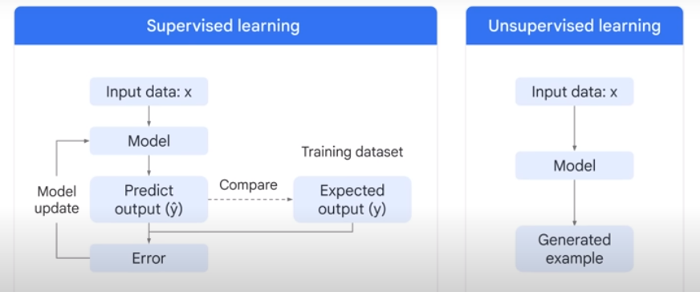

### Under Construction, Watch Your Step

# TODO clean up diff between these 2 pages

## AI Overview

Big surprise! MLOps is helped tremendously by knowing a fair bit about AI.

- NLP

- LLM
- CNN
- CV
- Transfer Learning
AI
  - ML
    A subset of AI dedicated to taking data from the past and training algorithms to create models that can perform highly complex tasks without being explicitly programmed.
    - Supervised (labeled): learn from past example to make future predictions
      - Reinforcement Learning ???
      Each iteration, weights are changed to minimize **error**
      - Gradient Decent
    - Unsupervised: raw data and look for correlations (grouping)
      

    - Deep Learning
      A subset of ML that uses artificial neural networks to process more complex patterns than traditional ML. Uses ANNs.
      - ANN (Artificial Neural Networks)(aka NN)
        - Multiple hidden layers (Input Layer - Hidden Layers - Output Layer)
        - Can process labeled and unlabeled data.
        - "Semi-Supervised Learning": small amount of labeled data, large amount of unlabeled.
          - Labeled helps learn basics of task
          - Unlabeled helps the NN generalize to new examples
      - Generative AI
        - Subset of Deep Learning.
        - Uses ANNs so can process labled and unlabeled data.
        - Uses Semi, supervised, unsupervised learning.
        - Typically involves the Transformer architecture. Essentially, it’s a type of AI that can map long-range dependencies and patterns in large training sets, then use what it learns to produce new content, including text, imagery, audio, and synthetic data.
        - Relies on large models, such as large language models (LLMs) that can classify and generate text, answer questions, and summarize documents
      - LLM (Large Language Models)
        - Subset of Deep Learning
    - ML/Deep Learning Model Types
      - Model types: Discriminative vs Generative
      
      - Discriminative (aka Predictive) used to ***classify*** (is this a dog or a cat or something else)
      - Generative (aka GenAI) used to ***generate*** (create a dog based on all the dog's you were trained on)
        - Part of flow is to check with Discriminative model to see if the generated object passes classification check.
        - Uses unstructured content to learn patterns in content.
        - NOTE: "model" can also be called a "function" with a multidimensional tensor/matrix with adjustable weights/values.
        
      - Classical Supervised and Unsupervised Learning
      
      - New Gen AI Supervised, Semi and Unsupervised Learning
      
      - Gen Lang models
        - PaLM
        - LaMDA
        - GPT

  - AI Roles
    - Data Scientist
    - Data Engineer
    - DataOps
    - ML Engineer
    - MLOps

      
- AGI

- Training
  - Gradient Descent
  - Sigmoid Functions
  - Attention

### Types of Models

#### Open Source

See [Hugging Face](https://huggingface.co/)

- BLOOM by BigScience
- LLaMA by Meta AI
- Flan-T5 by Google
- GPT-J by Eleuther AI

#### Proprietary

- OpenAI
- co:here
- AI21 Labs
- Antrhopic

#### Generative Graphics

- Google Imagen
- [Dall-E 2](https://openai.com/dall-e-2)
  - By OpenAI
- Midjourney
  - Runs inside Discord
  - [Docs](https://docs.midjourney.com/docs/quick-start)
  - Relaxed Mode:
    - free time use, slow, use for experiment
    - /relax
  - Fast Mode (Fast GPU):
    - use for upscaling, etc, something you discovered in Relaxed Mode
    - /fast
  
### Misc

### Libs and Langs

#### Libraries

- Pytorch
- TensorFlow
- LLM
  - LangChain
    - [Getting Started with LangChain: A Beginner’s Guide to Building LLM-Powered Applications](https://towardsdatascience.com/getting-started-with-langchain-a-beginners-guide-to-building-llm-powered-applications-95fc8898732c)

#### LLMs

- ChatGPT (OpenAI)
  - [Plugins 2023/05/17 ](https://medium.com/pcmag-access/what-are-chatgpt-plugins-the-next-phase-of-conversational-ai-is-here-a4c288300aa1)

- Google Bard
- MS Bing AI

#### Langs

- Python
- R Lang

### Autonomous Agents

GPT/LLM backed

- AutoGPT
  - GTP-4 undelying
- BabyAGI
- AgentGPT
- Interactive Simulacra (Stanford)
  - NPCs controlled by GPT

#### AutoML Frameworks

- Semantic Kernel

#### External Tools Access

Thanks to [A comprehensive and hands-on guide to autonomous agents with GPT](https://bootcamp.uxdesign.cc/a-comprehensive-and-hands-on-guide-to-autonomous-agents-with-gpt-b58d54724d50)

> Autonomous agents can now try to achieve a long-term goal by thinking through the sub-tasks, planning which actions to take, executing the actions with the help of external tools, and reflecting on the results.

- Toolformer
- JARVIS (HuggingGPT)
- VisualChatGPT (TaskMatrix)
- ReAct (Reasoning-Acting)
- Reflexion

#### Vector DBs

Used by above

- Pinecone
- Weaviate
- Milvus
- Faiss
- Chroma

### Websites

OpenAI
Hugging Face

### Cloud Offerings

### Certs

[Google Generative AI Training](https://cloud.google.com/blog/topics/training-certifications/new-google-cloud-generative-ai-training-resources)

### Articles

[Building Your Own DevSecOps Knowledge Base with OpenAI, LangChain, and LlamaIndex](https://betterprogramming.pub/building-your-own-devsecops-knowledge-base-with-openai-langchain-and-llamaindex-b28cda15abb7)